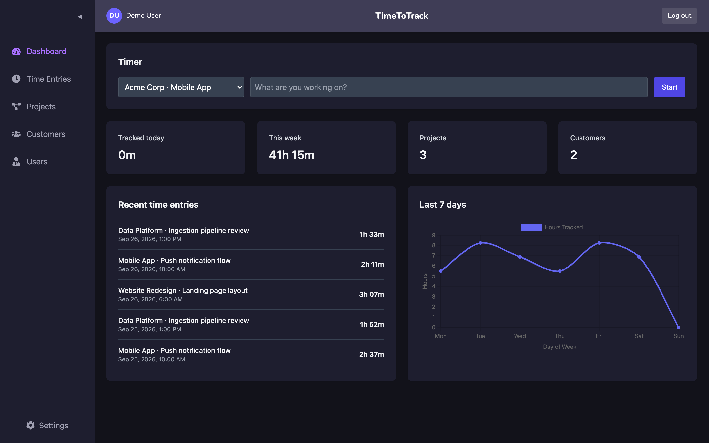
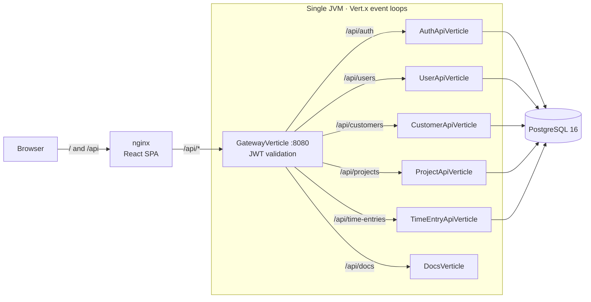

# TimeToTrack

[](https://github.com/AlanKalbermatter/timetotrack/actions/workflows/ci.yml)

A team time tracker. Start a timer against a client project, log time manually, and see where the week went.
The backend is a reactive **Vert.x** modular monolith behind a JWT-validating gateway. The frontend is **React + TypeScript**.



## Quickstart

```bash
docker compose up --build
```

Open <http://localhost:3000> and sign in with the demo account **demo@timetotrack.dev / demo1234**, or create your own.
API docs (Swagger UI) are at <http://localhost:3000/api/docs>.

If port 8080 is already taken on your machine, publish the API elsewhere: `API_PUBLISHED_PORT=18080 docker compose up --build`. The web app on :3000 is unaffected, because nginx reaches the API over the compose network.

## Architecture



Each service verticle owns a vertical slice (routes → service → DAO) and runs its own HTTP server on a loopback port. The gateway is the only public listener.

## Design decisions

- **A modular monolith with real service boundaries.** Services only talk to each other over HTTP through the gateway, and they bind to `127.0.0.1`. Moving one into its own process means changing a port and host in the gateway's route table. Nothing else knows where a service runs. Until there is a scaling or ownership reason to split, one deployable keeps operations simple.
- **Authenticate once, at the edge.** The gateway verifies the JWT (HS256, 8 h expiry) and forwards the caller as `X-User-Id`. It forwards only an allow-list of request headers, so a client-supplied `X-User-Id` never reaches a service. Services still reject requests without the header as a second line of defense.
- **Invariants live in the database.**
  - "One running timer per user" is a partial unique index.
  - "An entry ends after it starts" is a `CHECK` constraint.
  - Deleting a customer that has projects is blocked by a foreign key.

  Services translate those violations into `409`/`400` responses instead of re-checking in application code, where two concurrent requests could both pass the check.
- **Time is `timestamptz` in storage and ISO-8601 UTC on the wire.** The browser decides what "today" and "this week" mean in its own time zone and sends UTC bounds. The server needs the zone only to bucket the daily chart. An entry that crosses midnight counts on its start day.
- **Compile-time dependency injection.** Dagger builds the object graph at compile time, with no reflection or classpath scanning. A missing binding is a build error, not a startup error.
- **Non-blocking all the way down.** Handlers return Vert.x `Future`s, and the reactive Postgres client never blocks an event loop. PBKDF2 password hashing is CPU-bound, so it runs on the worker pool.
- **Errors are part of the API.** Every error is `{"error": "..."}` with a meaningful status. Unexpected failures are logged server-side and returned as an opaque `500`, so SQL and stack traces never leak.

## API

| Method | Path | |
|---|---|---|
| POST | `/api/auth/register`, `/api/auth/login` | public; returns `{token, user}` |
| GET | `/api/users`, `/api/users/me` | team directory, current user |
| GET, POST · GET, PUT, DELETE | `/api/customers` · `/api/customers/{id}` | shared across the team |
| GET, POST · GET, PUT, DELETE | `/api/projects` · `/api/projects/{id}` | belong to a customer |
| GET, POST · DELETE | `/api/time-entries` · `/api/time-entries/{id}` | the caller's entries only |
| GET | `/api/time-entries/current` | running timer or `204` |
| POST | `/api/time-entries/start`, `/api/time-entries/stop` | `409` if already running / not running |
| GET | `/api/time-entries/summary?from&to&tz` | totals by project and by day |

The full contract is in [`backend/src/main/resources/openapi.yaml`](backend/src/main/resources/openapi.yaml).

## Development

```bash
docker compose up -d db                      # Postgres 16 with schema and demo data on :5432
cd backend && mvn compile exec:java          # API gateway on :8080 (Java 21)
cd frontend && npm install && npm start      # http://localhost:3000, proxies /api to :8080
```

### Tests

```bash
cd backend && mvn verify                     # unit + integration tests (Testcontainers, needs Docker)
cd frontend && npm run typecheck && CI=true npm test
```

The integration suite starts PostgreSQL 16 in a container and runs the real schema. It drives the full application through the gateway and covers:

- registration and login;
- the timer lifecycle;
- per-user isolation, including a spoofed `X-User-Id`;
- constraint-to-HTTP mapping;
- summary math across range and time-zone boundaries.

### Configuration

| Variable | Default | |
|---|---|---|
| `APP_PROFILE` | `dev` | any other value requires `JWT_SECRET` |
| `JWT_SECRET` | dev-only secret | HS256 signing key |
| `HTTP_PORT` | `8080` | gateway port |
| `DB_HOST` / `DB_PORT` / `DB_NAME` / `DB_USER` / `DB_PASSWORD` | `dbconfig.json` | PostgreSQL connection |

## Project layout

```
backend/    Vert.x API: api/ (verticles), service/, dao/, auth/, http/, config/, model/
frontend/   React + TypeScript + Tailwind SPA
db/         demo seed data
docs/       design spec, implementation plan, screenshot
```

## Roadmap

- CSV/PDF export per customer and date range
- Roles (admin / member) and multiple workspaces
- Google Calendar sync
- Pomodoro-style notifications
- Mobile client
