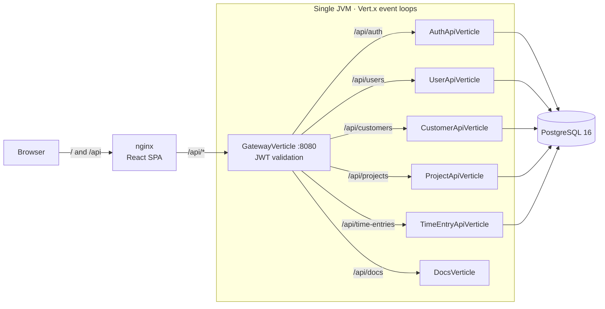
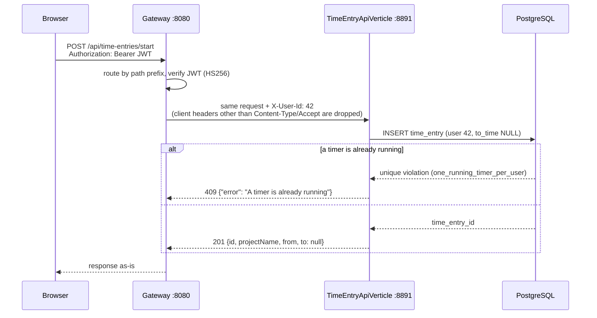

# TimeToTrack

[](https://github.com/AlanKalbermatter/timetotrack/actions/workflows/ci.yml)

A team time tracker. Start a timer against a client project, log time manually, and see where the week went.
The backend is a reactive **Vert.x** modular monolith behind a JWT-validating gateway. The frontend is **React + TypeScript**.


## Features

- **Accounts:** sign up, sign in, JWT sessions (8 h). Teammates see each other in a read-only directory.
- **Customers and projects:** shared by the whole team. Every project belongs to a customer.
- **Time tracking:** one running timer per person, which survives page reloads, plus manual entries for time you forgot to track.
- **Dashboard:** hours today and this week, recent entries, and a 7-day chart, all computed in your browser's time zone.
- **Privacy between teammates:** you only ever see and change your own time entries.

## Quickstart

Requires Docker.

```bash
docker compose up --build
```

Open <http://localhost:3000> and sign in with the demo account **demo@timetotrack.dev / demo1234**, or create your own.
API docs (Swagger UI) are at <http://localhost:3000/api/docs>.

All ports are published on `127.0.0.1` only, because the compose credentials and the default `JWT_SECRET` are public. If 8080 or 5432 is already taken on your machine, move them:

```bash
API_PUBLISHED_PORT=18080 DB_PUBLISHED_PORT=55432 docker compose up --build
```

The web app on :3000 is unaffected, because nginx reaches the API over the compose network.
`docker compose down -v` stops everything and resets the database to the demo data.

## Architecture



Each service verticle owns a vertical slice (routes → service → DAO) and runs its own HTTP server on a loopback port. The gateway is the only public listener.

### Life of a request



## Design decisions

- **A modular monolith with real service boundaries.** Services only talk to each other over HTTP through the gateway, and they bind to `127.0.0.1`. Moving one into its own process means changing a port and host in the gateway's route table. Nothing else knows where a service runs. Until there is a scaling or ownership reason to split, one deployable keeps operations simple.
- **Authenticate once, at the edge.** The gateway verifies the JWT (HS256, 8 h expiry) and forwards the caller as `X-User-Id`. It forwards only an allow-list of request headers, so a client-supplied `X-User-Id` never reaches a service. Services still reject requests without the header as a second line of defense.
- **Invariants live in the database.**
  - "One running timer per user" is a partial unique index.
  - "An entry ends after it starts" is a `CHECK` constraint.
  - Deleting a customer that has projects is blocked by a foreign key.

  Services translate those violations into `409`/`400` responses instead of re-checking in application code, where two concurrent requests could both pass the check.
- **Time is `timestamptz` in storage and ISO-8601 UTC on the wire.** The browser decides what "today" and "this week" mean in its own time zone and sends UTC bounds. The server needs the zone only to bucket the daily chart. Only IANA zone names are accepted, because Postgres reads numeric offsets such as `GMT+3` with the inverted POSIX sign.
- **Compile-time dependency injection.** Dagger builds the object graph at compile time, with no reflection or classpath scanning. A missing binding is a build error, not a startup error.
- **Non-blocking all the way down.** Handlers return Vert.x `Future`s, and the reactive Postgres client never blocks an event loop. PBKDF2 password hashing is CPU-bound, so it runs on the worker pool.
- **Errors are part of the API.** Every error is `{"error": "..."}` with a meaningful status. Unexpected failures are logged server-side and returned as an opaque `500`, so SQL and stack traces never leak.
- **A JSON-only surface.** Request bodies are capped at 64 KB, and multipart file parts are never written to disk, not even before authentication.

## API

| Method | Path | |
|---|---|---|
| POST | `/api/auth/register`, `/api/auth/login` | public; returns `{token, user}` |
| GET | `/api/users`, `/api/users/me` | team directory, current user |
| GET, POST · GET, PUT, DELETE | `/api/customers` · `/api/customers/{id}` | shared across the team |
| GET, POST · GET, PUT, DELETE | `/api/projects` · `/api/projects/{id}` | belong to a customer |
| GET, POST · DELETE | `/api/time-entries` · `/api/time-entries/{id}` | the caller's entries only |
| GET | `/api/time-entries/current` | running timer or `204` |
| POST | `/api/time-entries/start`, `/api/time-entries/stop` | `409` if already running / not running |
| GET | `/api/time-entries/summary?from&to&tz` | totals by project and by day |

| Status | Meaning |
|---|---|
| `400` | invalid input: missing field, wrong JSON type, bad id, bad date or time zone |
| `401` | missing, invalid or expired token |
| `404` | not found, or not yours |
| `409` | duplicate name, timer already running or not running, or deleting something still referenced |

The full contract is in [`backend/src/main/resources/openapi.yaml`](backend/src/main/resources/openapi.yaml), served as Swagger UI at `/api/docs`.

## Development

Prerequisites: **Java 21**, **Maven 3.9+**, **Node 20**, and **Docker** (for Postgres and the integration tests).

```bash
docker compose up -d db                      # Postgres 16 with schema and demo data on 127.0.0.1:5432
cd backend && mvn compile exec:java          # API gateway on :8080 (set HTTP_PORT to change it)
cd frontend && npm install && npm start      # http://localhost:3000, proxies /api to :8080
```

### Tests

```bash
cd backend && mvn verify                     # unit + integration tests (Testcontainers, needs Docker)
cd frontend && npm run typecheck && CI=true npm test && CI=true npm run build
```

| Layer | What is tested | How |
|---|---|---|
| Configuration, JSON parsing, JWT, password hashing | edge cases of pure logic | JUnit unit tests |
| Every service verticle | routes, validation, status codes, per-user scoping | real HTTP against the verticle, real Postgres 16 via Testcontainers |
| Schema | the timer, CHECK and foreign-key invariants | raw SQL against the real schema |
| Whole application | register → login → customer → project → timer → summary; a spoofed `X-User-Id` is ignored; unauthenticated uploads never touch disk | `ApiFlowTest` deploys everything and talks only to the gateway |
| Frontend | durations, week boundaries, datetime-local conversion; types; a warning-free build | Jest, `tsc`, `CI=true` build |

CI runs both suites on every push and pull request ([`.github/workflows/ci.yml`](.github/workflows/ci.yml)).

### Configuration

Application (read by the backend at startup):

| Variable | Default | |
|---|---|---|
| `APP_PROFILE` | `dev` | any other value requires `JWT_SECRET` |
| `JWT_SECRET` | dev-only secret | HS256 signing key |
| `HTTP_PORT` | `8080` | gateway port |
| `DB_HOST` / `DB_PORT` / `DB_NAME` / `DB_USER` / `DB_PASSWORD` | [`dbconfig.json`](backend/src/main/resources/dbconfig.json) | PostgreSQL connection |

Docker Compose:

| Variable | Default | |
|---|---|---|
| `API_PUBLISHED_PORT` | `8080` | host port for the API (always bound to 127.0.0.1) |
| `DB_PUBLISHED_PORT` | `5432` | host port for Postgres (always bound to 127.0.0.1) |
| `JWT_SECRET` | `local-docker-secret-change-me` | set a real secret for anything beyond local use |

## Project layout

```
backend/src/main/java/com/timetotrack/timetotrack/
  Main, MainVerticle     startup: config → pool → Dagger graph → services → gateway
  api/                   one verticle per resource, plus GatewayVerticle and DocsVerticle
  auth/                  PBKDF2 hashing, JWT issuing and verification, register and login
  config/                typed configuration from env vars
  dao/, constant/        reactive Postgres access and its SQL
  database/              pool factory, row and timestamp helpers
  dependencyInjection/   Dagger module and component
  error/                 ApiException hierarchy and Postgres constraint translation
  http/                  ServiceVerticle base class, request parsing, JSON responses
  model/                 records with explicit toJson()
  service/               business rules
backend/src/main/resources/   schema.sql, openapi.yaml, Swagger UI page
frontend/src/
  api/                   typed API client (one module per resource)
  auth/                  session context and route guard
  components/            shared UI, timer widget, modals, chart
  hooks/, utils/         data loading and time helpers
  pages/                 one component per route
db/seed.sql              demo data for docker compose
docs/                    design spec, implementation plan, screenshot
```

## Known limitations

- An entry that crosses midnight counts entirely on its start day in the daily chart.
- Timestamps sent to the API are not range-checked beyond ISO-8601 parsing.
- If the timer is started or stopped in another tab, the dashboard only notices after a reload.
- Gateway-level errors such as a body over 64 KB are returned as plain text, not JSON.
- No login rate limiting, and no per-request timeout between the gateway and the services.

## Further reading

- [Design spec](docs/specs/2026-09-27-mvp-design.md): scope, API and data model decisions.
- [Implementation plan](docs/plans/2026-09-27-timetotrack-mvp.md): the task-by-task, test-first plan this MVP was built from.

## Roadmap

- CSV/PDF export per customer and date range
- Roles (admin / member) and multiple workspaces
- Google Calendar sync
- Pomodoro-style notifications
- Mobile client
