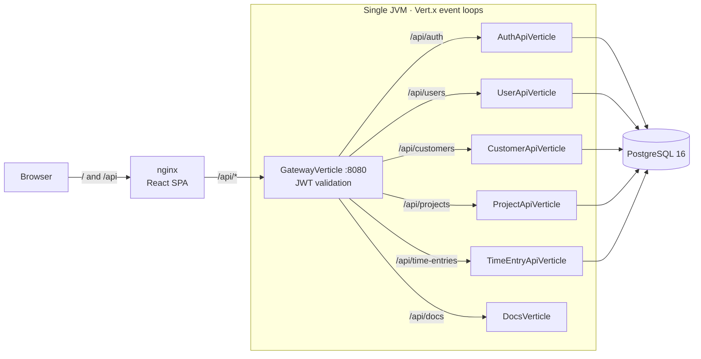

# TimeToTrack MVP Implementation Plan

> **For agentic workers:** REQUIRED SUB-SKILL: Use superpowers:subagent-driven-development (recommended) or superpowers:executing-plans to implement this plan task-by-task. Steps use checkbox (`- [ ]`) syntax for tracking.

**Goal:** Turn the unfinished TimeToTrack prototype into a working, tested, documented time tracker: JWT auth, shared customers and projects, per-user timers and manual entries, a live dashboard, one-command Docker startup, and green CI.

**Architecture:** A Vert.x modular monolith. Each resource (auth, users, customers, projects, time-entries, docs) is a verticle with its own HTTP server bound to `127.0.0.1` on an internal port. A `GatewayVerticle` on `0.0.0.0:8080` is the only public listener. It validates the JWT, strips any client-supplied `X-User-Id`, sets `X-User-Id` from the token, and proxies by path prefix. DAOs and services are `Future`-based over the reactive Postgres client, and Dagger wires the graph at compile time. The frontend is React 19 + TypeScript + Tailwind on CRA. It talks to `/api` (CRA proxy in dev, nginx in Docker).

**Tech Stack:** Java 21, Vert.x 4.5.14 (web, web-client, pg-client, auth-jwt), Dagger 2.51.1, PostgreSQL 16, JUnit 5.13.4, Testcontainers 2.0.5, React 19, TypeScript 4.9, Tailwind 3, axios, Chart.js, Docker Compose, GitHub Actions.

**Spec:** `docs/specs/2026-09-27-mvp-design.md`

## Global Constraints

- Java release **21** (`maven.compiler.release`). On this machine the default `java` is 11. Export `JAVA_HOME=/opt/homebrew/opt/openjdk@21/libexec/openjdk.jdk/Contents/Home` in every shell that runs Maven.
- On this machine, `~/.m2/settings.xml` mirrors everything to a VPN-only Nexus. Run Maven as `mvn -B -s ~/.m2/settings-central.xml …` (created in Task 1). Below, **`$MVN`** means `JAVA_HOME=/opt/homebrew/opt/openjdk@21/libexec/openjdk.jdk/Contents/Home mvn -B -s ~/.m2/settings-central.xml`. CI runs plain `mvn -B`.
- Backend commands run from `backend/`, and frontend commands from `frontend/`.
- Vert.x stays on **4.5.14**. No migration to Vert.x 5.
- All SQL uses `$1, $2, …` placeholders. `?` is never used.
- JSON is camelCase everywhere. Every error response is `{"error": "<message>"}` with status 400/401/404/409/500 (502 only from the gateway when an upstream is down). A 500 never includes SQL, stack traces or exception messages.
- Internal service verticles bind `127.0.0.1`. Only the gateway binds `0.0.0.0`.
- Ports: gateway `8080`, users `8888`, customers `8889`, projects `8890`, time-entries `8891`, docs `8892`, auth `8893`.
- Timestamps are `timestamptz` in Postgres, `Instant` in Java, and ISO-8601 UTC strings in JSON.
- JWT: HS256, secret from `JWT_SECRET`, claims `sub` (user id as a string) and `username`, 8 h expiry. `APP_PROFILE` defaults to `dev`, which uses a fixed dev secret. Any other profile fails startup without `JWT_SECRET`.
- Demo account from the seed: `demo@timetotrack.dev` / `demo1234`.
- Frontend: no new runtime libraries. `CI=true npm run build` treats ESLint warnings as errors, so every frontend task must leave zero warnings.
- Commits use conventional prefixes (`build:`, `feat:`, `fix:`, `test:`, `docs:`, `ci:`, `chore:`). **No `Co-Authored-By` trailer** (repo owner's convention).
- Work happens on branch `feat/mvp` in `~/Workspace/timetotrack-mvp`. The PR targets `master`.

## Review Focus

The spec does not name these five input classes, and they are the most likely to hurt real use. Each one has a pinning test in the task that owns the code:

1. **Wrong JSON types** (`"customerId": "3"`, `"email": 5`) must give 400 with a field-specific message, not a 500. Pinned in Task 3 (`JsonFieldsTest`), Task 5 (`registerValidatesInput`, number email) and Task 6 (`customerIdAsStringIs400`).
2. **Malformed, empty or array request bodies** on POST/PUT must give 400 JSON. Pinned in Task 3 (`ServiceVerticleTest`).
3. **Email case and whitespace variants** (`"  Ana@Example.COM "`) must resolve to the same account for both register (duplicate → 409) and login. Pinned in Task 5.
4. **Non-numeric or non-positive path ids** (`/api/customers/abc`, `/0`) must give 400, not 500. Pinned in Task 3 (`ServiceVerticleTest`) and Task 6.
5. **Summary with bad bounds or time zones** (missing `from`, `from >= to`, `tz=Mars/Olympus`, `tz=+03:00`) must give 400. `+03:00` is rejected because Postgres reads numeric offsets with inverted POSIX sign. Pinned in Task 8.

---

## File Map

Backend (`backend/src/main/java/com/timetotrack/timetotrack/`):

| File | Responsibility |
|---|---|
| `Main.java` | Process entry point: reads env, deploys `MainVerticle`, exits non-zero on startup failure |
| `MainVerticle.java` | Creates the pool, builds the Dagger graph, deploys service verticles then the gateway |
| `config/AppConfig.java`, `ServicePorts.java`, `DbConfig.java` | Typed configuration from env with `dbconfig.json` defaults |
| `database/DatabaseProvider.java` | Reactive PG pool factory |
| `database/Rows.java` | `RowSet` → `List`/`Optional` helpers |
| `database/Timestamps.java` | `Instant` ↔ `OffsetDateTime` (UTC) |
| `error/*` | `ApiException` hierarchy (400/401/404/409) + `PgErrors` SQLSTATE translation |
| `http/Http.java` | Respond/error/parse helpers shared by all verticles |
| `http/JsonFields.java` | Typed, validated reads from request JSON |
| `http/ServiceVerticle.java` | Base class: loopback HTTP server, body limit, `X-User-Id` guard, JSON 404/500 |
| `model/*` | Records with `toJson()` |
| `constant/*SQL.java` | SQL strings |
| `dao/*Dao.java` | Future-based data access |
| `service/*Service.java` | Business rules and error translation |
| `auth/*` | `PasswordHasher`, `TokenService`, `AuthService`, `AuthResult` |
| `api/*Verticle.java` | Route tables for each service, plus `GatewayVerticle` and `DocsVerticle` |
| `dependencyInjection/AppModule.java`, `AppComponent.java` | Dagger graph |

Backend resources: `schema.sql`, `dbconfig.json` (kept), `logback.xml` (kept), `openapi.yaml` (rewritten), `docs/index.html`.
Backend tests (`backend/src/test/java/com/timetotrack/timetotrack/`): `support/` (Await, TestDatabase, IntegrationTest, Fixtures, TestHttp, Ports) plus one test class per unit.

Frontend (`frontend/src/`): `api/` (client, types, one module per resource), `auth/` (AuthContext, RequireAuth), `hooks/useAsync.ts`, `utils/time.ts` (+ test), `components/` (ui.ts, states.tsx, PageCard, ConfirmButton, TimerWidget, modals/Modal + three modals), `pages/` (AuthLayout, Login, Register, Dashboard, TimeEntries, Projects, Customers, Users, Settings).

Root: `docker-compose.yml`, `db/seed.sql`, `.github/workflows/ci.yml`, `README.md`, `.gitignore`, `docs/screenshot-dashboard.png`.

---

### Task 1: Reset the backend to a Java 21 baseline

The prototype's backend layer uses callbacks, leaks SQL errors as 500s, and its tests don't compile. Every class is replaced by later tasks, so it is deleted up front. That keeps every intermediate commit compiling. The old code stays in git history.

**Files:**
- Create: `~/.m2/settings-central.xml` (machine-local, not in the repo)
- Replace: `backend/pom.xml`
- Delete: `backend/src/main/java/**`, `backend/src/test/**`, `backend/mvnw`, `backend/mvnw.cmd`, `.idea/`, `frontend/.idea/`
- Create: `.gitignore` (repo root)

**Interfaces:**
- Produces: a building Maven module with the dependency set every later backend task uses.

- [ ] **Step 1: Create the Central-only Maven settings file**

```bash
printf '<settings/>\n' > ~/.m2/settings-central.xml
```

- [ ] **Step 2: Delete the prototype backend sources, broken tests, broken wrapper and IDE files**

```bash
cd ~/Workspace/timetotrack-mvp
git rm -r -q backend/src/main/java backend/src/test backend/mvnw backend/mvnw.cmd
git rm -r -q --cached .idea frontend/.idea 2>/dev/null || true
rm -rf .idea frontend/.idea
```

- [ ] **Step 3: Add a root `.gitignore`**

```gitignore
# IDE
.idea/
*.iml
.vscode/

# OS
.DS_Store

# Build output
backend/target/
frontend/build/
frontend/node_modules/

# Local env
.env
```

- [ ] **Step 4: Replace `backend/pom.xml`**

```xml
<?xml version="1.0" encoding="UTF-8"?>
<project xmlns="http://maven.apache.org/POM/4.0.0"
         xmlns:xsi="http://www.w3.org/2001/XMLSchema-instance"
         xsi:schemaLocation="http://maven.apache.org/POM/4.0.0 http://maven.apache.org/xsd/maven-4.0.0.xsd">
    <modelVersion>4.0.0</modelVersion>

    <groupId>com.timetotrack</groupId>
    <artifactId>timetotrack</artifactId>
    <version>1.0.0-SNAPSHOT</version>

    <properties>
        <project.build.sourceEncoding>UTF-8</project.build.sourceEncoding>
        <maven.compiler.release>21</maven.compiler.release>

        <maven-compiler-plugin.version>3.14.0</maven-compiler-plugin.version>
        <maven-shade-plugin.version>3.6.0</maven-shade-plugin.version>
        <maven-surefire-plugin.version>3.5.4</maven-surefire-plugin.version>
        <exec-maven-plugin.version>3.5.0</exec-maven-plugin.version>

        <vertx.version>4.5.14</vertx.version>
        <dagger.version>2.51.1</dagger.version>
        <junit-jupiter.version>5.13.4</junit-jupiter.version>
        <testcontainers.version>2.0.5</testcontainers.version>

        <main.class>com.timetotrack.timetotrack.Main</main.class>
    </properties>

    <dependencyManagement>
        <dependencies>
            <dependency>
                <groupId>io.vertx</groupId>
                <artifactId>vertx-stack-depchain</artifactId>
                <version>${vertx.version}</version>
                <type>pom</type>
                <scope>import</scope>
            </dependency>
            <dependency>
                <groupId>org.testcontainers</groupId>
                <artifactId>testcontainers-bom</artifactId>
                <version>${testcontainers.version}</version>
                <type>pom</type>
                <scope>import</scope>
            </dependency>
        </dependencies>
    </dependencyManagement>

    <dependencies>
        <dependency>
            <groupId>io.vertx</groupId>
            <artifactId>vertx-web</artifactId>
        </dependency>
        <dependency>
            <groupId>io.vertx</groupId>
            <artifactId>vertx-web-client</artifactId>
        </dependency>
        <dependency>
            <groupId>io.vertx</groupId>
            <artifactId>vertx-pg-client</artifactId>
        </dependency>
        <dependency>
            <groupId>io.vertx</groupId>
            <artifactId>vertx-auth-jwt</artifactId>
        </dependency>
        <!-- SCRAM-SHA-256, the default password auth since Postgres 14 -->
        <dependency>
            <groupId>com.ongres.scram</groupId>
            <artifactId>client</artifactId>
            <version>2.1</version>
        </dependency>
        <dependency>
            <groupId>com.google.dagger</groupId>
            <artifactId>dagger</artifactId>
            <version>${dagger.version}</version>
        </dependency>
        <dependency>
            <groupId>org.slf4j</groupId>
            <artifactId>slf4j-api</artifactId>
            <version>2.0.9</version>
        </dependency>
        <dependency>
            <groupId>ch.qos.logback</groupId>
            <artifactId>logback-classic</artifactId>
            <version>1.5.13</version>
        </dependency>

        <dependency>
            <groupId>org.junit.jupiter</groupId>
            <artifactId>junit-jupiter</artifactId>
            <version>${junit-jupiter.version}</version>
            <scope>test</scope>
        </dependency>
        <dependency>
            <groupId>org.testcontainers</groupId>
            <artifactId>testcontainers-postgresql</artifactId>
            <scope>test</scope>
        </dependency>
        <!-- Testcontainers checks Postgres readiness over JDBC -->
        <dependency>
            <groupId>org.postgresql</groupId>
            <artifactId>postgresql</artifactId>
            <version>42.7.13</version>
            <scope>test</scope>
        </dependency>
    </dependencies>

    <build>
        <plugins>
            <plugin>
                <artifactId>maven-compiler-plugin</artifactId>
                <version>${maven-compiler-plugin.version}</version>
                <configuration>
                    <release>${maven.compiler.release}</release>
                    <annotationProcessorPaths>
                        <path>
                            <groupId>com.google.dagger</groupId>
                            <artifactId>dagger-compiler</artifactId>
                            <version>${dagger.version}</version>
                        </path>
                    </annotationProcessorPaths>
                </configuration>
            </plugin>

            <plugin>
                <artifactId>maven-shade-plugin</artifactId>
                <version>${maven-shade-plugin.version}</version>
                <executions>
                    <execution>
                        <phase>package</phase>
                        <goals>
                            <goal>shade</goal>
                        </goals>
                        <configuration>
                            <transformers>
                                <transformer implementation="org.apache.maven.plugins.shade.resource.ManifestResourceTransformer">
                                    <mainClass>${main.class}</mainClass>
                                </transformer>
                                <!-- Keeps META-INF/services entries (HashingStrategy, Netty) merged -->
                                <transformer implementation="org.apache.maven.plugins.shade.resource.ServicesResourceTransformer"/>
                            </transformers>
                            <outputFile>${project.build.directory}/timetotrack-fat.jar</outputFile>
                        </configuration>
                    </execution>
                </executions>
            </plugin>

            <plugin>
                <artifactId>maven-surefire-plugin</artifactId>
                <version>${maven-surefire-plugin.version}</version>
            </plugin>

            <plugin>
                <groupId>org.codehaus.mojo</groupId>
                <artifactId>exec-maven-plugin</artifactId>
                <version>${exec-maven-plugin.version}</version>
                <configuration>
                    <mainClass>${main.class}</mainClass>
                </configuration>
            </plugin>
        </plugins>
    </build>
</project>
```

- [ ] **Step 5: Verify the baseline builds**

Run: `cd backend && $MVN verify`
Expected: `BUILD SUCCESS` with `No tests to run.` (there are no sources yet).

- [ ] **Step 6: Commit**

```bash
cd ~/Workspace/timetotrack-mvp
git add -A
git commit -m "build: reset backend to a Java 21 baseline

Remove the callback-based prototype layer, its non-compiling tests,
the broken Maven wrapper and IDE files. Later commits rebuild each
slice on Future-based DAOs with integration tests."
```

---

### Task 2: Configuration, schema and test database

**Files:**
- Create: `backend/src/main/java/com/timetotrack/timetotrack/config/AppConfig.java`
- Create: `backend/src/main/java/com/timetotrack/timetotrack/config/ServicePorts.java`
- Create: `backend/src/main/java/com/timetotrack/timetotrack/config/DbConfig.java`
- Create: `backend/src/main/java/com/timetotrack/timetotrack/database/DatabaseProvider.java`
- Create: `backend/src/main/resources/schema.sql`
- Create: `backend/src/test/java/com/timetotrack/timetotrack/support/Await.java`
- Create: `backend/src/test/java/com/timetotrack/timetotrack/support/TestDatabase.java`
- Create: `backend/src/test/java/com/timetotrack/timetotrack/support/Fixtures.java`
- Create: `backend/src/test/java/com/timetotrack/timetotrack/support/IntegrationTest.java`
- Test: `backend/src/test/java/com/timetotrack/timetotrack/config/AppConfigTest.java`
- Test: `backend/src/test/java/com/timetotrack/timetotrack/database/SchemaTest.java`

**Interfaces:**
- Produces:
  - `record AppConfig(String profile, int gatewayPort, ServicePorts ports, DbConfig db, String jwtSecret)` with `static AppConfig fromEnv(Map<String,String>)` and `DEV_JWT_SECRET`
  - `record ServicePorts(int auth, int users, int customers, int projects, int timeEntries, int docs)` with `DEFAULT`
  - `record DbConfig(String host, int port, String database, String user, String password, int maxPoolSize)`
  - `DatabaseProvider.createPgPool(Vertx, DbConfig): Pool`
  - test support: `Await.await(Future<T>): T`, `Await.awaitFailure(Future<?>): Throwable`, `TestDatabase.dbConfig()`, `TestDatabase.truncateAll(Pool)`, `IntegrationTest` (static `vertx`, `pool`, `fixtures`; truncates before each test), and `Fixtures`: `user(String): int`, `customer(String): int`, `project(int, String): int`, `entry(int userId, int projectId, Instant from, Instant to): long`

- [ ] **Step 1: Write the failing config test**

`backend/src/test/java/com/timetotrack/timetotrack/config/AppConfigTest.java`:

```java
package com.timetotrack.timetotrack.config;

import org.junit.jupiter.api.Test;

import java.util.Map;

import static org.junit.jupiter.api.Assertions.assertEquals;
import static org.junit.jupiter.api.Assertions.assertThrows;
import static org.junit.jupiter.api.Assertions.assertTrue;

class AppConfigTest {

    @Test
    void devProfileFallsBackToDefaults() {
        AppConfig config = AppConfig.fromEnv(Map.of());

        assertEquals("dev", config.profile());
        assertEquals(8080, config.gatewayPort());
        assertEquals(ServicePorts.DEFAULT, config.ports());
        assertEquals(AppConfig.DEV_JWT_SECRET, config.jwtSecret());
        assertEquals(new DbConfig("localhost", 5432, "goldentimer", "goldentimer", "goldentimer123", 5), config.db());
    }

    @Test
    void environmentOverridesDefaults() {
        AppConfig config = AppConfig.fromEnv(Map.of(
                "HTTP_PORT", "9000",
                "DB_HOST", "db",
                "DB_PORT", "6543",
                "DB_NAME", "ttt",
                "DB_USER", "u",
                "DB_PASSWORD", "p",
                "JWT_SECRET", "s3cret"));

        assertEquals(9000, config.gatewayPort());
        assertEquals(new DbConfig("db", 6543, "ttt", "u", "p", 5), config.db());
        assertEquals("s3cret", config.jwtSecret());
    }

    @Test
    void nonDevProfileRequiresJwtSecret() {
        IllegalStateException error = assertThrows(IllegalStateException.class,
                () -> AppConfig.fromEnv(Map.of("APP_PROFILE", "docker")));

        assertTrue(error.getMessage().contains("JWT_SECRET"));
    }

    @Test
    void rejectsNonNumericPort() {
        IllegalStateException error = assertThrows(IllegalStateException.class,
                () -> AppConfig.fromEnv(Map.of("DB_PORT", "abc")));

        assertTrue(error.getMessage().contains("DB_PORT"));
    }
}
```

- [ ] **Step 2: Run it to verify it fails**

Run: `cd backend && $MVN test -Dtest=AppConfigTest`
Expected: COMPILATION ERROR (`cannot find symbol: class AppConfig`).

- [ ] **Step 3: Implement the config records**

`config/DbConfig.java`:

```java
package com.timetotrack.timetotrack.config;

public record DbConfig(String host, int port, String database, String user, String password, int maxPoolSize) {
}
```

`config/ServicePorts.java`:

```java
package com.timetotrack.timetotrack.config;

/** Loopback ports of the internal service verticles. Only the gateway port is public. */
public record ServicePorts(int auth, int users, int customers, int projects, int timeEntries, int docs) {

    public static final ServicePorts DEFAULT = new ServicePorts(8893, 8888, 8889, 8890, 8891, 8892);
}
```

`config/AppConfig.java`:

```java
package com.timetotrack.timetotrack.config;

import io.vertx.core.json.JsonObject;

import java.io.IOException;
import java.io.InputStream;
import java.nio.charset.StandardCharsets;
import java.util.Map;

public record AppConfig(String profile, int gatewayPort, ServicePorts ports, DbConfig db, String jwtSecret) {

    public static final String DEV_JWT_SECRET = "dev-only-insecure-jwt-secret-change-me";
    private static final String DEV_PROFILE = "dev";

    public static AppConfig fromEnv(Map<String, String> env) {
        String profile = env.getOrDefault("APP_PROFILE", DEV_PROFILE);
        String jwtSecret = env.get("JWT_SECRET");
        if (jwtSecret == null || jwtSecret.isBlank()) {
            if (!DEV_PROFILE.equals(profile)) {
                throw new IllegalStateException("JWT_SECRET must be set when APP_PROFILE=" + profile);
            }
            jwtSecret = DEV_JWT_SECRET;
        }
        return new AppConfig(profile, intEnv(env, "HTTP_PORT", 8080), ServicePorts.DEFAULT, dbFromEnv(env), jwtSecret);
    }

    private static DbConfig dbFromEnv(Map<String, String> env) {
        JsonObject defaults = loadDbDefaults();
        return new DbConfig(
                env.getOrDefault("DB_HOST", defaults.getString("host")),
                intEnv(env, "DB_PORT", defaults.getInteger("port")),
                env.getOrDefault("DB_NAME", defaults.getString("database")),
                env.getOrDefault("DB_USER", defaults.getString("user")),
                env.getOrDefault("DB_PASSWORD", defaults.getString("password")),
                defaults.getInteger("maxPoolSize", 5));
    }

    private static int intEnv(Map<String, String> env, String key, int fallback) {
        String value = env.get(key);
        if (value == null || value.isBlank()) {
            return fallback;
        }
        try {
            return Integer.parseInt(value.trim());
        } catch (NumberFormatException e) {
            throw new IllegalStateException(key + " must be an integer, got: " + value);
        }
    }

    private static JsonObject loadDbDefaults() {
        try (InputStream is = AppConfig.class.getClassLoader().getResourceAsStream("dbconfig.json")) {
            if (is == null) {
                throw new IllegalStateException("dbconfig.json not found on the classpath");
            }
            return new JsonObject(new String(is.readAllBytes(), StandardCharsets.UTF_8));
        } catch (IOException e) {
            throw new IllegalStateException("Failed to read dbconfig.json", e);
        }
    }
}
```

- [ ] **Step 4: Run the config test to verify it passes**

Run: `cd backend && $MVN test -Dtest=AppConfigTest`
Expected: `Tests run: 4, Failures: 0, Errors: 0`.

- [ ] **Step 5: Write `schema.sql`**

`backend/src/main/resources/schema.sql`:

```sql
-- TimeToTrack schema. Used by docker-compose (docker-entrypoint-initdb.d) and by the integration tests.

CREATE TABLE IF NOT EXISTS "user" (
    user_id       SERIAL PRIMARY KEY,
    username      TEXT        NOT NULL UNIQUE,
    email         TEXT        NOT NULL UNIQUE,
    full_name     TEXT        NOT NULL,
    password_hash TEXT        NOT NULL,
    created_at    TIMESTAMPTZ NOT NULL DEFAULT now()
);

CREATE TABLE IF NOT EXISTS customer (
    customer_id   SERIAL PRIMARY KEY,
    customer_name TEXT NOT NULL UNIQUE
);

CREATE TABLE IF NOT EXISTS projects (
    project_id   SERIAL PRIMARY KEY,
    project_name TEXT NOT NULL,
    customer_id  INT  NOT NULL REFERENCES customer (customer_id) ON DELETE RESTRICT,
    UNIQUE (customer_id, project_name)
);

CREATE TABLE IF NOT EXISTS time_entry (
    time_entry_id BIGSERIAL PRIMARY KEY,
    user_id       INT         NOT NULL REFERENCES "user" (user_id) ON DELETE CASCADE,
    project_id    INT         NOT NULL REFERENCES projects (project_id) ON DELETE RESTRICT,
    description   TEXT,
    from_time     TIMESTAMPTZ NOT NULL,
    to_time       TIMESTAMPTZ,
    CONSTRAINT time_entry_ends_after_start CHECK (to_time IS NULL OR to_time > from_time)
);

-- A user can have at most one running timer (to_time IS NULL).
CREATE UNIQUE INDEX IF NOT EXISTS one_running_timer_per_user ON time_entry (user_id) WHERE to_time IS NULL;
CREATE INDEX IF NOT EXISTS time_entry_user_from ON time_entry (user_id, from_time DESC);
```

- [ ] **Step 6: Add the pool factory**

`database/DatabaseProvider.java`:

```java
package com.timetotrack.timetotrack.database;

import com.timetotrack.timetotrack.config.DbConfig;
import io.vertx.core.Vertx;
import io.vertx.pgclient.PgBuilder;
import io.vertx.pgclient.PgConnectOptions;
import io.vertx.sqlclient.Pool;
import io.vertx.sqlclient.PoolOptions;

public final class DatabaseProvider {

    private DatabaseProvider() {
    }

    public static Pool createPgPool(Vertx vertx, DbConfig db) {
        PgConnectOptions connectOptions = new PgConnectOptions()
                .setHost(db.host())
                .setPort(db.port())
                .setDatabase(db.database())
                .setUser(db.user())
                .setPassword(db.password());

        return PgBuilder.pool()
                .with(new PoolOptions().setMaxSize(db.maxPoolSize()))
                .connectingTo(connectOptions)
                .using(vertx)
                .build();
    }
}
```

- [ ] **Step 7: Add the test support classes**

`support/Await.java`:

```java
package com.timetotrack.timetotrack.support;

import io.vertx.core.Future;

import java.util.concurrent.ExecutionException;
import java.util.concurrent.TimeUnit;
import java.util.concurrent.TimeoutException;

/** Blocks a test thread on a Vert.x Future. Never call from an event loop. */
public final class Await {

    private static final long TIMEOUT_SECONDS = 15;

    private Await() {
    }

    public static <T> T await(Future<T> future) {
        try {
            return future.toCompletionStage().toCompletableFuture().get(TIMEOUT_SECONDS, TimeUnit.SECONDS);
        } catch (ExecutionException e) {
            if (e.getCause() instanceof RuntimeException runtime) {
                throw runtime;
            }
            throw new IllegalStateException(e.getCause());
        } catch (InterruptedException e) {
            Thread.currentThread().interrupt();
            throw new IllegalStateException(e);
        } catch (TimeoutException e) {
            throw new IllegalStateException("Future did not complete within " + TIMEOUT_SECONDS + "s", e);
        }
    }

    public static Throwable awaitFailure(Future<?> future) {
        try {
            future.toCompletionStage().toCompletableFuture().get(TIMEOUT_SECONDS, TimeUnit.SECONDS);
        } catch (ExecutionException e) {
            return e.getCause();
        } catch (InterruptedException e) {
            Thread.currentThread().interrupt();
            throw new IllegalStateException(e);
        } catch (TimeoutException e) {
            throw new IllegalStateException("Future did not complete within " + TIMEOUT_SECONDS + "s", e);
        }
        throw new AssertionError("Expected the future to fail, but it succeeded");
    }
}
```

`support/TestDatabase.java`:

```java
package com.timetotrack.timetotrack.support;

import com.timetotrack.timetotrack.config.DbConfig;
import io.vertx.sqlclient.Pool;
import org.testcontainers.postgresql.PostgreSQLContainer;
import org.testcontainers.utility.MountableFile;

import static com.timetotrack.timetotrack.support.Await.await;

/** One Postgres 16 container per test JVM, initialised with the production schema.sql. */
public final class TestDatabase {

    private static final PostgreSQLContainer POSTGRES = new PostgreSQLContainer("postgres:16-alpine")
            .withCopyFileToContainer(
                    MountableFile.forClasspathResource("schema.sql"),
                    "/docker-entrypoint-initdb.d/01-schema.sql");

    static {
        // Testcontainers' Ryuk sidecar removes the container when the JVM exits.
        POSTGRES.start();
    }

    private TestDatabase() {
    }

    public static DbConfig dbConfig() {
        return new DbConfig(
                POSTGRES.getHost(),
                POSTGRES.getMappedPort(5432),
                POSTGRES.getDatabaseName(),
                POSTGRES.getUsername(),
                POSTGRES.getPassword(),
                4);
    }

    public static void truncateAll(Pool pool) {
        await(pool.query("TRUNCATE time_entry, projects, customer, \"user\" RESTART IDENTITY CASCADE").execute());
    }
}
```

`support/Fixtures.java`:

```java
package com.timetotrack.timetotrack.support;

import io.vertx.sqlclient.Pool;
import io.vertx.sqlclient.Tuple;

import java.time.Instant;
import java.time.OffsetDateTime;
import java.time.ZoneOffset;

import static com.timetotrack.timetotrack.support.Await.await;

/** Inserts rows directly with SQL, bypassing services, to arrange test state. */
public final class Fixtures {

    private final Pool pool;

    public Fixtures(Pool pool) {
        this.pool = pool;
    }

    public int user(String username) {
        return await(pool.preparedQuery(
                        "INSERT INTO \"user\" (username, email, full_name, password_hash) VALUES ($1, $2, $3, 'not-a-real-hash') RETURNING user_id")
                .execute(Tuple.of(username, username + "@example.com", username)))
                .iterator().next().getInteger("user_id");
    }

    public int customer(String name) {
        return await(pool.preparedQuery("INSERT INTO customer (customer_name) VALUES ($1) RETURNING customer_id")
                .execute(Tuple.of(name)))
                .iterator().next().getInteger("customer_id");
    }

    public int project(int customerId, String name) {
        return await(pool.preparedQuery("INSERT INTO projects (project_name, customer_id) VALUES ($1, $2) RETURNING project_id")
                .execute(Tuple.of(name, customerId)))
                .iterator().next().getInteger("project_id");
    }

    public long entry(int userId, int projectId, Instant from, Instant to) {
        return await(pool.preparedQuery(
                        "INSERT INTO time_entry (user_id, project_id, from_time, to_time) VALUES ($1, $2, $3, $4) RETURNING time_entry_id")
                .execute(Tuple.of(userId, projectId, utc(from), to == null ? null : utc(to))))
                .iterator().next().getLong("time_entry_id");
    }

    private static OffsetDateTime utc(Instant instant) {
        return instant.atOffset(ZoneOffset.UTC);
    }
}
```

`support/IntegrationTest.java`:

```java
package com.timetotrack.timetotrack.support;

import com.timetotrack.timetotrack.database.DatabaseProvider;
import io.vertx.core.Vertx;
import io.vertx.sqlclient.Pool;
import org.junit.jupiter.api.AfterAll;
import org.junit.jupiter.api.BeforeAll;
import org.junit.jupiter.api.BeforeEach;

import static com.timetotrack.timetotrack.support.Await.await;

/** Base class for tests that need Postgres: one Vert.x + pool per class, a clean database per test. */
public abstract class IntegrationTest {

    protected static Vertx vertx;
    protected static Pool pool;
    protected static Fixtures fixtures;

    @BeforeAll
    static void startInfrastructure() {
        vertx = Vertx.vertx();
        pool = DatabaseProvider.createPgPool(vertx, TestDatabase.dbConfig());
        fixtures = new Fixtures(pool);
    }

    @AfterAll
    static void stopInfrastructure() {
        await(pool.close());
        await(vertx.close());
    }

    @BeforeEach
    void cleanDatabase() {
        TestDatabase.truncateAll(pool);
    }
}
```

- [ ] **Step 8: Write the schema invariant test**

`database/SchemaTest.java`:

```java
package com.timetotrack.timetotrack.database;

import com.timetotrack.timetotrack.support.IntegrationTest;
import io.vertx.pgclient.PgException;
import io.vertx.sqlclient.Tuple;
import org.junit.jupiter.api.Test;

import java.time.Instant;
import java.time.ZoneOffset;

import static com.timetotrack.timetotrack.support.Await.awaitFailure;
import static org.junit.jupiter.api.Assertions.assertEquals;
import static org.junit.jupiter.api.Assertions.assertInstanceOf;

class SchemaTest extends IntegrationTest {

    private static final Instant NINE = Instant.parse("2026-01-01T09:00:00Z");

    @Test
    void allowsOnlyOneRunningTimerPerUser() {
        int userId = fixtures.user("ana");
        int projectId = fixtures.project(fixtures.customer("Acme"), "Web");
        fixtures.entry(userId, projectId, NINE, null);

        Throwable failure = awaitFailure(insertEntry(userId, projectId, NINE.plusSeconds(3600), null));

        assertEquals("23505", assertInstanceOf(PgException.class, failure).getSqlState());
    }

    @Test
    void rejectsEntriesThatEndBeforeTheyStart() {
        int userId = fixtures.user("ana");
        int projectId = fixtures.project(fixtures.customer("Acme"), "Web");

        Throwable failure = awaitFailure(insertEntry(userId, projectId, NINE, NINE.minusSeconds(60)));

        assertEquals("23514", assertInstanceOf(PgException.class, failure).getSqlState());
    }

    @Test
    void blocksDeletingCustomersThatHaveProjects() {
        int customerId = fixtures.customer("Acme");
        fixtures.project(customerId, "Web");

        Throwable failure = awaitFailure(pool.preparedQuery("DELETE FROM customer WHERE customer_id = $1")
                .execute(Tuple.of(customerId)));

        assertEquals("23503", assertInstanceOf(PgException.class, failure).getSqlState());
    }

    private io.vertx.core.Future<?> insertEntry(int userId, int projectId, Instant from, Instant to) {
        return pool.preparedQuery("INSERT INTO time_entry (user_id, project_id, from_time, to_time) VALUES ($1, $2, $3, $4)")
                .execute(Tuple.of(userId, projectId, from.atOffset(ZoneOffset.UTC), to == null ? null : to.atOffset(ZoneOffset.UTC)));
    }
}
```

- [ ] **Step 9: Run the schema test to verify it passes**

Docker must be running. Run: `cd backend && $MVN test -Dtest='AppConfigTest,SchemaTest'`
Expected: `Tests run: 7, Failures: 0, Errors: 0`.

- [ ] **Step 10: Commit**

```bash
git add backend/src
git commit -m "feat: add typed configuration, versioned schema and Postgres test harness"
```

---

### Task 3: HTTP foundation — errors, JSON parsing, service verticle base

**Files:**
- Create: `backend/src/main/java/com/timetotrack/timetotrack/error/ApiException.java`
- Create: `.../error/ValidationException.java`, `.../error/UnauthorizedException.java`, `.../error/NotFoundException.java`, `.../error/ConflictException.java`
- Create: `.../error/PgErrors.java`
- Create: `.../http/Http.java`
- Create: `.../http/JsonFields.java`
- Create: `.../http/ServiceVerticle.java`
- Create: `backend/src/test/java/com/timetotrack/timetotrack/support/Ports.java`
- Create: `backend/src/test/java/com/timetotrack/timetotrack/support/TestHttp.java`
- Test: `backend/src/test/java/com/timetotrack/timetotrack/http/JsonFieldsTest.java`
- Test: `backend/src/test/java/com/timetotrack/timetotrack/http/ServiceVerticleTest.java`

**Interfaces:**
- Consumes: nothing from earlier tasks except test `Await`.
- Produces:
  - `ApiException(int status, String message)` with `status()`. Subclasses `ValidationException` (400), `UnauthorizedException` (401), `NotFoundException` (404, plus `static <T> Future<T> require(Optional<T>, String message)`), `ConflictException` (409)
  - `PgErrors.UNIQUE_VIOLATION`, `FOREIGN_KEY_VIOLATION`, `CHECK_VIOLATION`, `is(Throwable, String)`, `<T> Function<Throwable, Future<T>> translate(String sqlState, Supplier<ApiException>)` (for `Future.recover`)
  - `Http.USER_ID_HEADER`, `respond(RoutingContext, int successStatus, Supplier<Future<?>>)` (a `JsonObject`/`JsonArray` result is sent with the status, and `null` → 204), `error(RoutingContext, Throwable)`, `send(RoutingContext, int, String)`, `errorBody(String)`, `userId(RoutingContext): int`, `pathId(RoutingContext, String): long`, `pathIntId(RoutingContext, String): int`, `body(RoutingContext): JsonObject`, `queryParam(RoutingContext, String): String`, `queryInstant(RoutingContext, String): Instant` (null when absent), `<T> toArray(List<T>, Function<T, JsonObject>): JsonArray`
  - `JsonFields.optionalString` (trimmed, blank → null), `requiredString`, `optionalRawString` (untrimmed, for passwords), `requiredInt`, `requiredInstant`, `parseInstant(String field, String raw)`
  - `abstract class ServiceVerticle(int port)` with `protected abstract void routes(Router)` and `protected boolean requiresUser()` (default `true`), plus `INTERNAL_HOST = "127.0.0.1"`
  - test support: `Ports.free(): int`, `TestHttp(int port)` with `asUser(int)`, `withToken(String)`, `withHeader(String, String)`, `get`, `delete`, `post(path, JsonObject)`, `put`, `send(method, path, rawBody)`, and `TestHttp.Response(int status, String body)` with `json()`, `jsonArray()`, `error()`

- [ ] **Step 1: Write the failing `JsonFields` test**

`http/JsonFieldsTest.java`:

```java
package com.timetotrack.timetotrack.http;

import com.timetotrack.timetotrack.error.ValidationException;
import io.vertx.core.json.JsonObject;
import org.junit.jupiter.api.Test;

import java.time.Instant;

import static org.junit.jupiter.api.Assertions.assertEquals;
import static org.junit.jupiter.api.Assertions.assertNull;
import static org.junit.jupiter.api.Assertions.assertThrows;

class JsonFieldsTest {

    @Test
    void optionalStringTrimsAndTreatsBlankAsAbsent() {
        JsonObject body = new JsonObject().put("name", "  Acme  ").put("blank", "   ");

        assertEquals("Acme", JsonFields.optionalString(body, "name"));
        assertNull(JsonFields.optionalString(body, "blank"));
        assertNull(JsonFields.optionalString(body, "missing"));
    }

    @Test
    void rawStringKeepsWhitespace() {
        assertEquals(" pass word ", JsonFields.optionalRawString(new JsonObject().put("password", " pass word "), "password"));
    }

    @Test
    void rejectsNonStringValues() {
        ValidationException error = assertThrows(ValidationException.class,
                () -> JsonFields.optionalString(new JsonObject().put("email", 5), "email"));

        assertEquals("email must be a string", error.getMessage());
    }

    @Test
    void requiredStringReportsMissingField() {
        ValidationException error = assertThrows(ValidationException.class,
                () -> JsonFields.requiredString(new JsonObject(), "name"));

        assertEquals("name is required", error.getMessage());
    }

    @Test
    void requiredIntAcceptsOnlyIntegers() {
        assertEquals(3, JsonFields.requiredInt(new JsonObject().put("customerId", 3), "customerId"));
        assertEquals("customerId must be an integer", assertThrows(ValidationException.class,
                () -> JsonFields.requiredInt(new JsonObject().put("customerId", "3"), "customerId")).getMessage());
        assertEquals("customerId must be an integer", assertThrows(ValidationException.class,
                () -> JsonFields.requiredInt(new JsonObject().put("customerId", 3.5), "customerId")).getMessage());
        assertEquals("customerId is required", assertThrows(ValidationException.class,
                () -> JsonFields.requiredInt(new JsonObject(), "customerId")).getMessage());
    }

    @Test
    void requiredInstantParsesIsoTimestampsWithOffset() {
        assertEquals(Instant.parse("2026-03-10T09:00:00Z"),
                JsonFields.requiredInstant(new JsonObject().put("from", "2026-03-10T09:00:00.000Z"), "from"));
        assertEquals(Instant.parse("2026-03-10T12:00:00Z"),
                JsonFields.requiredInstant(new JsonObject().put("from", "2026-03-10T09:00:00-03:00"), "from"));
        assertThrows(ValidationException.class,
                () -> JsonFields.requiredInstant(new JsonObject().put("from", "2026-03-10 09:00"), "from"));
    }
}
```

- [ ] **Step 2: Run it to verify it fails**

Run: `cd backend && $MVN test -Dtest=JsonFieldsTest`
Expected: COMPILATION ERROR (`package com.timetotrack.timetotrack.error does not exist`).

- [ ] **Step 3: Implement the error hierarchy**

`error/ApiException.java`:

```java
package com.timetotrack.timetotrack.error;

/** A failure whose message is safe to show to API clients, mapped to an HTTP status. */
public class ApiException extends RuntimeException {

    private final int status;

    public ApiException(int status, String message) {
        super(message);
        this.status = status;
    }

    public int status() {
        return status;
    }
}
```

`error/ValidationException.java`:

```java
package com.timetotrack.timetotrack.error;

public class ValidationException extends ApiException {

    public ValidationException(String message) {
        super(400, message);
    }
}
```

`error/UnauthorizedException.java`:

```java
package com.timetotrack.timetotrack.error;

public class UnauthorizedException extends ApiException {

    public UnauthorizedException(String message) {
        super(401, message);
    }
}
```

`error/NotFoundException.java`:

```java
package com.timetotrack.timetotrack.error;

import io.vertx.core.Future;

import java.util.Optional;

public class NotFoundException extends ApiException {

    public NotFoundException(String message) {
        super(404, message);
    }

    public static <T> Future<T> require(Optional<T> value, String message) {
        return value.map(Future::succeededFuture).orElseGet(() -> Future.failedFuture(new NotFoundException(message)));
    }
}
```

`error/ConflictException.java`:

```java
package com.timetotrack.timetotrack.error;

public class ConflictException extends ApiException {

    public ConflictException(String message) {
        super(409, message);
    }
}
```

`error/PgErrors.java`:

```java
package com.timetotrack.timetotrack.error;

import io.vertx.core.Future;
import io.vertx.pgclient.PgException;

import java.util.function.Function;
import java.util.function.Supplier;

/** Translates Postgres constraint violations into client-facing API errors. */
public final class PgErrors {

    public static final String UNIQUE_VIOLATION = "23505";
    public static final String FOREIGN_KEY_VIOLATION = "23503";
    public static final String CHECK_VIOLATION = "23514";

    private PgErrors() {
    }

    public static boolean is(Throwable failure, String sqlState) {
        return failure instanceof PgException pg && sqlState.equals(pg.getSqlState());
    }

    /** For {@code Future.recover}: replaces a matching violation, passes anything else through untouched. */
    public static <T> Function<Throwable, Future<T>> translate(String sqlState, Supplier<ApiException> replacement) {
        return failure -> Future.failedFuture(is(failure, sqlState) ? replacement.get() : failure);
    }
}
```

- [ ] **Step 4: Implement `JsonFields`**

`http/JsonFields.java`:

```java
package com.timetotrack.timetotrack.http;

import com.timetotrack.timetotrack.error.ValidationException;
import io.vertx.core.json.JsonObject;

import java.time.Instant;
import java.time.OffsetDateTime;
import java.time.format.DateTimeParseException;

/** Typed reads from request JSON. Every type or presence problem becomes a 400 with the field name. */
public final class JsonFields {

    private JsonFields() {
    }

    public static String optionalString(JsonObject body, String field) {
        String raw = optionalRawString(body, field);
        if (raw == null) {
            return null;
        }
        String trimmed = raw.trim();
        return trimmed.isEmpty() ? null : trimmed;
    }

    public static String requiredString(JsonObject body, String field) {
        String value = optionalString(body, field);
        if (value == null) {
            throw new ValidationException(field + " is required");
        }
        return value;
    }

    /** Untrimmed read, for values where whitespace is significant (passwords). */
    public static String optionalRawString(JsonObject body, String field) {
        Object value = body.getValue(field);
        if (value == null) {
            return null;
        }
        if (!(value instanceof String text)) {
            throw new ValidationException(field + " must be a string");
        }
        return text;
    }

    public static int requiredInt(JsonObject body, String field) {
        Object value = body.getValue(field);
        if (value == null) {
            throw new ValidationException(field + " is required");
        }
        if (value instanceof Integer number) {
            return number;
        }
        throw new ValidationException(field + " must be an integer");
    }

    public static Instant requiredInstant(JsonObject body, String field) {
        return parseInstant(field, requiredString(body, field));
    }

    public static Instant parseInstant(String field, String raw) {
        try {
            return OffsetDateTime.parse(raw).toInstant();
        } catch (DateTimeParseException e) {
            throw new ValidationException(field + " must be an ISO-8601 timestamp with an offset, e.g. 2026-01-31T09:00:00Z");
        }
    }
}
```

- [ ] **Step 5: Run the `JsonFields` test to verify it passes**

Run: `cd backend && $MVN test -Dtest=JsonFieldsTest`
Expected: `Tests run: 6, Failures: 0, Errors: 0`.

- [ ] **Step 6: Add the HTTP test support**

`support/Ports.java`:

```java
package com.timetotrack.timetotrack.support;

import java.io.IOException;
import java.io.UncheckedIOException;
import java.net.ServerSocket;

public final class Ports {

    private Ports() {
    }

    public static int free() {
        try (ServerSocket socket = new ServerSocket(0)) {
            socket.setReuseAddress(true);
            return socket.getLocalPort();
        } catch (IOException e) {
            throw new UncheckedIOException(e);
        }
    }
}
```

`support/TestHttp.java`:

```java
package com.timetotrack.timetotrack.support;

import io.vertx.core.json.JsonArray;
import io.vertx.core.json.JsonObject;

import java.io.IOException;
import java.io.UncheckedIOException;
import java.net.URI;
import java.net.http.HttpClient;
import java.net.http.HttpRequest;
import java.net.http.HttpResponse;
import java.time.Duration;
import java.util.HashMap;
import java.util.Map;

/** Blocking HTTP client for tests. Immutable: the with*() methods return a copy. */
public final class TestHttp {

    public record Response(int status, String body) {

        public JsonObject json() {
            return new JsonObject(body);
        }

        public JsonArray jsonArray() {
            return new JsonArray(body);
        }

        public String error() {
            return json().getString("error");
        }
    }

    private static final HttpClient CLIENT = HttpClient.newBuilder().connectTimeout(Duration.ofSeconds(5)).build();

    private final int port;
    private final Map<String, String> headers;

    public TestHttp(int port) {
        this(port, Map.of());
    }

    private TestHttp(int port, Map<String, String> headers) {
        this.port = port;
        this.headers = Map.copyOf(headers);
    }

    public TestHttp withHeader(String name, String value) {
        Map<String, String> copy = new HashMap<>(headers);
        copy.put(name, value);
        return new TestHttp(port, copy);
    }

    public TestHttp asUser(int userId) {
        return withHeader("X-User-Id", String.valueOf(userId));
    }

    public TestHttp withToken(String token) {
        return withHeader("Authorization", "Bearer " + token);
    }

    public Response get(String path) {
        return send("GET", path, null);
    }

    public Response delete(String path) {
        return send("DELETE", path, null);
    }

    public Response post(String path, JsonObject body) {
        return send("POST", path, body == null ? null : body.encode());
    }

    public Response put(String path, JsonObject body) {
        return send("PUT", path, body.encode());
    }

    public Response send(String method, String path, String rawBody) {
        HttpRequest.Builder builder = HttpRequest.newBuilder(URI.create("http://127.0.0.1:" + port + path))
                .timeout(Duration.ofSeconds(15))
                .method(method, rawBody == null
                        ? HttpRequest.BodyPublishers.noBody()
                        : HttpRequest.BodyPublishers.ofString(rawBody));
        if (rawBody != null) {
            builder.header("Content-Type", "application/json");
        }
        headers.forEach(builder::header);
        try {
            HttpResponse<String> response = CLIENT.send(builder.build(), HttpResponse.BodyHandlers.ofString());
            return new Response(response.statusCode(), response.body());
        } catch (IOException e) {
            throw new UncheckedIOException(e);
        } catch (InterruptedException e) {
            Thread.currentThread().interrupt();
            throw new IllegalStateException(e);
        }
    }
}
```

- [ ] **Step 7: Write the failing `ServiceVerticle` test**

`http/ServiceVerticleTest.java`:

```java
package com.timetotrack.timetotrack.http;

import com.timetotrack.timetotrack.error.ValidationException;
import com.timetotrack.timetotrack.support.Ports;
import com.timetotrack.timetotrack.support.TestHttp;
import com.timetotrack.timetotrack.support.TestHttp.Response;
import io.vertx.core.Future;
import io.vertx.core.Vertx;
import io.vertx.core.json.JsonObject;
import io.vertx.ext.web.Router;
import org.junit.jupiter.api.AfterAll;
import org.junit.jupiter.api.BeforeAll;
import org.junit.jupiter.api.Test;

import static com.timetotrack.timetotrack.support.Await.await;
import static org.junit.jupiter.api.Assertions.assertEquals;
import static org.junit.jupiter.api.Assertions.assertFalse;

class ServiceVerticleTest {

    /** Minimal service exercising every Http helper path. */
    static final class ProbeVerticle extends ServiceVerticle {

        ProbeVerticle(int port) {
            super(port);
        }

        @Override
        protected void routes(Router router) {
            router.get("/ok").handler(ctx -> Http.respond(ctx, 200,
                    () -> Future.succeededFuture(new JsonObject().put("ok", true).put("user", Http.userId(ctx)))));
            router.post("/echo").handler(ctx -> Http.respond(ctx, 201, () -> Future.succeededFuture(Http.body(ctx))));
            router.get("/none").handler(ctx -> Http.respond(ctx, 200, () -> Future.succeededFuture(null)));
            router.get("/invalid").handler(ctx -> Http.respond(ctx, 200, () -> {
                throw new ValidationException("bad input");
            }));
            router.get("/boom").handler(ctx -> Http.respond(ctx, 200,
                    () -> Future.failedFuture(new IllegalStateException("secret detail"))));
            router.get("/items/:id").handler(ctx -> Http.respond(ctx, 200,
                    () -> Future.succeededFuture(new JsonObject().put("id", Http.pathId(ctx, "id")))));
        }
    }

    private static Vertx vertx;
    private static TestHttp anonymous;
    private static TestHttp http;

    @BeforeAll
    static void deploy() {
        vertx = Vertx.vertx();
        int port = Ports.free();
        await(vertx.deployVerticle(new ProbeVerticle(port)));
        anonymous = new TestHttp(port);
        http = anonymous.asUser(7);
    }

    @AfterAll
    static void close() {
        await(vertx.close());
    }

    @Test
    void respondsWithJsonAndReadsUserHeader() {
        Response response = http.get("/ok");

        assertEquals(200, response.status());
        assertEquals(new JsonObject().put("ok", true).put("user", 7), response.json());
    }

    @Test
    void requiresUserHeader() {
        assertEquals(401, anonymous.get("/ok").status());
        assertEquals(401, anonymous.withHeader("X-User-Id", "abc").get("/ok").status());
        assertEquals("Missing authenticated user", anonymous.get("/ok").error());
    }

    @Test
    void echoesJsonBodies() {
        Response response = http.post("/echo", new JsonObject().put("a", 1));

        assertEquals(201, response.status());
        assertEquals(new JsonObject().put("a", 1), response.json());
    }

    @Test
    void rejectsMalformedEmptyAndArrayBodies() {
        assertEquals(400, http.send("POST", "/echo", "{not json").status());
        assertEquals(400, http.send("POST", "/echo", "").status());
        assertEquals(400, http.send("POST", "/echo", "[1,2]").status());
        assertEquals("Request body must be a JSON object", http.send("POST", "/echo", "[1,2]").error());
    }

    @Test
    void nullResultIsNoContent() {
        assertEquals(204, http.get("/none").status());
    }

    @Test
    void apiExceptionsKeepTheirStatusAndMessage() {
        Response response = http.get("/invalid");

        assertEquals(400, response.status());
        assertEquals("bad input", response.error());
    }

    @Test
    void unexpectedFailuresAreOpaque500s() {
        Response response = http.get("/boom");

        assertEquals(500, response.status());
        assertEquals("Internal server error", response.error());
        assertFalse(response.body().contains("secret"));
    }

    @Test
    void rejectsNonNumericAndNonPositiveIds() {
        assertEquals(200, http.get("/items/12").status());
        assertEquals(400, http.get("/items/abc").status());
        assertEquals(400, http.get("/items/0").status());
    }

    @Test
    void unknownRoutesAreJson404s() {
        Response response = http.get("/nope");

        assertEquals(404, response.status());
        assertEquals("No route for GET /nope", response.error());
    }
}
```

- [ ] **Step 8: Run it to verify it fails**

Run: `cd backend && $MVN test -Dtest=ServiceVerticleTest`
Expected: COMPILATION ERROR (`cannot find symbol: class ServiceVerticle`).

- [ ] **Step 9: Implement `Http`**

`http/Http.java`:

```java
package com.timetotrack.timetotrack.http;

import com.timetotrack.timetotrack.error.ApiException;
import com.timetotrack.timetotrack.error.UnauthorizedException;
import com.timetotrack.timetotrack.error.ValidationException;
import io.vertx.core.Future;
import io.vertx.core.json.DecodeException;
import io.vertx.core.json.JsonArray;
import io.vertx.core.json.JsonObject;
import io.vertx.ext.web.RoutingContext;
import org.slf4j.Logger;
import org.slf4j.LoggerFactory;

import java.time.Instant;
import java.util.List;
import java.util.function.Function;
import java.util.function.Supplier;

/** Request parsing and response writing shared by every service verticle. */
public final class Http {

    /** Set by the gateway from the validated JWT; internal services trust nothing else. */
    public static final String USER_ID_HEADER = "X-User-Id";

    private static final Logger LOGGER = LoggerFactory.getLogger(Http.class);

    private Http() {
    }

    /**
     * Runs {@code action} and writes its result: JsonObject/JsonArray with {@code successStatus}, null as 204.
     * Synchronous exceptions (e.g. validation while parsing) and failed futures both go through {@link #error}.
     */
    public static void respond(RoutingContext ctx, int successStatus, Supplier<Future<?>> action) {
        Future<?> result;
        try {
            result = action.get();
        } catch (RuntimeException e) {
            error(ctx, e);
            return;
        }
        result.onSuccess(value -> {
            if (value == null) {
                ctx.response().setStatusCode(204).end();
            } else if (value instanceof JsonObject json) {
                send(ctx, successStatus, json.encode());
            } else if (value instanceof JsonArray json) {
                send(ctx, successStatus, json.encode());
            } else {
                error(ctx, new IllegalStateException("Unsupported response type " + value.getClass().getName()));
            }
        }).onFailure(failure -> error(ctx, failure));
    }

    public static void error(RoutingContext ctx, Throwable failure) {
        if (ctx.response().ended()) {
            return;
        }
        if (failure instanceof ApiException api) {
            send(ctx, api.status(), errorBody(api.getMessage()));
            return;
        }
        LOGGER.error("Unhandled error on {} {}", ctx.request().method(), ctx.request().path(), failure);
        send(ctx, 500, errorBody("Internal server error"));
    }

    public static void send(RoutingContext ctx, int status, String json) {
        ctx.response()
                .setStatusCode(status)
                .putHeader("Content-Type", "application/json")
                .end(json);
    }

    public static String errorBody(String message) {
        return new JsonObject().put("error", message).encode();
    }

    public static int userId(RoutingContext ctx) {
        String header = ctx.request().getHeader(USER_ID_HEADER);
        if (header == null) {
            throw new UnauthorizedException("Missing authenticated user");
        }
        try {
            return Integer.parseInt(header);
        } catch (NumberFormatException e) {
            throw new UnauthorizedException("Invalid authenticated user");
        }
    }

    public static long pathId(RoutingContext ctx, String name) {
        String raw = ctx.pathParam(name);
        try {
            long id = Long.parseLong(raw);
            if (id > 0) {
                return id;
            }
        } catch (NumberFormatException ignored) {
            // falls through to the validation error below
        }
        throw new ValidationException("Invalid " + name + ": " + raw);
    }

    public static int pathIntId(RoutingContext ctx, String name) {
        long id = pathId(ctx, name);
        if (id > Integer.MAX_VALUE) {
            throw new ValidationException("Invalid " + name + ": " + id);
        }
        return (int) id;
    }

    public static JsonObject body(RoutingContext ctx) {
        try {
            JsonObject body = ctx.body().asJsonObject();
            if (body != null) {
                return body;
            }
        } catch (DecodeException | ClassCastException ignored) {
            // falls through to the validation error below
        }
        throw new ValidationException("Request body must be a JSON object");
    }

    public static String queryParam(RoutingContext ctx, String name) {
        String raw = ctx.request().getParam(name);
        return raw == null || raw.isBlank() ? null : raw.trim();
    }

    public static Instant queryInstant(RoutingContext ctx, String name) {
        String raw = queryParam(ctx, name);
        return raw == null ? null : JsonFields.parseInstant(name, raw);
    }

    public static <T> JsonArray toArray(List<T> items, Function<T, JsonObject> toJson) {
        return new JsonArray(items.stream().map(toJson).toList());
    }
}
```

- [ ] **Step 10: Implement `ServiceVerticle`**

`http/ServiceVerticle.java`:

```java
package com.timetotrack.timetotrack.http;

import com.timetotrack.timetotrack.error.ApiException;
import com.timetotrack.timetotrack.error.NotFoundException;
import io.vertx.core.AbstractVerticle;
import io.vertx.core.Promise;
import io.vertx.ext.web.Router;
import io.vertx.ext.web.handler.BodyHandler;
import org.slf4j.Logger;
import org.slf4j.LoggerFactory;

/**
 * An internal service: its own HTTP server on the loopback interface, reachable only through the gateway.
 * Subclasses declare routes; this class owns body limits, the caller-identity guard and JSON 404/500s.
 */
public abstract class ServiceVerticle extends AbstractVerticle {

    public static final String INTERNAL_HOST = "127.0.0.1";

    private static final Logger LOGGER = LoggerFactory.getLogger(ServiceVerticle.class);
    private static final long MAX_BODY_BYTES = 64 * 1024;

    private final int port;

    protected ServiceVerticle(int port) {
        this.port = port;
    }

    protected abstract void routes(Router router);

    /** Whether every route needs the gateway-provided X-User-Id header. Public services (auth, docs) override. */
    protected boolean requiresUser() {
        return true;
    }

    @Override
    public void start(Promise<Void> startPromise) {
        Router router = Router.router(vertx);
        router.route().handler(BodyHandler.create().setBodyLimit(MAX_BODY_BYTES));
        if (requiresUser()) {
            router.route().handler(ctx -> {
                try {
                    Http.userId(ctx);
                    ctx.next();
                } catch (ApiException e) {
                    Http.error(ctx, e);
                }
            });
        }
        routes(router);
        router.route().last().handler(ctx -> Http.error(ctx,
                new NotFoundException("No route for " + ctx.request().method() + " " + ctx.request().path())));
        router.errorHandler(500, ctx -> Http.error(ctx, ctx.failure()));

        vertx.createHttpServer()
                .requestHandler(router)
                .listen(port, INTERNAL_HOST)
                .onSuccess(server -> {
                    LOGGER.info("{} listening on {}:{}", getClass().getSimpleName(), INTERNAL_HOST, server.actualPort());
                    startPromise.complete();
                })
                .onFailure(startPromise::fail);
    }
}
```

- [ ] **Step 11: Run the HTTP tests to verify they pass**

Run: `cd backend && $MVN test -Dtest='JsonFieldsTest,ServiceVerticleTest'`
Expected: `Tests run: 15, Failures: 0, Errors: 0`.

- [ ] **Step 12: Commit**

```bash
git add backend/src
git commit -m "feat: add HTTP foundation with typed JSON parsing and consistent error responses"
```

---

### Task 4: Users slice — team list and current profile

**Files:**
- Create: `backend/src/main/java/com/timetotrack/timetotrack/database/Rows.java`
- Create: `.../model/User.java`, `.../model/UserCredentials.java`
- Create: `.../constant/UserSQL.java`
- Create: `.../dao/UserDao.java`
- Create: `.../service/UserService.java`
- Create: `.../api/UserApiVerticle.java`
- Test: `backend/src/test/java/com/timetotrack/timetotrack/api/UserApiVerticleTest.java`

**Interfaces:**
- Consumes: `ServiceVerticle`, `Http`, `NotFoundException.require` (Task 3); `IntegrationTest`, `Fixtures`, `TestHttp`, `Ports` (Tasks 2–3).
- Produces:
  - `Rows.map(RowSet<Row>, Function<Row,T>): List<T>`, `Rows.first(RowSet<Row>): Optional<Row>`
  - `record User(Integer id, String username, String email, String fullName)` with `toJson()` → `{id, username, email, fullName}`
  - `record UserCredentials(User user, String passwordHash)`
  - `UserDao(Pool)`: `findAll(): Future<List<User>>`, `findById(int): Future<Optional<User>>`, `findCredentialsByEmail(String): Future<Optional<UserCredentials>>`, `create(User, String passwordHash): Future<User>`
  - `UserService(UserDao)`: `findAll()`, `findById(int): Future<User>` (404 when missing)
  - `UserApiVerticle(UserService, int port)`: `GET /api/users`, `GET /api/users/me`

- [ ] **Step 1: Write the failing test**

`api/UserApiVerticleTest.java`:

```java
package com.timetotrack.timetotrack.api;

import com.timetotrack.timetotrack.dao.UserDao;
import com.timetotrack.timetotrack.service.UserService;
import com.timetotrack.timetotrack.support.IntegrationTest;
import com.timetotrack.timetotrack.support.Ports;
import com.timetotrack.timetotrack.support.TestHttp;
import com.timetotrack.timetotrack.support.TestHttp.Response;
import io.vertx.core.json.JsonObject;
import org.junit.jupiter.api.BeforeAll;
import org.junit.jupiter.api.Test;

import java.util.List;

import static com.timetotrack.timetotrack.support.Await.await;
import static org.junit.jupiter.api.Assertions.assertEquals;
import static org.junit.jupiter.api.Assertions.assertFalse;

class UserApiVerticleTest extends IntegrationTest {

    private static TestHttp http;

    @BeforeAll
    static void deploy() {
        int port = Ports.free();
        await(vertx.deployVerticle(new UserApiVerticle(new UserService(new UserDao(pool)), port)));
        http = new TestHttp(port);
    }

    @Test
    void listsTeamOrderedByFullNameWithoutSecrets() {
        int zoe = fixtures.user("zoe");
        fixtures.user("ana");

        Response response = http.asUser(zoe).get("/api/users");

        assertEquals(200, response.status());
        List<String> usernames = response.jsonArray().stream()
                .map(user -> ((JsonObject) user).getString("username"))
                .toList();
        assertEquals(List.of("ana", "zoe"), usernames);
        assertFalse(response.body().contains("password"));
    }

    @Test
    void meReturnsTheCallersProfile() {
        int ana = fixtures.user("ana");

        Response response = http.asUser(ana).get("/api/users/me");

        assertEquals(200, response.status());
        assertEquals(new JsonObject()
                .put("id", ana)
                .put("username", "ana")
                .put("email", "ana@example.com")
                .put("fullName", "ana"), response.json());
    }

    @Test
    void meForAnUnknownUserIs404() {
        assertEquals(404, http.asUser(999).get("/api/users/me").status());
    }

    @Test
    void requiresTheGatewayUserHeader() {
        assertEquals(401, http.get("/api/users").status());
    }
}
```

- [ ] **Step 2: Run it to verify it fails**

Run: `cd backend && $MVN test -Dtest=UserApiVerticleTest`
Expected: COMPILATION ERROR (`cannot find symbol: class UserApiVerticle`).

- [ ] **Step 3: Implement row helpers, models and SQL**

`database/Rows.java`:

```java
package com.timetotrack.timetotrack.database;

import io.vertx.sqlclient.Row;
import io.vertx.sqlclient.RowIterator;
import io.vertx.sqlclient.RowSet;

import java.util.ArrayList;
import java.util.List;
import java.util.Optional;
import java.util.function.Function;

public final class Rows {

    private Rows() {
    }

    public static <T> List<T> map(RowSet<Row> rows, Function<Row, T> mapper) {
        List<T> result = new ArrayList<>(rows.size());
        for (Row row : rows) {
            result.add(mapper.apply(row));
        }
        return result;
    }

    public static Optional<Row> first(RowSet<Row> rows) {
        RowIterator<Row> iterator = rows.iterator();
        return iterator.hasNext() ? Optional.of(iterator.next()) : Optional.empty();
    }
}
```

`model/User.java`:

```java
package com.timetotrack.timetotrack.model;

import io.vertx.core.json.JsonObject;

public record User(Integer id, String username, String email, String fullName) {

    public JsonObject toJson() {
        return new JsonObject()
                .put("id", id)
                .put("username", username)
                .put("email", email)
                .put("fullName", fullName);
    }
}
```

`model/UserCredentials.java`:

```java
package com.timetotrack.timetotrack.model;

/** A user plus their password hash. Never serialised: only AuthService reads it. */
public record UserCredentials(User user, String passwordHash) {
}
```

`constant/UserSQL.java`:

```java
package com.timetotrack.timetotrack.constant;

public final class UserSQL {

    private static final String COLUMNS = "user_id, username, email, full_name";

    public static final String SELECT_ALL = "SELECT " + COLUMNS + " FROM \"user\" ORDER BY full_name, username";
    public static final String SELECT_BY_ID = "SELECT " + COLUMNS + " FROM \"user\" WHERE user_id = $1";
    public static final String SELECT_CREDENTIALS_BY_EMAIL =
            "SELECT " + COLUMNS + ", password_hash FROM \"user\" WHERE email = $1";
    public static final String INSERT_ONE =
            "INSERT INTO \"user\" (username, email, full_name, password_hash) VALUES ($1, $2, $3, $4) RETURNING user_id";

    private UserSQL() {
    }
}
```

- [ ] **Step 4: Implement DAO, service and verticle**

`dao/UserDao.java`:

```java
package com.timetotrack.timetotrack.dao;

import com.timetotrack.timetotrack.constant.UserSQL;
import com.timetotrack.timetotrack.database.Rows;
import com.timetotrack.timetotrack.model.User;
import com.timetotrack.timetotrack.model.UserCredentials;
import io.vertx.core.Future;
import io.vertx.sqlclient.Pool;
import io.vertx.sqlclient.Row;
import io.vertx.sqlclient.Tuple;

import java.util.List;
import java.util.Optional;

public class UserDao {

    private final Pool pool;

    public UserDao(Pool pool) {
        this.pool = pool;
    }

    public Future<List<User>> findAll() {
        return pool.query(UserSQL.SELECT_ALL).execute().map(rows -> Rows.map(rows, UserDao::toUser));
    }

    public Future<Optional<User>> findById(int id) {
        return pool.preparedQuery(UserSQL.SELECT_BY_ID)
                .execute(Tuple.of(id))
                .map(rows -> Rows.first(rows).map(UserDao::toUser));
    }

    public Future<Optional<UserCredentials>> findCredentialsByEmail(String email) {
        return pool.preparedQuery(UserSQL.SELECT_CREDENTIALS_BY_EMAIL)
                .execute(Tuple.of(email))
                .map(rows -> Rows.first(rows).map(row -> new UserCredentials(toUser(row), row.getString("password_hash"))));
    }

    public Future<User> create(User user, String passwordHash) {
        return pool.preparedQuery(UserSQL.INSERT_ONE)
                .execute(Tuple.of(user.username(), user.email(), user.fullName(), passwordHash))
                .map(rows -> new User(rows.iterator().next().getInteger("user_id"), user.username(), user.email(), user.fullName()));
    }

    private static User toUser(Row row) {
        return new User(
                row.getInteger("user_id"),
                row.getString("username"),
                row.getString("email"),
                row.getString("full_name"));
    }
}
```

`service/UserService.java`:

```java
package com.timetotrack.timetotrack.service;

import com.timetotrack.timetotrack.dao.UserDao;
import com.timetotrack.timetotrack.error.NotFoundException;
import com.timetotrack.timetotrack.model.User;
import io.vertx.core.Future;

import java.util.List;

public class UserService {

    private final UserDao users;

    public UserService(UserDao users) {
        this.users = users;
    }

    public Future<List<User>> findAll() {
        return users.findAll();
    }

    public Future<User> findById(int id) {
        return users.findById(id).compose(found -> NotFoundException.require(found, "User " + id + " not found"));
    }
}
```

`api/UserApiVerticle.java`:

```java
package com.timetotrack.timetotrack.api;

import com.timetotrack.timetotrack.http.Http;
import com.timetotrack.timetotrack.http.ServiceVerticle;
import com.timetotrack.timetotrack.model.User;
import com.timetotrack.timetotrack.service.UserService;
import io.vertx.ext.web.Router;

/** Read-only team directory. Accounts are created through the auth service. */
public class UserApiVerticle extends ServiceVerticle {

    private final UserService users;

    public UserApiVerticle(UserService users, int port) {
        super(port);
        this.users = users;
    }

    @Override
    protected void routes(Router router) {
        router.get("/api/users").handler(ctx -> Http.respond(ctx, 200,
                () -> users.findAll().map(list -> Http.toArray(list, User::toJson))));
        router.get("/api/users/me").handler(ctx -> Http.respond(ctx, 200,
                () -> users.findById(Http.userId(ctx)).map(User::toJson)));
    }
}
```

- [ ] **Step 5: Run the test to verify it passes**

Run: `cd backend && $MVN test -Dtest=UserApiVerticleTest`
Expected: `Tests run: 4, Failures: 0, Errors: 0`.

- [ ] **Step 6: Commit**

```bash
git add backend/src
git commit -m "feat: add users service with team list and current profile"
```

---

### Task 5: Auth — password hashing, JWT issuing, register and login

**Files:**
- Create: `backend/src/main/java/com/timetotrack/timetotrack/auth/PasswordHasher.java`
- Create: `.../auth/TokenService.java`
- Create: `.../auth/AuthResult.java`
- Create: `.../auth/AuthService.java`
- Create: `.../api/AuthApiVerticle.java`
- Test: `backend/src/test/java/com/timetotrack/timetotrack/auth/PasswordHasherTest.java`
- Test: `backend/src/test/java/com/timetotrack/timetotrack/auth/TokenServiceTest.java`
- Test: `backend/src/test/java/com/timetotrack/timetotrack/api/AuthApiVerticleTest.java`

**Interfaces:**
- Consumes: `UserDao.create`, `UserDao.findCredentialsByEmail`, `User`, `UserCredentials` (Task 4); `PgErrors`, `ConflictException`, `ValidationException`, `UnauthorizedException`, `JsonFields`, `Http`, `ServiceVerticle` (Task 3).
- Produces:
  - `PasswordHasher`: `hash(String): String`, `verify(String hash, String password): boolean` (blocking CPU work, so call it through `executeBlocking`)
  - `TokenService(Vertx, String secret)`: `issue(User): String`, `verify(String token): Future<Integer>` (fails with `UnauthorizedException`)
  - `record AuthResult(String token, User user)` with `toJson()` → `{token, user}`
  - `AuthService(Vertx, UserDao, PasswordHasher, TokenService)`: `register(String email, String username, String fullName, String password): Future<AuthResult>`, `login(String email, String password): Future<AuthResult>`
  - `AuthApiVerticle(AuthService, int port)`: `POST /api/auth/register` (201), `POST /api/auth/login` (200). It is public (`requiresUser() == false`)

- [ ] **Step 1: Write the failing unit tests**

`auth/PasswordHasherTest.java`:

```java
package com.timetotrack.timetotrack.auth;

import org.junit.jupiter.api.Test;

import static org.junit.jupiter.api.Assertions.assertFalse;
import static org.junit.jupiter.api.Assertions.assertNotEquals;
import static org.junit.jupiter.api.Assertions.assertTrue;

class PasswordHasherTest {

    private final PasswordHasher hasher = new PasswordHasher();

    @Test
    void verifiesTheOriginalPasswordOnly() {
        String hash = hasher.hash("correct horse");

        assertTrue(hasher.verify(hash, "correct horse"));
        assertFalse(hasher.verify(hash, "correct horse "));
        assertFalse(hasher.verify(hash, "wrong"));
    }

    @Test
    void saltsEveryHash() {
        String first = hasher.hash("same-password");
        String second = hasher.hash("same-password");

        assertNotEquals(first, second);
        assertTrue(first.startsWith("$pbkdf2$"));
        assertFalse(first.contains("same-password"));
    }
}
```

`auth/TokenServiceTest.java`:

```java
package com.timetotrack.timetotrack.auth;

import com.timetotrack.timetotrack.error.UnauthorizedException;
import com.timetotrack.timetotrack.model.User;
import io.vertx.core.Vertx;
import org.junit.jupiter.api.AfterAll;
import org.junit.jupiter.api.BeforeAll;
import org.junit.jupiter.api.Test;

import static com.timetotrack.timetotrack.support.Await.await;
import static com.timetotrack.timetotrack.support.Await.awaitFailure;
import static org.junit.jupiter.api.Assertions.assertEquals;
import static org.junit.jupiter.api.Assertions.assertInstanceOf;

class TokenServiceTest {

    private static final User ANA = new User(42, "ana", "ana@example.com", "Ana");
    private static Vertx vertx;

    @BeforeAll
    static void start() {
        vertx = Vertx.vertx();
    }

    @AfterAll
    static void stop() {
        await(vertx.close());
    }

    @Test
    void issuedTokensVerifyToTheUserId() {
        TokenService tokens = new TokenService(vertx, "secret-a");

        assertEquals(42, await(tokens.verify(tokens.issue(ANA))));
    }

    @Test
    void rejectsTokensSignedWithAnotherSecret() {
        String token = new TokenService(vertx, "secret-a").issue(ANA);

        Throwable failure = awaitFailure(new TokenService(vertx, "secret-b").verify(token));

        assertInstanceOf(UnauthorizedException.class, failure);
    }

    @Test
    void rejectsGarbage() {
        assertInstanceOf(UnauthorizedException.class, awaitFailure(new TokenService(vertx, "secret-a").verify("not-a-jwt")));
    }
}
```

- [ ] **Step 2: Run them to verify they fail**

Run: `cd backend && $MVN test -Dtest='PasswordHasherTest,TokenServiceTest'`
Expected: COMPILATION ERROR (`cannot find symbol: class PasswordHasher`).

- [ ] **Step 3: Implement the hasher and token service**

`auth/PasswordHasher.java`:

```java
package com.timetotrack.timetotrack.auth;

import io.vertx.ext.auth.HashingStrategy;

import java.security.SecureRandom;
import java.util.Base64;

/**
 * PBKDF2 password hashing via vertx-auth-common, producing self-describing "$pbkdf2$salt$hash" strings.
 * CPU-bound: callers on an event loop must use executeBlocking.
 */
public class PasswordHasher {

    private static final String ALGORITHM = "pbkdf2";
    private static final int SALT_BYTES = 16;

    private final HashingStrategy strategy = HashingStrategy.load();
    private final SecureRandom random = new SecureRandom();

    public String hash(String password) {
        byte[] salt = new byte[SALT_BYTES];
        random.nextBytes(salt);
        return strategy.hash(ALGORITHM, null, Base64.getEncoder().encodeToString(salt), password);
    }

    public boolean verify(String hash, String password) {
        return strategy.verify(hash, password);
    }
}
```

`auth/TokenService.java`:

```java
package com.timetotrack.timetotrack.auth;

import com.timetotrack.timetotrack.error.UnauthorizedException;
import com.timetotrack.timetotrack.model.User;
import io.vertx.core.Future;
import io.vertx.core.Vertx;
import io.vertx.core.json.JsonObject;
import io.vertx.ext.auth.JWTOptions;
import io.vertx.ext.auth.PubSecKeyOptions;
import io.vertx.ext.auth.authentication.TokenCredentials;
import io.vertx.ext.auth.jwt.JWTAuth;
import io.vertx.ext.auth.jwt.JWTAuthOptions;

/** Issues and verifies HS256 JWTs whose "sub" claim is the user id. */
public class TokenService {

    private static final String ALGORITHM = "HS256";
    private static final int EXPIRES_IN_MINUTES = 8 * 60;

    private final JWTAuth jwtAuth;

    public TokenService(Vertx vertx, String secret) {
        this.jwtAuth = JWTAuth.create(vertx, new JWTAuthOptions()
                .addPubSecKey(new PubSecKeyOptions().setAlgorithm(ALGORITHM).setBuffer(secret)));
    }

    public String issue(User user) {
        JsonObject claims = new JsonObject()
                .put("sub", String.valueOf(user.id()))
                .put("username", user.username());
        return jwtAuth.generateToken(claims, new JWTOptions()
                .setAlgorithm(ALGORITHM)
                .setExpiresInMinutes(EXPIRES_IN_MINUTES));
    }

    public Future<Integer> verify(String token) {
        return jwtAuth.authenticate(new TokenCredentials(token))
                .map(user -> Integer.parseInt(user.principal().getString("sub")))
                .recover(failure -> Future.failedFuture(new UnauthorizedException("Invalid or expired token")));
    }
}
```

- [ ] **Step 4: Run the unit tests to verify they pass**

Run: `cd backend && $MVN test -Dtest='PasswordHasherTest,TokenServiceTest'`
Expected: `Tests run: 5, Failures: 0, Errors: 0`.

- [ ] **Step 5: Write the failing API test**

`api/AuthApiVerticleTest.java`:

```java
package com.timetotrack.timetotrack.api;

import com.timetotrack.timetotrack.auth.AuthService;
import com.timetotrack.timetotrack.auth.PasswordHasher;
import com.timetotrack.timetotrack.auth.TokenService;
import com.timetotrack.timetotrack.dao.UserDao;
import com.timetotrack.timetotrack.support.IntegrationTest;
import com.timetotrack.timetotrack.support.Ports;
import com.timetotrack.timetotrack.support.TestHttp;
import com.timetotrack.timetotrack.support.TestHttp.Response;
import io.vertx.core.json.JsonObject;
import org.junit.jupiter.api.BeforeAll;
import org.junit.jupiter.api.Test;

import static com.timetotrack.timetotrack.support.Await.await;
import static org.junit.jupiter.api.Assertions.assertEquals;
import static org.junit.jupiter.api.Assertions.assertFalse;
import static org.junit.jupiter.api.Assertions.assertTrue;

class AuthApiVerticleTest extends IntegrationTest {

    private static TestHttp http;
    private static TokenService tokens;

    @BeforeAll
    static void deploy() {
        tokens = new TokenService(vertx, "test-secret");
        AuthService auth = new AuthService(vertx, new UserDao(pool), new PasswordHasher(), tokens);
        int port = Ports.free();
        await(vertx.deployVerticle(new AuthApiVerticle(auth, port)));
        http = new TestHttp(port);
    }

    private static JsonObject registration(String email, String username) {
        return new JsonObject()
                .put("email", email)
                .put("username", username)
                .put("fullName", "Ana Gómez")
                .put("password", "correct-horse");
    }

    @Test
    void registerReturnsATokenForTheNewUser() {
        Response response = http.post("/api/auth/register", registration("  Ana@Example.com ", "ana"));

        assertEquals(201, response.status());
        JsonObject user = response.json().getJsonObject("user");
        assertEquals("ana@example.com", user.getString("email"));
        assertEquals("Ana Gómez", user.getString("fullName"));
        assertEquals(user.getInteger("id"), await(tokens.verify(response.json().getString("token"))));
        assertFalse(response.body().contains("password"));
    }

    @Test
    void registerRejectsADuplicateEmailIgnoringCase() {
        assertEquals(201, http.post("/api/auth/register", registration("ana@example.com", "ana")).status());

        Response duplicate = http.post("/api/auth/register", registration("ANA@example.com", "ana2"));

        assertEquals(409, duplicate.status());
        assertEquals("Email or username is already registered", duplicate.error());
    }

    @Test
    void registerValidatesInput() {
        assertEquals("A valid email is required",
                http.post("/api/auth/register", registration("not-an-email", "ana")).error());
        assertEquals("username is required",
                http.post("/api/auth/register", registration("ana@example.com", "  ")).error());
        assertEquals("Password must be at least 8 characters",
                http.post("/api/auth/register", registration("ana@example.com", "ana").put("password", "short")).error());
        Response numberEmail = http.post("/api/auth/register", registration("x", "ana").put("email", 5));
        assertEquals(400, numberEmail.status());
        assertEquals("email must be a string", numberEmail.error());
    }

    @Test
    void loginAcceptsEmailCaseAndWhitespaceVariants() {
        http.post("/api/auth/register", registration("ana@example.com", "ana"));

        Response response = http.post("/api/auth/login",
                new JsonObject().put("email", " Ana@Example.COM ").put("password", "correct-horse"));

        assertEquals(200, response.status());
        assertTrue(response.json().getString("token").length() > 20);
        assertEquals("ana", response.json().getJsonObject("user").getString("username"));
    }

    @Test
    void loginFailsTheSameWayForWrongPasswordAndUnknownEmail() {
        http.post("/api/auth/register", registration("ana@example.com", "ana"));

        Response wrongPassword = http.post("/api/auth/login",
                new JsonObject().put("email", "ana@example.com").put("password", "incorrect"));
        Response unknownEmail = http.post("/api/auth/login",
                new JsonObject().put("email", "bob@example.com").put("password", "correct-horse"));

        assertEquals(401, wrongPassword.status());
        assertEquals(401, unknownEmail.status());
        assertEquals(wrongPassword.error(), unknownEmail.error());
    }
}
```

- [ ] **Step 6: Run it to verify it fails**

Run: `cd backend && $MVN test -Dtest=AuthApiVerticleTest`
Expected: COMPILATION ERROR (`cannot find symbol: class AuthService`).

- [ ] **Step 7: Implement `AuthResult`, `AuthService` and `AuthApiVerticle`**

`auth/AuthResult.java`:

```java
package com.timetotrack.timetotrack.auth;

import com.timetotrack.timetotrack.model.User;
import io.vertx.core.json.JsonObject;

public record AuthResult(String token, User user) {

    public JsonObject toJson() {
        return new JsonObject().put("token", token).put("user", user.toJson());
    }
}
```

`auth/AuthService.java`:

```java
package com.timetotrack.timetotrack.auth;

import com.timetotrack.timetotrack.dao.UserDao;
import com.timetotrack.timetotrack.error.ConflictException;
import com.timetotrack.timetotrack.error.PgErrors;
import com.timetotrack.timetotrack.error.UnauthorizedException;
import com.timetotrack.timetotrack.error.ValidationException;
import com.timetotrack.timetotrack.model.User;
import com.timetotrack.timetotrack.model.UserCredentials;
import io.vertx.core.Future;
import io.vertx.core.Vertx;

import java.util.Locale;
import java.util.regex.Pattern;

public class AuthService {

    static final int MIN_PASSWORD_LENGTH = 8;
    private static final int MAX_NAME_LENGTH = 100;
    private static final Pattern EMAIL = Pattern.compile("^[^@\\s]+@[^@\\s]+\\.[^@\\s]+$");
    private static final String INVALID_CREDENTIALS = "Invalid email or password";

    private final Vertx vertx;
    private final UserDao users;
    private final PasswordHasher hasher;
    private final TokenService tokens;

    public AuthService(Vertx vertx, UserDao users, PasswordHasher hasher, TokenService tokens) {
        this.vertx = vertx;
        this.users = users;
        this.hasher = hasher;
        this.tokens = tokens;
    }

    /** All string arguments except the password arrive trimmed, with blank already converted to null. */
    public Future<AuthResult> register(String email, String username, String fullName, String password) {
        String normalizedEmail = normalizeEmail(email);
        if (normalizedEmail == null || !EMAIL.matcher(normalizedEmail).matches()) {
            return Future.failedFuture(new ValidationException("A valid email is required"));
        }
        if (username == null) {
            return Future.failedFuture(new ValidationException("username is required"));
        }
        if (fullName == null) {
            return Future.failedFuture(new ValidationException("fullName is required"));
        }
        if (username.length() > MAX_NAME_LENGTH || fullName.length() > MAX_NAME_LENGTH) {
            return Future.failedFuture(new ValidationException("username and fullName must be at most " + MAX_NAME_LENGTH + " characters"));
        }
        if (password == null || password.length() < MIN_PASSWORD_LENGTH) {
            return Future.failedFuture(new ValidationException("Password must be at least " + MIN_PASSWORD_LENGTH + " characters"));
        }
        return vertx.executeBlocking(() -> hasher.hash(password))
                .compose(hash -> users.create(new User(null, username, normalizedEmail, fullName), hash))
                .recover(PgErrors.translate(PgErrors.UNIQUE_VIOLATION,
                        () -> new ConflictException("Email or username is already registered")))
                .map(user -> new AuthResult(tokens.issue(user), user));
    }

    public Future<AuthResult> login(String email, String password) {
        String normalizedEmail = normalizeEmail(email);
        if (normalizedEmail == null || password == null) {
            return Future.failedFuture(new ValidationException("Email and password are required"));
        }
        return users.findCredentialsByEmail(normalizedEmail).compose(found -> {
            if (found.isEmpty()) {
                return Future.failedFuture(new UnauthorizedException(INVALID_CREDENTIALS));
            }
            UserCredentials credentials = found.get();
            return vertx.executeBlocking(() -> hasher.verify(credentials.passwordHash(), password))
                    .compose(matches -> matches
                            ? Future.succeededFuture(new AuthResult(tokens.issue(credentials.user()), credentials.user()))
                            : Future.failedFuture(new UnauthorizedException(INVALID_CREDENTIALS)));
        });
    }

    private static String normalizeEmail(String email) {
        return email == null ? null : email.toLowerCase(Locale.ROOT);
    }
}
```

`api/AuthApiVerticle.java`:

```java
package com.timetotrack.timetotrack.api;

import com.timetotrack.timetotrack.auth.AuthResult;
import com.timetotrack.timetotrack.auth.AuthService;
import com.timetotrack.timetotrack.http.Http;
import com.timetotrack.timetotrack.http.JsonFields;
import com.timetotrack.timetotrack.http.ServiceVerticle;
import io.vertx.core.json.JsonObject;
import io.vertx.ext.web.Router;

public class AuthApiVerticle extends ServiceVerticle {

    private final AuthService auth;

    public AuthApiVerticle(AuthService auth, int port) {
        super(port);
        this.auth = auth;
    }

    @Override
    protected boolean requiresUser() {
        return false;
    }

    @Override
    protected void routes(Router router) {
        router.post("/api/auth/register").handler(ctx -> Http.respond(ctx, 201, () -> {
            JsonObject body = Http.body(ctx);
            return auth.register(
                    JsonFields.optionalString(body, "email"),
                    JsonFields.optionalString(body, "username"),
                    JsonFields.optionalString(body, "fullName"),
                    JsonFields.optionalRawString(body, "password")).map(AuthResult::toJson);
        }));
        router.post("/api/auth/login").handler(ctx -> Http.respond(ctx, 200, () -> {
            JsonObject body = Http.body(ctx);
            return auth.login(
                    JsonFields.optionalString(body, "email"),
                    JsonFields.optionalRawString(body, "password")).map(AuthResult::toJson);
        }));
    }
}
```

- [ ] **Step 8: Run the auth tests to verify they pass**

Run: `cd backend && $MVN test -Dtest='PasswordHasherTest,TokenServiceTest,AuthApiVerticleTest'`
Expected: `Tests run: 10, Failures: 0, Errors: 0`.

- [ ] **Step 9: Commit**

```bash
git add backend/src
git commit -m "feat: add registration and login with PBKDF2 hashing and HS256 JWTs"
```

---

### Task 6: Customers and projects

**Files:**
- Create: `backend/src/main/java/com/timetotrack/timetotrack/model/Customer.java`, `.../model/Project.java`
- Create: `.../constant/CustomerSQL.java`, `.../constant/ProjectSQL.java`
- Create: `.../dao/CustomerDao.java`, `.../dao/ProjectDao.java`
- Create: `.../service/CustomerService.java`, `.../service/ProjectService.java`
- Create: `.../api/CustomerApiVerticle.java`, `.../api/ProjectApiVerticle.java`
- Test: `backend/src/test/java/com/timetotrack/timetotrack/api/CustomerApiVerticleTest.java`
- Test: `backend/src/test/java/com/timetotrack/timetotrack/api/ProjectApiVerticleTest.java`

**Interfaces:**
- Consumes: `Rows`, `PgErrors`, `NotFoundException.require`, `ValidationException`, `ConflictException`, `Http`, `JsonFields`, `ServiceVerticle`.
- Produces:
  - `record Customer(Integer id, String name)` → `{id, name}`
  - `record Project(Integer id, String name, Integer customerId, String customerName)` → `{id, name, customerId, customerName}`
  - `CustomerService(CustomerDao)`: `findAll`, `findById(int)`, `create(String name)`, `update(int, String)`, `delete(int): Future<Void>`
  - `ProjectService(ProjectDao)`: `findAll`, `findById(int)`, `create(String name, int customerId)`, `update(int, String, int)`, `delete(int): Future<Void>`
  - Routes: `GET|POST /api/customers`, `GET|PUT|DELETE /api/customers/:id`, and the same for `/api/projects`

- [ ] **Step 1: Write the failing customer test**

`api/CustomerApiVerticleTest.java`:

```java
package com.timetotrack.timetotrack.api;

import com.timetotrack.timetotrack.dao.CustomerDao;
import com.timetotrack.timetotrack.service.CustomerService;
import com.timetotrack.timetotrack.support.IntegrationTest;
import com.timetotrack.timetotrack.support.Ports;
import com.timetotrack.timetotrack.support.TestHttp;
import com.timetotrack.timetotrack.support.TestHttp.Response;
import io.vertx.core.json.JsonObject;
import org.junit.jupiter.api.BeforeAll;
import org.junit.jupiter.api.Test;

import static com.timetotrack.timetotrack.support.Await.await;
import static org.junit.jupiter.api.Assertions.assertEquals;

class CustomerApiVerticleTest extends IntegrationTest {

    private static TestHttp http;

    @BeforeAll
    static void deploy() {
        int port = Ports.free();
        await(vertx.deployVerticle(new CustomerApiVerticle(new CustomerService(new CustomerDao(pool)), port)));
        http = new TestHttp(port).asUser(1);
    }

    @Test
    void supportsTheFullLifecycle() {
        Response created = http.post("/api/customers", new JsonObject().put("name", "  Acme Corp "));
        assertEquals(201, created.status());
        int id = created.json().getInteger("id");
        assertEquals("Acme Corp", created.json().getString("name"));

        assertEquals(1, http.get("/api/customers").jsonArray().size());
        assertEquals("Acme Corp", http.get("/api/customers/" + id).json().getString("name"));

        Response renamed = http.put("/api/customers/" + id, new JsonObject().put("name", "Acme Inc"));
        assertEquals(200, renamed.status());
        assertEquals("Acme Inc", renamed.json().getString("name"));

        assertEquals(204, http.delete("/api/customers/" + id).status());
        assertEquals(404, http.get("/api/customers/" + id).status());
    }

    @Test
    void duplicateNamesAreConflicts() {
        fixtures.customer("Acme");

        Response response = http.post("/api/customers", new JsonObject().put("name", "Acme"));

        assertEquals(409, response.status());
        assertEquals("A customer named 'Acme' already exists", response.error());
    }

    @Test
    void blankNamesAreRejected() {
        Response response = http.post("/api/customers", new JsonObject().put("name", "   "));

        assertEquals(400, response.status());
        assertEquals("name is required", response.error());
    }

    @Test
    void invalidIdsAre400AndUnknownIdsAre404() {
        assertEquals(400, http.get("/api/customers/abc").status());
        assertEquals(400, http.delete("/api/customers/0").status());
        assertEquals(404, http.put("/api/customers/999", new JsonObject().put("name", "X")).status());
        assertEquals(404, http.delete("/api/customers/999").status());
    }

    @Test
    void customersWithProjectsCannotBeDeleted() {
        int customerId = fixtures.customer("Acme");
        fixtures.project(customerId, "Web");

        Response response = http.delete("/api/customers/" + customerId);

        assertEquals(409, response.status());
        assertEquals("Customer " + customerId + " still has projects", response.error());
    }
}
```

- [ ] **Step 2: Run it to verify it fails**

Run: `cd backend && $MVN test -Dtest=CustomerApiVerticleTest`
Expected: COMPILATION ERROR (`cannot find symbol: class CustomerApiVerticle`).

- [ ] **Step 3: Implement the customer slice**

`model/Customer.java`:

```java
package com.timetotrack.timetotrack.model;

import io.vertx.core.json.JsonObject;

public record Customer(Integer id, String name) {

    public JsonObject toJson() {
        return new JsonObject().put("id", id).put("name", name);
    }
}
```

`constant/CustomerSQL.java`:

```java
package com.timetotrack.timetotrack.constant;

public final class CustomerSQL {

    public static final String SELECT_ALL = "SELECT customer_id, customer_name FROM customer ORDER BY customer_name";
    public static final String SELECT_BY_ID = "SELECT customer_id, customer_name FROM customer WHERE customer_id = $1";
    public static final String INSERT_ONE = "INSERT INTO customer (customer_name) VALUES ($1) RETURNING customer_id";
    public static final String UPDATE_ONE = "UPDATE customer SET customer_name = $1 WHERE customer_id = $2";
    public static final String DELETE_BY_ID = "DELETE FROM customer WHERE customer_id = $1";

    private CustomerSQL() {
    }
}
```

`dao/CustomerDao.java`:

```java
package com.timetotrack.timetotrack.dao;

import com.timetotrack.timetotrack.constant.CustomerSQL;
import com.timetotrack.timetotrack.database.Rows;
import com.timetotrack.timetotrack.model.Customer;
import io.vertx.core.Future;
import io.vertx.sqlclient.Pool;
import io.vertx.sqlclient.Row;
import io.vertx.sqlclient.Tuple;

import java.util.List;
import java.util.Optional;

public class CustomerDao {

    private final Pool pool;

    public CustomerDao(Pool pool) {
        this.pool = pool;
    }

    public Future<List<Customer>> findAll() {
        return pool.query(CustomerSQL.SELECT_ALL).execute().map(rows -> Rows.map(rows, CustomerDao::toCustomer));
    }

    public Future<Optional<Customer>> findById(int id) {
        return pool.preparedQuery(CustomerSQL.SELECT_BY_ID)
                .execute(Tuple.of(id))
                .map(rows -> Rows.first(rows).map(CustomerDao::toCustomer));
    }

    public Future<Customer> create(String name) {
        return pool.preparedQuery(CustomerSQL.INSERT_ONE)
                .execute(Tuple.of(name))
                .map(rows -> new Customer(rows.iterator().next().getInteger("customer_id"), name));
    }

    /** @return whether a row was updated */
    public Future<Boolean> update(int id, String name) {
        return pool.preparedQuery(CustomerSQL.UPDATE_ONE).execute(Tuple.of(name, id)).map(rows -> rows.rowCount() > 0);
    }

    /** @return whether a row was deleted */
    public Future<Boolean> delete(int id) {
        return pool.preparedQuery(CustomerSQL.DELETE_BY_ID).execute(Tuple.of(id)).map(rows -> rows.rowCount() > 0);
    }

    private static Customer toCustomer(Row row) {
        return new Customer(row.getInteger("customer_id"), row.getString("customer_name"));
    }
}
```

`service/CustomerService.java`:

```java
package com.timetotrack.timetotrack.service;

import com.timetotrack.timetotrack.dao.CustomerDao;
import com.timetotrack.timetotrack.error.ConflictException;
import com.timetotrack.timetotrack.error.NotFoundException;
import com.timetotrack.timetotrack.error.PgErrors;
import com.timetotrack.timetotrack.error.ValidationException;
import com.timetotrack.timetotrack.model.Customer;
import io.vertx.core.Future;

import java.util.List;

public class CustomerService {

    static final int MAX_NAME_LENGTH = 120;

    private final CustomerDao customers;

    public CustomerService(CustomerDao customers) {
        this.customers = customers;
    }

    public Future<List<Customer>> findAll() {
        return customers.findAll();
    }

    public Future<Customer> findById(int id) {
        return customers.findById(id).compose(found -> NotFoundException.require(found, notFound(id)));
    }

    public Future<Customer> create(String name) {
        return validName(name).compose(valid -> customers.create(valid)
                .recover(PgErrors.translate(PgErrors.UNIQUE_VIOLATION, () -> duplicate(valid))));
    }

    public Future<Customer> update(int id, String name) {
        return validName(name).compose(valid -> customers.update(id, valid)
                .recover(PgErrors.translate(PgErrors.UNIQUE_VIOLATION, () -> duplicate(valid)))
                .compose(updated -> updated
                        ? Future.succeededFuture(new Customer(id, valid))
                        : Future.failedFuture(new NotFoundException(notFound(id)))));
    }

    public Future<Void> delete(int id) {
        return customers.delete(id)
                .recover(PgErrors.translate(PgErrors.FOREIGN_KEY_VIOLATION,
                        () -> new ConflictException("Customer " + id + " still has projects")))
                .compose(deleted -> deleted
                        ? Future.<Void>succeededFuture()
                        : Future.failedFuture(new NotFoundException(notFound(id))));
    }

    private static Future<String> validName(String name) {
        if (name == null) {
            return Future.failedFuture(new ValidationException("name is required"));
        }
        if (name.length() > MAX_NAME_LENGTH) {
            return Future.failedFuture(new ValidationException("name must be at most " + MAX_NAME_LENGTH + " characters"));
        }
        return Future.succeededFuture(name);
    }

    private static ConflictException duplicate(String name) {
        return new ConflictException("A customer named '" + name + "' already exists");
    }

    private static String notFound(int id) {
        return "Customer " + id + " not found";
    }
}
```

`api/CustomerApiVerticle.java`:

```java
package com.timetotrack.timetotrack.api;

import com.timetotrack.timetotrack.http.Http;
import com.timetotrack.timetotrack.http.JsonFields;
import com.timetotrack.timetotrack.http.ServiceVerticle;
import com.timetotrack.timetotrack.model.Customer;
import com.timetotrack.timetotrack.service.CustomerService;
import io.vertx.ext.web.Router;

public class CustomerApiVerticle extends ServiceVerticle {

    private final CustomerService customers;

    public CustomerApiVerticle(CustomerService customers, int port) {
        super(port);
        this.customers = customers;
    }

    @Override
    protected void routes(Router router) {
        router.get("/api/customers").handler(ctx -> Http.respond(ctx, 200,
                () -> customers.findAll().map(list -> Http.toArray(list, Customer::toJson))));
        router.post("/api/customers").handler(ctx -> Http.respond(ctx, 201,
                () -> customers.create(JsonFields.optionalString(Http.body(ctx), "name")).map(Customer::toJson)));
        router.get("/api/customers/:id").handler(ctx -> Http.respond(ctx, 200,
                () -> customers.findById(Http.pathIntId(ctx, "id")).map(Customer::toJson)));
        router.put("/api/customers/:id").handler(ctx -> Http.respond(ctx, 200,
                () -> customers.update(Http.pathIntId(ctx, "id"), JsonFields.optionalString(Http.body(ctx), "name"))
                        .map(Customer::toJson)));
        router.delete("/api/customers/:id").handler(ctx -> Http.respond(ctx, 204,
                () -> customers.delete(Http.pathIntId(ctx, "id"))));
    }
}
```

- [ ] **Step 4: Run the customer test to verify it passes**

Run: `cd backend && $MVN test -Dtest=CustomerApiVerticleTest`
Expected: `Tests run: 5, Failures: 0, Errors: 0`.

- [ ] **Step 5: Write the failing project test**

`api/ProjectApiVerticleTest.java`:

```java
package com.timetotrack.timetotrack.api;

import com.timetotrack.timetotrack.dao.ProjectDao;
import com.timetotrack.timetotrack.service.ProjectService;
import com.timetotrack.timetotrack.support.IntegrationTest;
import com.timetotrack.timetotrack.support.Ports;
import com.timetotrack.timetotrack.support.TestHttp;
import com.timetotrack.timetotrack.support.TestHttp.Response;
import io.vertx.core.json.JsonObject;
import org.junit.jupiter.api.BeforeAll;
import org.junit.jupiter.api.Test;

import java.time.Instant;
import java.util.List;

import static com.timetotrack.timetotrack.support.Await.await;
import static org.junit.jupiter.api.Assertions.assertEquals;

class ProjectApiVerticleTest extends IntegrationTest {

    private static TestHttp http;

    @BeforeAll
    static void deploy() {
        int port = Ports.free();
        await(vertx.deployVerticle(new ProjectApiVerticle(new ProjectService(new ProjectDao(pool)), port)));
        http = new TestHttp(port).asUser(1);
    }

    private static JsonObject project(String name, Object customerId) {
        return new JsonObject().put("name", name).put("customerId", customerId);
    }

    @Test
    void createReturnsTheProjectWithItsCustomerName() {
        int acme = fixtures.customer("Acme");

        Response response = http.post("/api/projects", project("Website", acme));

        assertEquals(201, response.status());
        assertEquals("Website", response.json().getString("name"));
        assertEquals(acme, response.json().getInteger("customerId"));
        assertEquals("Acme", response.json().getString("customerName"));
    }

    @Test
    void unknownCustomerIs400() {
        Response response = http.post("/api/projects", project("Website", 999));

        assertEquals(400, response.status());
        assertEquals("Customer 999 does not exist", response.error());
    }

    @Test
    void customerIdAsStringIs400() {
        Response response = http.post("/api/projects", project("Website", "3"));

        assertEquals(400, response.status());
        assertEquals("customerId must be an integer", response.error());
    }

    @Test
    void namesAreUniquePerCustomerOnly() {
        int acme = fixtures.customer("Acme");
        int globex = fixtures.customer("Globex");
        fixtures.project(acme, "Website");

        assertEquals(409, http.post("/api/projects", project("Website", acme)).status());
        assertEquals(201, http.post("/api/projects", project("Website", globex)).status());
    }

    @Test
    void updateCanMoveAProjectToAnotherCustomer() {
        int acme = fixtures.customer("Acme");
        int globex = fixtures.customer("Globex");
        int website = fixtures.project(acme, "Website");

        Response response = http.put("/api/projects/" + website, project("Portal", globex));

        assertEquals(200, response.status());
        assertEquals("Portal", response.json().getString("name"));
        assertEquals("Globex", response.json().getString("customerName"));
    }

    @Test
    void listIsOrderedByCustomerThenName() {
        int globex = fixtures.customer("Globex");
        int acme = fixtures.customer("Acme");
        fixtures.project(globex, "Alpha");
        fixtures.project(acme, "Zeta");
        fixtures.project(acme, "Beta");

        List<String> names = http.get("/api/projects").jsonArray().stream()
                .map(p -> ((JsonObject) p).getString("name"))
                .toList();

        assertEquals(List.of("Beta", "Zeta", "Alpha"), names);
    }

    @Test
    void projectsWithTimeEntriesCannotBeDeleted() {
        int projectId = fixtures.project(fixtures.customer("Acme"), "Website");
        fixtures.entry(fixtures.user("ana"), projectId,
                Instant.parse("2026-03-10T09:00:00Z"), Instant.parse("2026-03-10T10:00:00Z"));

        Response response = http.delete("/api/projects/" + projectId);

        assertEquals(409, response.status());
        assertEquals("Project " + projectId + " has time entries", response.error());
        assertEquals(204, http.delete("/api/projects/" + fixtures.project(fixtures.customer("Globex"), "Empty")).status());
    }
}
```

- [ ] **Step 6: Run it to verify it fails**

Run: `cd backend && $MVN test -Dtest=ProjectApiVerticleTest`
Expected: COMPILATION ERROR (`cannot find symbol: class ProjectApiVerticle`).

- [ ] **Step 7: Implement the project slice**

`model/Project.java`:

```java
package com.timetotrack.timetotrack.model;

import io.vertx.core.json.JsonObject;

public record Project(Integer id, String name, Integer customerId, String customerName) {

    public JsonObject toJson() {
        return new JsonObject()
                .put("id", id)
                .put("name", name)
                .put("customerId", customerId)
                .put("customerName", customerName);
    }
}
```

`constant/ProjectSQL.java`:

```java
package com.timetotrack.timetotrack.constant;

public final class ProjectSQL {

    private static final String SELECT =
            "SELECT p.project_id, p.project_name, p.customer_id, c.customer_name "
                    + "FROM projects p JOIN customer c ON c.customer_id = p.customer_id ";

    public static final String SELECT_ALL = SELECT + "ORDER BY c.customer_name, p.project_name";
    public static final String SELECT_BY_ID = SELECT + "WHERE p.project_id = $1";
    public static final String INSERT_ONE =
            "INSERT INTO projects (project_name, customer_id) VALUES ($1, $2) RETURNING project_id";
    public static final String UPDATE_ONE =
            "UPDATE projects SET project_name = $1, customer_id = $2 WHERE project_id = $3";
    public static final String DELETE_BY_ID = "DELETE FROM projects WHERE project_id = $1";

    private ProjectSQL() {
    }
}
```

`dao/ProjectDao.java`:

```java
package com.timetotrack.timetotrack.dao;

import com.timetotrack.timetotrack.constant.ProjectSQL;
import com.timetotrack.timetotrack.database.Rows;
import com.timetotrack.timetotrack.model.Project;
import io.vertx.core.Future;
import io.vertx.sqlclient.Pool;
import io.vertx.sqlclient.Row;
import io.vertx.sqlclient.Tuple;

import java.util.List;
import java.util.Optional;

public class ProjectDao {

    private final Pool pool;

    public ProjectDao(Pool pool) {
        this.pool = pool;
    }

    public Future<List<Project>> findAll() {
        return pool.query(ProjectSQL.SELECT_ALL).execute().map(rows -> Rows.map(rows, ProjectDao::toProject));
    }

    public Future<Optional<Project>> findById(int id) {
        return pool.preparedQuery(ProjectSQL.SELECT_BY_ID)
                .execute(Tuple.of(id))
                .map(rows -> Rows.first(rows).map(ProjectDao::toProject));
    }

    /** @return the new project id */
    public Future<Integer> create(String name, int customerId) {
        return pool.preparedQuery(ProjectSQL.INSERT_ONE)
                .execute(Tuple.of(name, customerId))
                .map(rows -> rows.iterator().next().getInteger("project_id"));
    }

    /** @return whether a row was updated */
    public Future<Boolean> update(int id, String name, int customerId) {
        return pool.preparedQuery(ProjectSQL.UPDATE_ONE)
                .execute(Tuple.of(name, customerId, id))
                .map(rows -> rows.rowCount() > 0);
    }

    /** @return whether a row was deleted */
    public Future<Boolean> delete(int id) {
        return pool.preparedQuery(ProjectSQL.DELETE_BY_ID).execute(Tuple.of(id)).map(rows -> rows.rowCount() > 0);
    }

    private static Project toProject(Row row) {
        return new Project(
                row.getInteger("project_id"),
                row.getString("project_name"),
                row.getInteger("customer_id"),
                row.getString("customer_name"));
    }
}
```

`service/ProjectService.java`:

```java
package com.timetotrack.timetotrack.service;

import com.timetotrack.timetotrack.dao.ProjectDao;
import com.timetotrack.timetotrack.error.ConflictException;
import com.timetotrack.timetotrack.error.NotFoundException;
import com.timetotrack.timetotrack.error.PgErrors;
import com.timetotrack.timetotrack.error.ValidationException;
import com.timetotrack.timetotrack.model.Project;
import io.vertx.core.Future;

import java.util.List;

public class ProjectService {

    static final int MAX_NAME_LENGTH = 120;

    private final ProjectDao projects;

    public ProjectService(ProjectDao projects) {
        this.projects = projects;
    }

    public Future<List<Project>> findAll() {
        return projects.findAll();
    }

    public Future<Project> findById(int id) {
        return projects.findById(id).compose(found -> NotFoundException.require(found, notFound(id)));
    }

    public Future<Project> create(String name, int customerId) {
        return validName(name).compose(valid -> projects.create(valid, customerId)
                .recover(PgErrors.translate(PgErrors.FOREIGN_KEY_VIOLATION, () -> unknownCustomer(customerId)))
                .recover(PgErrors.translate(PgErrors.UNIQUE_VIOLATION, () -> duplicate(valid)))
                .compose(this::findById));
    }

    public Future<Project> update(int id, String name, int customerId) {
        return validName(name).compose(valid -> projects.update(id, valid, customerId)
                .recover(PgErrors.translate(PgErrors.FOREIGN_KEY_VIOLATION, () -> unknownCustomer(customerId)))
                .recover(PgErrors.translate(PgErrors.UNIQUE_VIOLATION, () -> duplicate(valid)))
                .compose(updated -> updated
                        ? findById(id)
                        : Future.failedFuture(new NotFoundException(notFound(id)))));
    }

    public Future<Void> delete(int id) {
        return projects.delete(id)
                .recover(PgErrors.translate(PgErrors.FOREIGN_KEY_VIOLATION,
                        () -> new ConflictException("Project " + id + " has time entries")))
                .compose(deleted -> deleted
                        ? Future.<Void>succeededFuture()
                        : Future.failedFuture(new NotFoundException(notFound(id))));
    }

    private static Future<String> validName(String name) {
        if (name == null) {
            return Future.failedFuture(new ValidationException("name is required"));
        }
        if (name.length() > MAX_NAME_LENGTH) {
            return Future.failedFuture(new ValidationException("name must be at most " + MAX_NAME_LENGTH + " characters"));
        }
        return Future.succeededFuture(name);
    }

    private static ValidationException unknownCustomer(int customerId) {
        return new ValidationException("Customer " + customerId + " does not exist");
    }

    private static ConflictException duplicate(String name) {
        return new ConflictException("Project '" + name + "' already exists for this customer");
    }

    private static String notFound(int id) {
        return "Project " + id + " not found";
    }
}
```

`api/ProjectApiVerticle.java`:

```java
package com.timetotrack.timetotrack.api;

import com.timetotrack.timetotrack.http.Http;
import com.timetotrack.timetotrack.http.JsonFields;
import com.timetotrack.timetotrack.http.ServiceVerticle;
import com.timetotrack.timetotrack.model.Project;
import com.timetotrack.timetotrack.service.ProjectService;
import io.vertx.core.json.JsonObject;
import io.vertx.ext.web.Router;

public class ProjectApiVerticle extends ServiceVerticle {

    private final ProjectService projects;

    public ProjectApiVerticle(ProjectService projects, int port) {
        super(port);
        this.projects = projects;
    }

    @Override
    protected void routes(Router router) {
        router.get("/api/projects").handler(ctx -> Http.respond(ctx, 200,
                () -> projects.findAll().map(list -> Http.toArray(list, Project::toJson))));
        router.post("/api/projects").handler(ctx -> Http.respond(ctx, 201, () -> {
            JsonObject body = Http.body(ctx);
            return projects.create(JsonFields.optionalString(body, "name"), JsonFields.requiredInt(body, "customerId"))
                    .map(Project::toJson);
        }));
        router.get("/api/projects/:id").handler(ctx -> Http.respond(ctx, 200,
                () -> projects.findById(Http.pathIntId(ctx, "id")).map(Project::toJson)));
        router.put("/api/projects/:id").handler(ctx -> Http.respond(ctx, 200, () -> {
            JsonObject body = Http.body(ctx);
            return projects.update(Http.pathIntId(ctx, "id"),
                    JsonFields.optionalString(body, "name"),
                    JsonFields.requiredInt(body, "customerId")).map(Project::toJson);
        }));
        router.delete("/api/projects/:id").handler(ctx -> Http.respond(ctx, 204,
                () -> projects.delete(Http.pathIntId(ctx, "id"))));
    }
}
```

- [ ] **Step 8: Run both tests to verify they pass**

Run: `cd backend && $MVN test -Dtest='CustomerApiVerticleTest,ProjectApiVerticleTest'`
Expected: `Tests run: 12, Failures: 0, Errors: 0`.

- [ ] **Step 9: Commit**

```bash
git add backend/src
git commit -m "feat: add customers and projects with constraint-backed conflict handling"
```

---

### Task 7: Time entries — timer lifecycle, manual entries, per-user scoping

**Files:**
- Create: `backend/src/main/java/com/timetotrack/timetotrack/database/Timestamps.java`
- Create: `.../model/TimeEntry.java`
- Create: `.../constant/TimeEntrySQL.java`
- Create: `.../dao/TimeEntryDao.java`
- Create: `.../service/TimeEntryService.java`
- Create: `.../api/TimeEntryApiVerticle.java`
- Test: `backend/src/test/java/com/timetotrack/timetotrack/api/TimeEntryApiVerticleTest.java`

**Interfaces:**
- Consumes: `Rows`, `PgErrors`, `NotFoundException.require`, `ConflictException`, `ValidationException`, `Http`, `JsonFields`, `ServiceVerticle`, `Fixtures`.
- Produces:
  - `Timestamps.toDb(Instant): OffsetDateTime` (UTC, null-safe), `Timestamps.fromDb(OffsetDateTime): Instant` (null-safe)
  - `record TimeEntry(Long id, int userId, int projectId, String projectName, String description, Instant from, Instant to)` → `{id, projectId, projectName, description, from, to}`, where `to` is null while running
  - `TimeEntryDao(Pool)`: `findForUser(int, Instant from, Instant to, Instant now)`, `findByIdForUser(long, int)`, `findRunning(int)`, `insert(int userId, int projectId, String description, Instant from, Instant to): Future<Long>`, `stopRunning(int, Instant now): Future<Optional<Long>>`, `deleteForUser(long, int): Future<Boolean>`
  - `TimeEntryService(TimeEntryDao, Clock)`: `list(int, Instant, Instant)`, `createManual(int, int, String, Instant, Instant)`, `delete(int, long)`, `current(int): Future<Optional<TimeEntry>>`, `start(int, int, String)`, `stop(int)`
  - Routes: `GET /api/time-entries?from&to`, `POST /api/time-entries`, `GET /api/time-entries/current`, `POST /api/time-entries/start`, `POST /api/time-entries/stop`, `DELETE /api/time-entries/:id`

The prototype's `?` placeholders, the 4-values-for-5-placeholders `UPDATE`, list serialisation and empty-result crash all disappear with the rewrite. The tests below run every time-entry query against real Postgres, so none of those bugs can come back unnoticed.

- [ ] **Step 1: Write the failing test**

`api/TimeEntryApiVerticleTest.java`:

```java
package com.timetotrack.timetotrack.api;

import com.timetotrack.timetotrack.dao.TimeEntryDao;
import com.timetotrack.timetotrack.service.TimeEntryService;
import com.timetotrack.timetotrack.support.IntegrationTest;
import com.timetotrack.timetotrack.support.Ports;
import com.timetotrack.timetotrack.support.TestHttp;
import com.timetotrack.timetotrack.support.TestHttp.Response;
import io.vertx.core.json.JsonObject;
import org.junit.jupiter.api.BeforeAll;
import org.junit.jupiter.api.BeforeEach;
import org.junit.jupiter.api.Test;

import java.time.Clock;
import java.time.Instant;
import java.util.List;

import static com.timetotrack.timetotrack.support.Await.await;
import static org.junit.jupiter.api.Assertions.assertEquals;
import static org.junit.jupiter.api.Assertions.assertNotNull;
import static org.junit.jupiter.api.Assertions.assertNull;
import static org.junit.jupiter.api.Assertions.assertTrue;

class TimeEntryApiVerticleTest extends IntegrationTest {

    private static final Instant DAY1_09 = Instant.parse("2026-03-09T09:00:00Z");
    private static final Instant DAY1_10 = Instant.parse("2026-03-09T10:00:00Z");
    private static final Instant DAY2_09 = Instant.parse("2026-03-10T09:00:00Z");
    private static final Instant DAY2_11 = Instant.parse("2026-03-10T11:00:00Z");

    private static TestHttp anonymous;
    private int ana;
    private int bob;
    private int website;
    private TestHttp asAna;
    private TestHttp asBob;

    @BeforeAll
    static void deploy() {
        int port = Ports.free();
        TimeEntryService service = new TimeEntryService(new TimeEntryDao(pool), Clock.systemUTC());
        await(vertx.deployVerticle(new TimeEntryApiVerticle(service, port)));
        anonymous = new TestHttp(port);
    }

    @BeforeEach
    void arrange() {
        ana = fixtures.user("ana");
        bob = fixtures.user("bob");
        website = fixtures.project(fixtures.customer("Acme"), "Website");
        asAna = anonymous.asUser(ana);
        asBob = anonymous.asUser(bob);
    }

    @Test
    void timerLifecycle() {
        Response started = asAna.post("/api/time-entries/start",
                new JsonObject().put("projectId", website).put("description", "  Landing page "));
        assertEquals(201, started.status());
        assertNull(started.json().getValue("to"));
        assertEquals("Website", started.json().getString("projectName"));
        assertEquals("Landing page", started.json().getString("description"));
        long id = started.json().getLong("id");

        assertEquals(id, asAna.get("/api/time-entries/current").json().getLong("id"));

        Response second = asAna.post("/api/time-entries/start", new JsonObject().put("projectId", website));
        assertEquals(409, second.status());
        assertEquals("A timer is already running", second.error());

        Response stopped = asAna.post("/api/time-entries/stop", null);
        assertEquals(200, stopped.status());
        assertEquals(id, stopped.json().getLong("id"));
        Instant from = Instant.parse(stopped.json().getString("from"));
        Instant to = Instant.parse(stopped.json().getString("to"));
        assertTrue(to.isAfter(from));

        assertEquals(204, asAna.get("/api/time-entries/current").status());
        Response stopAgain = asAna.post("/api/time-entries/stop", null);
        assertEquals(409, stopAgain.status());
        assertEquals("No timer is running", stopAgain.error());
    }

    @Test
    void timersAreIndependentPerUser() {
        assertEquals(201, asAna.post("/api/time-entries/start", new JsonObject().put("projectId", website)).status());
        assertEquals(201, asBob.post("/api/time-entries/start", new JsonObject().put("projectId", website)).status());
    }

    @Test
    void startingOnAnUnknownProjectIs400() {
        Response response = asAna.post("/api/time-entries/start", new JsonObject().put("projectId", 999));

        assertEquals(400, response.status());
        assertEquals("Project 999 does not exist", response.error());
    }

    @Test
    void manualEntriesMustEndAfterTheyStart() {
        JsonObject body = new JsonObject()
                .put("projectId", website)
                .put("from", DAY1_10.toString())
                .put("to", DAY1_09.toString());

        Response response = asAna.post("/api/time-entries", body);

        assertEquals(400, response.status());
        assertEquals("to must be after from", response.error());
    }

    @Test
    void createsManualEntries() {
        Response response = asAna.post("/api/time-entries", new JsonObject()
                .put("projectId", website)
                .put("description", "Planning")
                .put("from", "2026-03-09T06:00:00-03:00")
                .put("to", DAY1_10.toString()));

        assertEquals(201, response.status());
        assertEquals(DAY1_09.toString(), response.json().getString("from"));
        assertEquals(DAY1_10.toString(), response.json().getString("to"));
        assertEquals("Planning", response.json().getString("description"));
    }

    @Test
    void listReturnsOnlyTheCallersEntriesNewestFirstWithinRange() {
        long older = fixtures.entry(ana, website, DAY1_09, DAY1_10);
        long newer = fixtures.entry(ana, website, DAY2_09, DAY2_11);
        fixtures.entry(bob, website, DAY2_09, DAY2_11);

        Response all = asAna.get("/api/time-entries?from=2026-03-01T00:00:00Z&to=2026-03-31T00:00:00Z");
        List<Long> ids = all.jsonArray().stream().map(e -> ((JsonObject) e).getLong("id")).toList();
        assertEquals(List.of(newer, older), ids);

        Response secondDayOnly = asAna.get("/api/time-entries?from=2026-03-10T00:00:00Z&to=2026-03-11T00:00:00Z");
        assertEquals(1, secondDayOnly.jsonArray().size());
    }

    @Test
    void invalidRangesAre400() {
        assertEquals(400, asAna.get("/api/time-entries?from=yesterday").status());
        assertEquals(400, asAna.get("/api/time-entries?from=2026-03-10T00:00:00Z&to=2026-03-09T00:00:00Z").status());
    }

    @Test
    void usersCannotDeleteEachOthersEntries() {
        long anasEntry = fixtures.entry(ana, website, DAY1_09, DAY1_10);

        assertEquals(404, asBob.delete("/api/time-entries/" + anasEntry).status());
        assertEquals(1, asAna.get("/api/time-entries?from=2026-03-01T00:00:00Z&to=2026-03-31T00:00:00Z").jsonArray().size());

        assertEquals(204, asAna.delete("/api/time-entries/" + anasEntry).status());
        assertEquals(404, asAna.delete("/api/time-entries/" + anasEntry).status());
    }

    @Test
    void requiresTheGatewayUserHeader() {
        assertEquals(401, anonymous.get("/api/time-entries").status());
        assertNotNull(anonymous.get("/api/time-entries").error());
    }
}
```

- [ ] **Step 2: Run it to verify it fails**

Run: `cd backend && $MVN test -Dtest=TimeEntryApiVerticleTest`
Expected: COMPILATION ERROR (`cannot find symbol: class TimeEntryApiVerticle`).

- [ ] **Step 3: Implement timestamps, model and SQL**

`database/Timestamps.java`:

```java
package com.timetotrack.timetotrack.database;

import java.time.Instant;
import java.time.OffsetDateTime;
import java.time.ZoneOffset;

/** The reactive PG client binds timestamptz as OffsetDateTime; the domain uses Instant. */
public final class Timestamps {

    private Timestamps() {
    }

    public static OffsetDateTime toDb(Instant instant) {
        return instant == null ? null : instant.atOffset(ZoneOffset.UTC);
    }

    public static Instant fromDb(OffsetDateTime value) {
        return value == null ? null : value.toInstant();
    }
}
```

`model/TimeEntry.java`:

```java
package com.timetotrack.timetotrack.model;

import io.vertx.core.json.JsonObject;

import java.time.Instant;

/** A block of tracked time. {@code to == null} means the timer is still running. */
public record TimeEntry(Long id, int userId, int projectId, String projectName, String description, Instant from, Instant to) {

    public JsonObject toJson() {
        return new JsonObject()
                .put("id", id)
                .put("projectId", projectId)
                .put("projectName", projectName)
                .put("description", description)
                .put("from", from.toString())
                .put("to", to == null ? null : to.toString());
    }
}
```

`constant/TimeEntrySQL.java`:

```java
package com.timetotrack.timetotrack.constant;

public final class TimeEntrySQL {

    private static final String SELECT =
            "SELECT te.time_entry_id, te.user_id, te.project_id, p.project_name, te.description, te.from_time, te.to_time "
                    + "FROM time_entry te JOIN projects p ON p.project_id = te.project_id ";

    /** $1 user, $2 range start, $3 range end, $4 now (end of running entries). Overlap semantics. */
    public static final String SELECT_FOR_USER_IN_RANGE = SELECT
            + "WHERE te.user_id = $1 AND te.from_time < $3 AND COALESCE(te.to_time, $4) > $2 "
            + "ORDER BY te.from_time DESC";
    public static final String SELECT_BY_ID_FOR_USER = SELECT + "WHERE te.time_entry_id = $1 AND te.user_id = $2";
    public static final String SELECT_RUNNING_FOR_USER = SELECT + "WHERE te.user_id = $1 AND te.to_time IS NULL";
    public static final String INSERT_ONE =
            "INSERT INTO time_entry (user_id, project_id, description, from_time, to_time) "
                    + "VALUES ($1, $2, $3, $4, $5) RETURNING time_entry_id";
    /** Ends the running entry at $2, nudged 1 ms past from_time so the CHECK constraint always holds. */
    public static final String STOP_RUNNING_FOR_USER =
            "UPDATE time_entry SET to_time = GREATEST($2, from_time + interval '1 millisecond') "
                    + "WHERE user_id = $1 AND to_time IS NULL RETURNING time_entry_id";
    public static final String DELETE_FOR_USER = "DELETE FROM time_entry WHERE time_entry_id = $1 AND user_id = $2";

    private TimeEntrySQL() {
    }
}
```

- [ ] **Step 4: Implement DAO, service and verticle**

`dao/TimeEntryDao.java`:

```java
package com.timetotrack.timetotrack.dao;

import com.timetotrack.timetotrack.constant.TimeEntrySQL;
import com.timetotrack.timetotrack.database.Rows;
import com.timetotrack.timetotrack.model.TimeEntry;
import io.vertx.core.Future;
import io.vertx.sqlclient.Pool;
import io.vertx.sqlclient.Row;
import io.vertx.sqlclient.Tuple;

import java.time.Instant;
import java.util.List;
import java.util.Optional;

import static com.timetotrack.timetotrack.database.Timestamps.fromDb;
import static com.timetotrack.timetotrack.database.Timestamps.toDb;

/** Every query is scoped by user id: one user can never read or change another's entries. */
public class TimeEntryDao {

    private final Pool pool;

    public TimeEntryDao(Pool pool) {
        this.pool = pool;
    }

    public Future<List<TimeEntry>> findForUser(int userId, Instant from, Instant to, Instant now) {
        return pool.preparedQuery(TimeEntrySQL.SELECT_FOR_USER_IN_RANGE)
                .execute(Tuple.of(userId, toDb(from), toDb(to), toDb(now)))
                .map(rows -> Rows.map(rows, TimeEntryDao::toEntry));
    }

    public Future<Optional<TimeEntry>> findByIdForUser(long id, int userId) {
        return pool.preparedQuery(TimeEntrySQL.SELECT_BY_ID_FOR_USER)
                .execute(Tuple.of(id, userId))
                .map(rows -> Rows.first(rows).map(TimeEntryDao::toEntry));
    }

    public Future<Optional<TimeEntry>> findRunning(int userId) {
        return pool.preparedQuery(TimeEntrySQL.SELECT_RUNNING_FOR_USER)
                .execute(Tuple.of(userId))
                .map(rows -> Rows.first(rows).map(TimeEntryDao::toEntry));
    }

    /** @return the new entry id; {@code to == null} starts a running timer */
    public Future<Long> insert(int userId, int projectId, String description, Instant from, Instant to) {
        return pool.preparedQuery(TimeEntrySQL.INSERT_ONE)
                .execute(Tuple.of(userId, projectId, description, toDb(from), toDb(to)))
                .map(rows -> rows.iterator().next().getLong("time_entry_id"));
    }

    /** @return the id of the entry that was stopped, or empty when no timer was running */
    public Future<Optional<Long>> stopRunning(int userId, Instant now) {
        return pool.preparedQuery(TimeEntrySQL.STOP_RUNNING_FOR_USER)
                .execute(Tuple.of(userId, toDb(now)))
                .map(rows -> Rows.first(rows).map(row -> row.getLong("time_entry_id")));
    }

    /** @return whether a row owned by the user was deleted */
    public Future<Boolean> deleteForUser(long id, int userId) {
        return pool.preparedQuery(TimeEntrySQL.DELETE_FOR_USER)
                .execute(Tuple.of(id, userId))
                .map(rows -> rows.rowCount() > 0);
    }

    private static TimeEntry toEntry(Row row) {
        return new TimeEntry(
                row.getLong("time_entry_id"),
                row.getInteger("user_id"),
                row.getInteger("project_id"),
                row.getString("project_name"),
                row.getString("description"),
                fromDb(row.getOffsetDateTime("from_time")),
                fromDb(row.getOffsetDateTime("to_time")));
    }
}
```

`service/TimeEntryService.java`:

```java
package com.timetotrack.timetotrack.service;

import com.timetotrack.timetotrack.dao.TimeEntryDao;
import com.timetotrack.timetotrack.error.ConflictException;
import com.timetotrack.timetotrack.error.NotFoundException;
import com.timetotrack.timetotrack.error.PgErrors;
import com.timetotrack.timetotrack.error.ValidationException;
import com.timetotrack.timetotrack.model.TimeEntry;
import io.vertx.core.Future;

import java.time.Clock;
import java.time.Duration;
import java.time.Instant;
import java.util.List;
import java.util.Optional;

public class TimeEntryService {

    static final int MAX_DESCRIPTION_LENGTH = 500;
    static final Duration DEFAULT_LOOKBACK = Duration.ofDays(30);

    private final TimeEntryDao entries;
    private final Clock clock;

    public TimeEntryService(TimeEntryDao entries, Clock clock) {
        this.entries = entries;
        this.clock = clock;
    }

    /** Entries overlapping [from, to); defaults to the last 30 days. */
    public Future<List<TimeEntry>> list(int userId, Instant from, Instant to) {
        Instant now = clock.instant();
        Instant start = from != null ? from : now.minus(DEFAULT_LOOKBACK);
        Instant end = to != null ? to : now.plus(Duration.ofDays(1));
        if (!start.isBefore(end)) {
            return Future.failedFuture(new ValidationException("from must be before to"));
        }
        return entries.findForUser(userId, start, end, now);
    }

    public Future<TimeEntry> createManual(int userId, int projectId, String description, Instant from, Instant to) {
        if (!from.isBefore(to)) {
            return Future.failedFuture(new ValidationException("to must be after from"));
        }
        return validDescription(description)
                .compose(valid -> entries.insert(userId, projectId, valid, from, to))
                .recover(PgErrors.translate(PgErrors.FOREIGN_KEY_VIOLATION, () -> unknownProject(projectId)))
                .compose(id -> load(id, userId));
    }

    public Future<Void> delete(int userId, long id) {
        return entries.deleteForUser(id, userId).compose(deleted -> deleted
                ? Future.<Void>succeededFuture()
                : Future.failedFuture(new NotFoundException("Time entry " + id + " not found")));
    }

    public Future<Optional<TimeEntry>> current(int userId) {
        return entries.findRunning(userId);
    }

    public Future<TimeEntry> start(int userId, int projectId, String description) {
        Instant now = clock.instant();
        return validDescription(description)
                .compose(valid -> entries.insert(userId, projectId, valid, now, null))
                .recover(PgErrors.translate(PgErrors.UNIQUE_VIOLATION, () -> new ConflictException("A timer is already running")))
                .recover(PgErrors.translate(PgErrors.FOREIGN_KEY_VIOLATION, () -> unknownProject(projectId)))
                .compose(id -> load(id, userId));
    }

    public Future<TimeEntry> stop(int userId) {
        return entries.stopRunning(userId, clock.instant())
                .compose(stopped -> stopped
                        .map(id -> load(id, userId))
                        .orElseGet(() -> Future.failedFuture(new ConflictException("No timer is running"))));
    }

    private Future<TimeEntry> load(long id, int userId) {
        return entries.findByIdForUser(id, userId)
                .compose(found -> NotFoundException.require(found, "Time entry " + id + " not found"));
    }

    private static Future<String> validDescription(String description) {
        if (description != null && description.length() > MAX_DESCRIPTION_LENGTH) {
            return Future.failedFuture(new ValidationException(
                    "description must be at most " + MAX_DESCRIPTION_LENGTH + " characters"));
        }
        return Future.succeededFuture(description);
    }

    private static ValidationException unknownProject(int projectId) {
        return new ValidationException("Project " + projectId + " does not exist");
    }
}
```

`api/TimeEntryApiVerticle.java`:

```java
package com.timetotrack.timetotrack.api;

import com.timetotrack.timetotrack.http.Http;
import com.timetotrack.timetotrack.http.JsonFields;
import com.timetotrack.timetotrack.http.ServiceVerticle;
import com.timetotrack.timetotrack.model.TimeEntry;
import com.timetotrack.timetotrack.service.TimeEntryService;
import io.vertx.core.json.JsonObject;
import io.vertx.ext.web.Router;

/** All routes act on the caller's own entries (X-User-Id). */
public class TimeEntryApiVerticle extends ServiceVerticle {

    private final TimeEntryService entries;

    public TimeEntryApiVerticle(TimeEntryService entries, int port) {
        super(port);
        this.entries = entries;
    }

    @Override
    protected void routes(Router router) {
        router.get("/api/time-entries").handler(ctx -> Http.respond(ctx, 200,
                () -> entries.list(Http.userId(ctx), Http.queryInstant(ctx, "from"), Http.queryInstant(ctx, "to"))
                        .map(list -> Http.toArray(list, TimeEntry::toJson))));
        router.post("/api/time-entries").handler(ctx -> Http.respond(ctx, 201, () -> {
            JsonObject body = Http.body(ctx);
            return entries.createManual(Http.userId(ctx),
                    JsonFields.requiredInt(body, "projectId"),
                    JsonFields.optionalString(body, "description"),
                    JsonFields.requiredInstant(body, "from"),
                    JsonFields.requiredInstant(body, "to")).map(TimeEntry::toJson);
        }));
        router.get("/api/time-entries/current").handler(ctx -> Http.respond(ctx, 200,
                () -> entries.current(Http.userId(ctx)).map(found -> found.map(TimeEntry::toJson).orElse(null))));
        router.post("/api/time-entries/start").handler(ctx -> Http.respond(ctx, 201, () -> {
            JsonObject body = Http.body(ctx);
            return entries.start(Http.userId(ctx),
                    JsonFields.requiredInt(body, "projectId"),
                    JsonFields.optionalString(body, "description")).map(TimeEntry::toJson);
        }));
        router.post("/api/time-entries/stop").handler(ctx -> Http.respond(ctx, 200,
                () -> entries.stop(Http.userId(ctx)).map(TimeEntry::toJson)));
        router.delete("/api/time-entries/:id").handler(ctx -> Http.respond(ctx, 204,
                () -> entries.delete(Http.userId(ctx), Http.pathId(ctx, "id"))));
    }
}
```

- [ ] **Step 5: Run the test to verify it passes**

Run: `cd backend && $MVN test -Dtest=TimeEntryApiVerticleTest`
Expected: `Tests run: 9, Failures: 0, Errors: 0`.

- [ ] **Step 6: Commit**

```bash
git add backend/src
git commit -m "feat: add per-user time entries with running timer and manual entries

Replaces the prototype's time-entry layer, whose '?' placeholders,
under-bound UPDATE and list serialisation failed at runtime."
```

---

### Task 8: Summary endpoint for the dashboard

**Files:**
- Create: `backend/src/main/java/com/timetotrack/timetotrack/model/Summary.java`
- Modify: `.../constant/TimeEntrySQL.java` (add two queries)
- Modify: `.../dao/TimeEntryDao.java` (add `summaryByProject`, `summaryByDay`)
- Modify: `.../service/TimeEntryService.java` (add `summary`)
- Modify: `.../api/TimeEntryApiVerticle.java` (add route)
- Test: `backend/src/test/java/com/timetotrack/timetotrack/api/TimeEntrySummaryTest.java`

**Interfaces:**
- Consumes: Task 7's DAO/service/verticle and `Http.queryParam`.
- Produces:
  - `record Summary(long totalSeconds, List<ProjectTotal> byProject, List<DayTotal> byDay)` with nested `record ProjectTotal(int projectId, String projectName, long seconds)` and `record DayTotal(String date, long seconds)`. `toJson()` → `{totalSeconds, byProject:[{projectId, projectName, seconds}], byDay:[{date, seconds}]}`
  - `TimeEntryService.summary(int userId, Instant from, Instant to, String tz): Future<Summary>`
  - Route `GET /api/time-entries/summary?from&to&tz`

Rules: `from` and `to` are required, and `from < to`. The range is at most 366 days. `tz` is an IANA region id or `UTC` (default `UTC`), and fixed offsets such as `+03:00` are rejected (Review Focus #5). Entries are clipped to the range, and a running entry counts up to "now". `byDay` buckets each clipped entry by the local date of its clipped start in `tz`. An entry that crosses midnight counts entirely on its start day, which is fine for daily totals of work sessions and is documented in the README.

- [ ] **Step 1: Write the failing test**

`api/TimeEntrySummaryTest.java`:

```java
package com.timetotrack.timetotrack.api;

import com.timetotrack.timetotrack.dao.TimeEntryDao;
import com.timetotrack.timetotrack.service.TimeEntryService;
import com.timetotrack.timetotrack.support.IntegrationTest;
import com.timetotrack.timetotrack.support.Ports;
import com.timetotrack.timetotrack.support.TestHttp;
import com.timetotrack.timetotrack.support.TestHttp.Response;
import io.vertx.core.json.JsonArray;
import io.vertx.core.json.JsonObject;
import org.junit.jupiter.api.BeforeAll;
import org.junit.jupiter.api.BeforeEach;
import org.junit.jupiter.api.Test;

import java.time.Clock;
import java.time.Instant;
import java.time.ZoneOffset;

import static com.timetotrack.timetotrack.support.Await.await;
import static org.junit.jupiter.api.Assertions.assertEquals;

class TimeEntrySummaryTest extends IntegrationTest {

    private static final Instant NOW = Instant.parse("2026-03-10T12:00:00Z");
    private static TestHttp anonymous;

    private TestHttp asAna;
    private int web;
    private int api;
    private int ana;

    @BeforeAll
    static void deploy() {
        int port = Ports.free();
        TimeEntryService service = new TimeEntryService(new TimeEntryDao(pool), Clock.fixed(NOW, ZoneOffset.UTC));
        await(vertx.deployVerticle(new TimeEntryApiVerticle(service, port)));
        anonymous = new TestHttp(port);
    }

    @BeforeEach
    void arrange() {
        ana = fixtures.user("ana");
        int bob = fixtures.user("bob");
        int acme = fixtures.customer("Acme");
        web = fixtures.project(acme, "Web");
        api = fixtures.project(acme, "Api");
        asAna = anonymous.asUser(ana);

        fixtures.entry(ana, web, at("2026-03-09T09:00:00Z"), at("2026-03-09T10:00:00Z"));   // 3600 on day 9
        fixtures.entry(ana, web, at("2026-03-10T08:00:00Z"), at("2026-03-10T09:30:00Z"));   // 5400 on day 10
        fixtures.entry(ana, api, at("2026-03-10T10:00:00Z"), null);                        // running: 7200 until NOW
        fixtures.entry(bob, web, at("2026-03-10T08:00:00Z"), at("2026-03-10T09:00:00Z"));   // someone else's
    }

    private static Instant at(String iso) {
        return Instant.parse(iso);
    }

    private Response summary(String query) {
        return asAna.get("/api/time-entries/summary?" + query);
    }

    @Test
    void totalsByProjectAndDayIncludingTheRunningTimer() {
        Response response = summary("from=2026-03-09T00:00:00Z&to=2026-03-11T00:00:00Z&tz=UTC");

        assertEquals(200, response.status());
        JsonObject body = response.json();
        assertEquals(16200, body.getLong("totalSeconds"));
        assertEquals(new JsonArray()
                .add(new JsonObject().put("projectId", web).put("projectName", "Web").put("seconds", 9000))
                .add(new JsonObject().put("projectId", api).put("projectName", "Api").put("seconds", 7200)),
                body.getJsonArray("byProject"));
        assertEquals(new JsonArray()
                .add(new JsonObject().put("date", "2026-03-09").put("seconds", 3600))
                .add(new JsonObject().put("date", "2026-03-10").put("seconds", 12600)),
                body.getJsonArray("byDay"));
    }

    @Test
    void clipsEntriesToTheRequestedRange() {
        Response response = summary("from=2026-03-09T09:30:00Z&to=2026-03-10T08:30:00Z");

        assertEquals(1800 + 1800, response.json().getLong("totalSeconds"));
    }

    @Test
    void bucketsDaysInTheRequestedTimeZone() {
        fixtures.entry(ana, web, at("2026-03-10T01:00:00Z"), at("2026-03-10T02:00:00Z")); // 22:00 on the 9th in Buenos Aires

        Response response = summary("from=2026-03-10T00:30:00Z&to=2026-03-10T02:30:00Z&tz=America/Argentina/Buenos_Aires");

        assertEquals(new JsonArray().add(new JsonObject().put("date", "2026-03-09").put("seconds", 3600)),
                response.json().getJsonArray("byDay"));
    }

    @Test
    void rejectsInvalidBoundsAndTimeZones() {
        assertEquals("from and to are required", summary("to=2026-03-11T00:00:00Z").error());
        assertEquals("from must be before to", summary("from=2026-03-11T00:00:00Z&to=2026-03-10T00:00:00Z").error());
        assertEquals(400, summary("from=2025-01-01T00:00:00Z&to=2026-03-11T00:00:00Z").status());
        assertEquals(400, summary("from=2026-03-09T00:00:00Z&to=2026-03-11T00:00:00Z&tz=Mars/Olympus").status());
        assertEquals(400, summary("from=2026-03-09T00:00:00Z&to=2026-03-11T00:00:00Z&tz=%2B03:00").status());
    }
}
```

- [ ] **Step 2: Run it to verify it fails**

Run: `cd backend && $MVN test -Dtest=TimeEntrySummaryTest`
Expected: it compiles, because the test only uses existing classes, but all 4 tests FAIL: the route does not exist yet, so responses are `404 No route for GET /api/time-entries/summary`.

- [ ] **Step 3: Add the model**

`model/Summary.java`:

```java
package com.timetotrack.timetotrack.model;

import io.vertx.core.json.JsonArray;
import io.vertx.core.json.JsonObject;

import java.util.List;

public record Summary(long totalSeconds, List<ProjectTotal> byProject, List<DayTotal> byDay) {

    public record ProjectTotal(int projectId, String projectName, long seconds) {
    }

    /** {@code date} is YYYY-MM-DD in the requested time zone. */
    public record DayTotal(String date, long seconds) {
    }

    public JsonObject toJson() {
        return new JsonObject()
                .put("totalSeconds", totalSeconds)
                .put("byProject", new JsonArray(byProject.stream()
                        .map(p -> new JsonObject()
                                .put("projectId", p.projectId())
                                .put("projectName", p.projectName())
                                .put("seconds", p.seconds()))
                        .toList()))
                .put("byDay", new JsonArray(byDay.stream()
                        .map(d -> new JsonObject().put("date", d.date()).put("seconds", d.seconds()))
                        .toList()));
    }
}
```

- [ ] **Step 4: Add the SQL (append inside `TimeEntrySQL`, before the private constructor)**

```java
    /** Seconds of the entry inside [$2, $3), running entries ending at $4. Shared by both summary queries. */
    private static final String CLIPPED_SECONDS =
            "CAST(SUM(EXTRACT(EPOCH FROM LEAST(COALESCE(te.to_time, $4), $3) - GREATEST(te.from_time, $2))) AS BIGINT)";
    private static final String OVERLAPS_RANGE =
            "te.user_id = $1 AND te.from_time < $3 AND COALESCE(te.to_time, $4) > $2";

    /** $1 user, $2 start, $3 end, $4 now. */
    public static final String SUMMARY_BY_PROJECT =
            "SELECT p.project_id, p.project_name, " + CLIPPED_SECONDS + " AS seconds "
                    + "FROM time_entry te JOIN projects p ON p.project_id = te.project_id "
                    + "WHERE " + OVERLAPS_RANGE + " "
                    + "GROUP BY p.project_id, p.project_name ORDER BY seconds DESC, p.project_name";

    /** $1 user, $2 start, $3 end, $4 now, $5 IANA time zone. */
    public static final String SUMMARY_BY_DAY =
            "SELECT to_char(GREATEST(te.from_time, $2) AT TIME ZONE $5, 'YYYY-MM-DD') AS day, " + CLIPPED_SECONDS + " AS seconds "
                    + "FROM time_entry te "
                    + "WHERE " + OVERLAPS_RANGE + " "
                    + "GROUP BY day ORDER BY day";
```

- [ ] **Step 5: Add the DAO methods (inside `TimeEntryDao`)**

Add the imports `com.timetotrack.timetotrack.model.Summary.DayTotal` and `com.timetotrack.timetotrack.model.Summary.ProjectTotal`, then:

```java
    public Future<List<ProjectTotal>> summaryByProject(int userId, Instant from, Instant to, Instant now) {
        return pool.preparedQuery(TimeEntrySQL.SUMMARY_BY_PROJECT)
                .execute(Tuple.of(userId, toDb(from), toDb(to), toDb(now)))
                .map(rows -> Rows.map(rows, row -> new ProjectTotal(
                        row.getInteger("project_id"), row.getString("project_name"), row.getLong("seconds"))));
    }

    public Future<List<DayTotal>> summaryByDay(int userId, Instant from, Instant to, Instant now, String zoneId) {
        return pool.preparedQuery(TimeEntrySQL.SUMMARY_BY_DAY)
                .execute(Tuple.of(userId, toDb(from), toDb(to), toDb(now), zoneId))
                .map(rows -> Rows.map(rows, row -> new DayTotal(row.getString("day"), row.getLong("seconds"))));
    }
```

- [ ] **Step 6: Add the service method (inside `TimeEntryService`)**

Add the imports `com.timetotrack.timetotrack.model.Summary`, `com.timetotrack.timetotrack.model.Summary.DayTotal`, `com.timetotrack.timetotrack.model.Summary.ProjectTotal`, `java.time.DateTimeException`, `java.time.ZoneId` and `java.time.ZoneOffset`, then add:

```java
    static final Duration MAX_SUMMARY_RANGE = Duration.ofDays(366);

    public Future<Summary> summary(int userId, Instant from, Instant to, String tz) {
        if (from == null || to == null) {
            return Future.failedFuture(new ValidationException("from and to are required"));
        }
        if (!from.isBefore(to)) {
            return Future.failedFuture(new ValidationException("from must be before to"));
        }
        if (Duration.between(from, to).compareTo(MAX_SUMMARY_RANGE) > 0) {
            return Future.failedFuture(new ValidationException("The range must be at most 366 days"));
        }
        String zoneId;
        try {
            zoneId = postgresZone(tz);
        } catch (ValidationException e) {
            return Future.failedFuture(e);
        }
        Instant now = clock.instant();
        Future<List<ProjectTotal>> byProject = entries.summaryByProject(userId, from, to, now);
        Future<List<DayTotal>> byDay = entries.summaryByDay(userId, from, to, now, zoneId);
        return Future.all(byProject, byDay).map(done -> new Summary(
                byProject.result().stream().mapToLong(ProjectTotal::seconds).sum(),
                byProject.result(),
                byDay.result()));
    }

    /**
     * Postgres interprets numeric offsets like "+03:00" with the POSIX (inverted) sign, so only
     * region ids and UTC are accepted.
     */
    private static String postgresZone(String tz) {
        if (tz == null) {
            return "UTC";
        }
        try {
            ZoneId zone = ZoneId.of(tz);
            if (zone instanceof ZoneOffset offset) {
                if (offset.equals(ZoneOffset.UTC)) {
                    return "UTC";
                }
                throw new ValidationException("tz must be an IANA time zone such as America/Argentina/Buenos_Aires");
            }
            return zone.getId();
        } catch (DateTimeException e) {
            throw new ValidationException("tz must be an IANA time zone such as America/Argentina/Buenos_Aires");
        }
    }
```

- [ ] **Step 7: Add the route (inside `TimeEntryApiVerticle.routes`, before the `DELETE` route)**

```java
        router.get("/api/time-entries/summary").handler(ctx -> Http.respond(ctx, 200,
                () -> entries.summary(Http.userId(ctx),
                        Http.queryInstant(ctx, "from"),
                        Http.queryInstant(ctx, "to"),
                        Http.queryParam(ctx, "tz")).map(Summary::toJson)));
```

Add the import `com.timetotrack.timetotrack.model.Summary`.

- [ ] **Step 8: Run the summary and time-entry tests to verify they pass**

Run: `cd backend && $MVN test -Dtest='TimeEntrySummaryTest,TimeEntryApiVerticleTest'`
Expected: `Tests run: 13, Failures: 0, Errors: 0`.

- [ ] **Step 9: Commit**

```bash
git add backend/src
git commit -m "feat: add time summary by project and day with range clipping and time zones"
```

---

### Task 9: Gateway, API docs and application wiring

**Files:**
- Create: `backend/src/main/java/com/timetotrack/timetotrack/api/GatewayVerticle.java`
- Create: `.../api/DocsVerticle.java`
- Create: `backend/src/main/resources/docs/index.html`
- Replace: `backend/src/main/resources/openapi.yaml`
- Create: `.../dependencyInjection/AppModule.java`, `.../dependencyInjection/AppComponent.java`
- Create: `.../MainVerticle.java`, `.../Main.java`
- Test: `backend/src/test/java/com/timetotrack/timetotrack/api/GatewayRoutesTest.java`
- Test: `backend/src/test/java/com/timetotrack/timetotrack/ApiFlowTest.java`

**Interfaces:**
- Consumes: every service and verticle from Tasks 4–8; `AppConfig`, `ServicePorts`, `DatabaseProvider` (Task 2); `TokenService` (Task 5); `Http` (Task 3).
- Produces:
  - `GatewayVerticle(int port, ServicePorts ports, TokenService tokens)`, whose nested `record Route(String prefix, int targetPort, boolean isPublic)` goes with a package-visible `Optional<Route> routeFor(String path)`
  - `DocsVerticle(int port)`: `GET /api/docs` and `/api/docs/` serve Swagger UI, `GET /api/docs/openapi.yaml` serves the spec
  - `MainVerticle(AppConfig)`, `Main.main`

- [ ] **Step 1: Write the failing route-table unit test**

`api/GatewayRoutesTest.java`:

```java
package com.timetotrack.timetotrack.api;

import com.timetotrack.timetotrack.config.ServicePorts;
import org.junit.jupiter.api.Test;

import static org.junit.jupiter.api.Assertions.assertEquals;
import static org.junit.jupiter.api.Assertions.assertFalse;
import static org.junit.jupiter.api.Assertions.assertTrue;

class GatewayRoutesTest {

    private final GatewayVerticle gateway = new GatewayVerticle(8080, ServicePorts.DEFAULT, null);

    private int portFor(String path) {
        return gateway.routeFor(path).orElseThrow().targetPort();
    }

    @Test
    void routesByPrefixOnSegmentBoundaries() {
        assertEquals(8888, portFor("/api/users"));
        assertEquals(8888, portFor("/api/users/me"));
        assertEquals(8891, portFor("/api/time-entries/summary"));
        assertEquals(8893, portFor("/api/auth/login"));
        assertFalse(gateway.routeFor("/api/usersX").isPresent());
        assertFalse(gateway.routeFor("/").isPresent());
    }

    @Test
    void onlyAuthAndDocsArePublic() {
        assertTrue(gateway.routeFor("/api/auth/register").orElseThrow().isPublic());
        assertTrue(gateway.routeFor("/api/docs/openapi.yaml").orElseThrow().isPublic());
        assertFalse(gateway.routeFor("/api/customers").orElseThrow().isPublic());
    }
}
```

- [ ] **Step 2: Run it to verify it fails**

Run: `cd backend && $MVN test -Dtest=GatewayRoutesTest`
Expected: COMPILATION ERROR (`cannot find symbol: class GatewayVerticle`).

- [ ] **Step 3: Implement the gateway**

`api/GatewayVerticle.java`:

```java
package com.timetotrack.timetotrack.api;

import com.timetotrack.timetotrack.auth.TokenService;
import com.timetotrack.timetotrack.config.ServicePorts;
import com.timetotrack.timetotrack.error.NotFoundException;
import com.timetotrack.timetotrack.error.UnauthorizedException;
import com.timetotrack.timetotrack.http.Http;
import com.timetotrack.timetotrack.http.ServiceVerticle;
import io.vertx.core.AbstractVerticle;
import io.vertx.core.Future;
import io.vertx.core.Promise;
import io.vertx.core.buffer.Buffer;
import io.vertx.ext.web.Router;
import io.vertx.ext.web.RoutingContext;
import io.vertx.ext.web.client.HttpRequest;
import io.vertx.ext.web.client.HttpResponse;
import io.vertx.ext.web.client.WebClient;
import io.vertx.ext.web.client.WebClientOptions;
import io.vertx.ext.web.handler.BodyHandler;
import org.slf4j.Logger;
import org.slf4j.LoggerFactory;

import java.util.Comparator;
import java.util.List;
import java.util.Optional;

/**
 * The only public listener. Matches the path prefix to an internal service, authenticates the
 * bearer token for non-public routes, and proxies the request with X-User-Id set from the token.
 * Only an allow-list of request headers is forwarded, so a client-supplied X-User-Id never reaches a service.
 */
public class GatewayVerticle extends AbstractVerticle {

    record Route(String prefix, int targetPort, boolean isPublic) {
    }

    private static final Logger LOGGER = LoggerFactory.getLogger(GatewayVerticle.class);
    private static final List<String> FORWARDED_REQUEST_HEADERS = List.of("Content-Type", "Accept");
    private static final String BEARER = "Bearer ";
    private static final long MAX_BODY_BYTES = 64 * 1024;

    private final int port;
    private final List<Route> routes;
    private final TokenService tokens;
    private WebClient client;

    public GatewayVerticle(int port, ServicePorts ports, TokenService tokens) {
        this.port = port;
        this.tokens = tokens;
        this.routes = List.of(
                new Route("/api/auth", ports.auth(), true),
                new Route("/api/docs", ports.docs(), true),
                new Route("/api/users", ports.users(), false),
                new Route("/api/customers", ports.customers(), false),
                new Route("/api/projects", ports.projects(), false),
                new Route("/api/time-entries", ports.timeEntries(), false));
    }

    Optional<Route> routeFor(String path) {
        return routes.stream()
                .filter(route -> path.equals(route.prefix()) || path.startsWith(route.prefix() + "/"))
                .max(Comparator.comparingInt(route -> route.prefix().length()));
    }

    @Override
    public void start(Promise<Void> startPromise) {
        client = WebClient.create(vertx, new WebClientOptions().setFollowRedirects(false));
        Router router = Router.router(vertx);
        router.route().handler(BodyHandler.create().setBodyLimit(MAX_BODY_BYTES));
        router.route().handler(this::dispatch);

        vertx.createHttpServer()
                .requestHandler(router)
                .listen(port, "0.0.0.0")
                .onSuccess(server -> {
                    LOGGER.info("Gateway listening on 0.0.0.0:{}", server.actualPort());
                    startPromise.complete();
                })
                .onFailure(startPromise::fail);
    }

    private void dispatch(RoutingContext ctx) {
        Optional<Route> match = routeFor(ctx.request().path());
        if (match.isEmpty()) {
            Http.error(ctx, new NotFoundException("No route for " + ctx.request().path()));
            return;
        }
        Route route = match.get();
        if (route.isPublic()) {
            forward(ctx, route, null);
            return;
        }
        String authorization = ctx.request().getHeader("Authorization");
        if (authorization == null || !authorization.startsWith(BEARER)) {
            Http.error(ctx, new UnauthorizedException("Missing bearer token"));
            return;
        }
        tokens.verify(authorization.substring(BEARER.length()).trim())
                .onSuccess(userId -> forward(ctx, route, userId))
                .onFailure(failure -> Http.error(ctx, failure));
    }

    private void forward(RoutingContext ctx, Route route, Integer userId) {
        HttpRequest<Buffer> upstream = client.request(
                ctx.request().method(), route.targetPort(), ServiceVerticle.INTERNAL_HOST, ctx.request().uri());
        for (String header : FORWARDED_REQUEST_HEADERS) {
            String value = ctx.request().getHeader(header);
            if (value != null) {
                upstream.putHeader(header, value);
            }
        }
        if (userId != null) {
            upstream.putHeader(Http.USER_ID_HEADER, String.valueOf(userId));
        }
        Buffer body = ctx.body().buffer();
        Future<HttpResponse<Buffer>> response = body == null || body.length() == 0
                ? upstream.send()
                : upstream.sendBuffer(body);
        response.onSuccess(result -> {
            ctx.response().setStatusCode(result.statusCode());
            String contentType = result.getHeader("Content-Type");
            if (contentType != null) {
                ctx.response().putHeader("Content-Type", contentType);
            }
            Buffer payload = result.body();
            if (payload == null) {
                ctx.response().end();
            } else {
                ctx.response().end(payload);
            }
        }).onFailure(failure -> {
            LOGGER.error("Upstream {} failed for {} {}", route.prefix(), ctx.request().method(), ctx.request().path(), failure);
            Http.send(ctx, 502, Http.errorBody("Upstream service unavailable"));
        });
    }
}
```

- [ ] **Step 4: Run the route test to verify it passes**

Run: `cd backend && $MVN test -Dtest=GatewayRoutesTest`
Expected: `Tests run: 2, Failures: 0, Errors: 0`.

- [ ] **Step 5: Add the docs verticle and assets**

`api/DocsVerticle.java`:

```java
package com.timetotrack.timetotrack.api;

import com.timetotrack.timetotrack.http.ServiceVerticle;
import io.vertx.core.buffer.Buffer;
import io.vertx.ext.web.Router;

import java.io.IOException;
import java.io.InputStream;
import java.io.UncheckedIOException;

/** Serves Swagger UI (loaded from a CDN) and the OpenAPI document. Public. */
public class DocsVerticle extends ServiceVerticle {

    private final Buffer indexHtml = classpathResource("docs/index.html");
    private final Buffer openApiYaml = classpathResource("openapi.yaml");

    public DocsVerticle(int port) {
        super(port);
    }

    @Override
    protected boolean requiresUser() {
        return false;
    }

    @Override
    protected void routes(Router router) {
        router.get("/api/docs").handler(ctx -> ctx.response()
                .putHeader("Content-Type", "text/html; charset=utf-8").end(indexHtml));
        router.get("/api/docs/").handler(ctx -> ctx.response()
                .putHeader("Content-Type", "text/html; charset=utf-8").end(indexHtml));
        router.get("/api/docs/openapi.yaml").handler(ctx -> ctx.response()
                .putHeader("Content-Type", "application/yaml").end(openApiYaml));
    }

    private static Buffer classpathResource(String path) {
        try (InputStream is = DocsVerticle.class.getClassLoader().getResourceAsStream(path)) {
            if (is == null) {
                throw new IllegalStateException(path + " not found on the classpath");
            }
            return Buffer.buffer(is.readAllBytes());
        } catch (IOException e) {
            throw new UncheckedIOException(e);
        }
    }
}
```

`backend/src/main/resources/docs/index.html`:

```html
<!doctype html>
<html lang="en">
<head>
    <meta charset="utf-8">
    <title>TimeToTrack API</title>
    <link rel="stylesheet" href="https://cdn.jsdelivr.net/npm/swagger-ui-dist@5.17.14/swagger-ui.css">
</head>
<body>
<div id="swagger-ui"></div>
<script src="https://cdn.jsdelivr.net/npm/swagger-ui-dist@5.17.14/swagger-ui-bundle.js"></script>
<script>
    window.ui = SwaggerUIBundle({ url: "/api/docs/openapi.yaml", dom_id: "#swagger-ui", persistAuthorization: true });
</script>
</body>
</html>
```

`backend/src/main/resources/openapi.yaml`:

```yaml
openapi: 3.0.3
info:
  title: TimeToTrack API
  version: 1.0.0
  description: >
    Team time tracking. Register or log in to get a JWT, then send it as `Authorization: Bearer <token>`.
    Errors are always `{"error": "<message>"}`.
servers:
  - url: /
security:
  - bearerAuth: []
paths:
  /api/auth/register:
    post:
      tags: [auth]
      security: []
      summary: Create an account
      requestBody:
        required: true
        content:
          application/json:
            schema:
              type: object
              required: [email, username, fullName, password]
              properties:
                email: { type: string, format: email }
                username: { type: string }
                fullName: { type: string }
                password: { type: string, minLength: 8 }
      responses:
        '201': { description: Registered, content: { application/json: { schema: { $ref: '#/components/schemas/AuthResponse' } } } }
        '400': { $ref: '#/components/responses/Error' }
        '409': { $ref: '#/components/responses/Error' }
  /api/auth/login:
    post:
      tags: [auth]
      security: []
      summary: Log in
      requestBody:
        required: true
        content:
          application/json:
            schema:
              type: object
              required: [email, password]
              properties:
                email: { type: string, format: email }
                password: { type: string }
      responses:
        '200': { description: Logged in, content: { application/json: { schema: { $ref: '#/components/schemas/AuthResponse' } } } }
        '401': { $ref: '#/components/responses/Error' }
  /api/users:
    get:
      tags: [users]
      summary: Team directory
      responses:
        '200': { description: OK, content: { application/json: { schema: { type: array, items: { $ref: '#/components/schemas/User' } } } } }
  /api/users/me:
    get:
      tags: [users]
      summary: Current user
      responses:
        '200': { description: OK, content: { application/json: { schema: { $ref: '#/components/schemas/User' } } } }
  /api/customers:
    get:
      tags: [customers]
      summary: List customers
      responses:
        '200': { description: OK, content: { application/json: { schema: { type: array, items: { $ref: '#/components/schemas/Customer' } } } } }
    post:
      tags: [customers]
      summary: Create a customer
      requestBody: { required: true, content: { application/json: { schema: { $ref: '#/components/schemas/CustomerInput' } } } }
      responses:
        '201': { description: Created, content: { application/json: { schema: { $ref: '#/components/schemas/Customer' } } } }
        '400': { $ref: '#/components/responses/Error' }
        '409': { $ref: '#/components/responses/Error' }
  /api/customers/{id}:
    parameters: [ { $ref: '#/components/parameters/Id' } ]
    get:
      tags: [customers]
      summary: Get a customer
      responses:
        '200': { description: OK, content: { application/json: { schema: { $ref: '#/components/schemas/Customer' } } } }
        '404': { $ref: '#/components/responses/Error' }
    put:
      tags: [customers]
      summary: Rename a customer
      requestBody: { required: true, content: { application/json: { schema: { $ref: '#/components/schemas/CustomerInput' } } } }
      responses:
        '200': { description: OK, content: { application/json: { schema: { $ref: '#/components/schemas/Customer' } } } }
        '404': { $ref: '#/components/responses/Error' }
        '409': { $ref: '#/components/responses/Error' }
    delete:
      tags: [customers]
      summary: Delete a customer without projects
      responses:
        '204': { description: Deleted }
        '404': { $ref: '#/components/responses/Error' }
        '409': { $ref: '#/components/responses/Error' }
  /api/projects:
    get:
      tags: [projects]
      summary: List projects
      responses:
        '200': { description: OK, content: { application/json: { schema: { type: array, items: { $ref: '#/components/schemas/Project' } } } } }
    post:
      tags: [projects]
      summary: Create a project
      requestBody: { required: true, content: { application/json: { schema: { $ref: '#/components/schemas/ProjectInput' } } } }
      responses:
        '201': { description: Created, content: { application/json: { schema: { $ref: '#/components/schemas/Project' } } } }
        '400': { $ref: '#/components/responses/Error' }
        '409': { $ref: '#/components/responses/Error' }
  /api/projects/{id}:
    parameters: [ { $ref: '#/components/parameters/Id' } ]
    get:
      tags: [projects]
      summary: Get a project
      responses:
        '200': { description: OK, content: { application/json: { schema: { $ref: '#/components/schemas/Project' } } } }
        '404': { $ref: '#/components/responses/Error' }
    put:
      tags: [projects]
      summary: Update a project
      requestBody: { required: true, content: { application/json: { schema: { $ref: '#/components/schemas/ProjectInput' } } } }
      responses:
        '200': { description: OK, content: { application/json: { schema: { $ref: '#/components/schemas/Project' } } } }
        '400': { $ref: '#/components/responses/Error' }
        '404': { $ref: '#/components/responses/Error' }
    delete:
      tags: [projects]
      summary: Delete a project without time entries
      responses:
        '204': { description: Deleted }
        '404': { $ref: '#/components/responses/Error' }
        '409': { $ref: '#/components/responses/Error' }
  /api/time-entries:
    get:
      tags: [time-entries]
      summary: Caller's entries overlapping a range (default last 30 days), newest first
      parameters:
        - { name: from, in: query, schema: { type: string, format: date-time } }
        - { name: to, in: query, schema: { type: string, format: date-time } }
      responses:
        '200': { description: OK, content: { application/json: { schema: { type: array, items: { $ref: '#/components/schemas/TimeEntry' } } } } }
    post:
      tags: [time-entries]
      summary: Log a finished block of time
      requestBody:
        required: true
        content:
          application/json:
            schema:
              type: object
              required: [projectId, from, to]
              properties:
                projectId: { type: integer }
                description: { type: string, maxLength: 500 }
                from: { type: string, format: date-time }
                to: { type: string, format: date-time }
      responses:
        '201': { description: Created, content: { application/json: { schema: { $ref: '#/components/schemas/TimeEntry' } } } }
        '400': { $ref: '#/components/responses/Error' }
  /api/time-entries/{id}:
    parameters: [ { $ref: '#/components/parameters/Id' } ]
    delete:
      tags: [time-entries]
      summary: Delete one of the caller's entries
      responses:
        '204': { description: Deleted }
        '404': { $ref: '#/components/responses/Error' }
  /api/time-entries/current:
    get:
      tags: [time-entries]
      summary: The caller's running timer
      responses:
        '200': { description: Running, content: { application/json: { schema: { $ref: '#/components/schemas/TimeEntry' } } } }
        '204': { description: No timer running }
  /api/time-entries/start:
    post:
      tags: [time-entries]
      summary: Start a timer
      requestBody:
        required: true
        content:
          application/json:
            schema:
              type: object
              required: [projectId]
              properties:
                projectId: { type: integer }
                description: { type: string, maxLength: 500 }
      responses:
        '201': { description: Started, content: { application/json: { schema: { $ref: '#/components/schemas/TimeEntry' } } } }
        '400': { $ref: '#/components/responses/Error' }
        '409': { $ref: '#/components/responses/Error' }
  /api/time-entries/stop:
    post:
      tags: [time-entries]
      summary: Stop the running timer
      responses:
        '200': { description: Stopped, content: { application/json: { schema: { $ref: '#/components/schemas/TimeEntry' } } } }
        '409': { $ref: '#/components/responses/Error' }
  /api/time-entries/summary:
    get:
      tags: [time-entries]
      summary: Totals by project and by day; running timers count up to now
      parameters:
        - { name: from, in: query, required: true, schema: { type: string, format: date-time } }
        - { name: to, in: query, required: true, schema: { type: string, format: date-time } }
        - { name: tz, in: query, schema: { type: string, example: America/Argentina/Buenos_Aires, default: UTC } }
      responses:
        '200': { description: OK, content: { application/json: { schema: { $ref: '#/components/schemas/Summary' } } } }
        '400': { $ref: '#/components/responses/Error' }
components:
  securitySchemes:
    bearerAuth: { type: http, scheme: bearer, bearerFormat: JWT }
  parameters:
    Id: { name: id, in: path, required: true, schema: { type: integer, minimum: 1 } }
  responses:
    Error:
      description: Error
      content: { application/json: { schema: { $ref: '#/components/schemas/Error' } } }
  schemas:
    Error:
      type: object
      properties: { error: { type: string } }
    User:
      type: object
      properties:
        id: { type: integer }
        username: { type: string }
        email: { type: string }
        fullName: { type: string }
    AuthResponse:
      type: object
      properties:
        token: { type: string }
        user: { $ref: '#/components/schemas/User' }
    Customer:
      type: object
      properties: { id: { type: integer }, name: { type: string } }
    CustomerInput:
      type: object
      required: [name]
      properties: { name: { type: string, maxLength: 120 } }
    Project:
      type: object
      properties:
        id: { type: integer }
        name: { type: string }
        customerId: { type: integer }
        customerName: { type: string }
    ProjectInput:
      type: object
      required: [name, customerId]
      properties:
        name: { type: string, maxLength: 120 }
        customerId: { type: integer }
    TimeEntry:
      type: object
      properties:
        id: { type: integer }
        projectId: { type: integer }
        projectName: { type: string }
        description: { type: string, nullable: true }
        from: { type: string, format: date-time }
        to: { type: string, format: date-time, nullable: true, description: null while the timer is running }
    Summary:
      type: object
      properties:
        totalSeconds: { type: integer }
        byProject:
          type: array
          items:
            type: object
            properties: { projectId: { type: integer }, projectName: { type: string }, seconds: { type: integer } }
        byDay:
          type: array
          items:
            type: object
            properties: { date: { type: string, format: date }, seconds: { type: integer } }
```

- [ ] **Step 6: Wire the Dagger graph, `MainVerticle` and `Main`**

`dependencyInjection/AppModule.java`:

```java
package com.timetotrack.timetotrack.dependencyInjection;

import com.timetotrack.timetotrack.api.AuthApiVerticle;
import com.timetotrack.timetotrack.api.CustomerApiVerticle;
import com.timetotrack.timetotrack.api.DocsVerticle;
import com.timetotrack.timetotrack.api.GatewayVerticle;
import com.timetotrack.timetotrack.api.ProjectApiVerticle;
import com.timetotrack.timetotrack.api.TimeEntryApiVerticle;
import com.timetotrack.timetotrack.api.UserApiVerticle;
import com.timetotrack.timetotrack.auth.AuthService;
import com.timetotrack.timetotrack.auth.PasswordHasher;
import com.timetotrack.timetotrack.auth.TokenService;
import com.timetotrack.timetotrack.config.AppConfig;
import com.timetotrack.timetotrack.dao.CustomerDao;
import com.timetotrack.timetotrack.dao.ProjectDao;
import com.timetotrack.timetotrack.dao.TimeEntryDao;
import com.timetotrack.timetotrack.dao.UserDao;
import com.timetotrack.timetotrack.service.CustomerService;
import com.timetotrack.timetotrack.service.ProjectService;
import com.timetotrack.timetotrack.service.TimeEntryService;
import com.timetotrack.timetotrack.service.UserService;
import dagger.Module;
import dagger.Provides;
import io.vertx.core.Vertx;
import io.vertx.sqlclient.Pool;

import javax.inject.Singleton;
import java.time.Clock;

@Module
public class AppModule {

    private final AppConfig config;
    private final Vertx vertx;
    private final Pool pool;

    public AppModule(AppConfig config, Vertx vertx, Pool pool) {
        this.config = config;
        this.vertx = vertx;
        this.pool = pool;
    }

    @Provides @Singleton Clock clock() { return Clock.systemUTC(); }

    @Provides @Singleton PasswordHasher passwordHasher() { return new PasswordHasher(); }

    @Provides @Singleton TokenService tokenService() { return new TokenService(vertx, config.jwtSecret()); }

    @Provides @Singleton UserDao userDao() { return new UserDao(pool); }

    @Provides @Singleton CustomerDao customerDao() { return new CustomerDao(pool); }

    @Provides @Singleton ProjectDao projectDao() { return new ProjectDao(pool); }

    @Provides @Singleton TimeEntryDao timeEntryDao() { return new TimeEntryDao(pool); }

    @Provides @Singleton
    AuthService authService(UserDao users, PasswordHasher hasher, TokenService tokens) {
        return new AuthService(vertx, users, hasher, tokens);
    }

    @Provides @Singleton UserService userService(UserDao users) { return new UserService(users); }

    @Provides @Singleton CustomerService customerService(CustomerDao customers) { return new CustomerService(customers); }

    @Provides @Singleton ProjectService projectService(ProjectDao projects) { return new ProjectService(projects); }

    @Provides @Singleton
    TimeEntryService timeEntryService(TimeEntryDao entries, Clock clock) {
        return new TimeEntryService(entries, clock);
    }

    @Provides AuthApiVerticle authApiVerticle(AuthService auth) {
        return new AuthApiVerticle(auth, config.ports().auth());
    }

    @Provides UserApiVerticle userApiVerticle(UserService users) {
        return new UserApiVerticle(users, config.ports().users());
    }

    @Provides CustomerApiVerticle customerApiVerticle(CustomerService customers) {
        return new CustomerApiVerticle(customers, config.ports().customers());
    }

    @Provides ProjectApiVerticle projectApiVerticle(ProjectService projects) {
        return new ProjectApiVerticle(projects, config.ports().projects());
    }

    @Provides TimeEntryApiVerticle timeEntryApiVerticle(TimeEntryService entries) {
        return new TimeEntryApiVerticle(entries, config.ports().timeEntries());
    }

    @Provides DocsVerticle docsVerticle() { return new DocsVerticle(config.ports().docs()); }

    @Provides GatewayVerticle gatewayVerticle(TokenService tokens) {
        return new GatewayVerticle(config.gatewayPort(), config.ports(), tokens);
    }
}
```

`dependencyInjection/AppComponent.java`:

```java
package com.timetotrack.timetotrack.dependencyInjection;

import com.timetotrack.timetotrack.api.AuthApiVerticle;
import com.timetotrack.timetotrack.api.CustomerApiVerticle;
import com.timetotrack.timetotrack.api.DocsVerticle;
import com.timetotrack.timetotrack.api.GatewayVerticle;
import com.timetotrack.timetotrack.api.ProjectApiVerticle;
import com.timetotrack.timetotrack.api.TimeEntryApiVerticle;
import com.timetotrack.timetotrack.api.UserApiVerticle;
import dagger.Component;

import javax.inject.Singleton;

@Singleton
@Component(modules = AppModule.class)
public interface AppComponent {

    AuthApiVerticle authApiVerticle();

    UserApiVerticle userApiVerticle();

    CustomerApiVerticle customerApiVerticle();

    ProjectApiVerticle projectApiVerticle();

    TimeEntryApiVerticle timeEntryApiVerticle();

    DocsVerticle docsVerticle();

    GatewayVerticle gatewayVerticle();
}
```

`MainVerticle.java`:

```java
package com.timetotrack.timetotrack;

import com.timetotrack.timetotrack.config.AppConfig;
import com.timetotrack.timetotrack.database.DatabaseProvider;
import com.timetotrack.timetotrack.dependencyInjection.AppComponent;
import com.timetotrack.timetotrack.dependencyInjection.AppModule;
import com.timetotrack.timetotrack.dependencyInjection.DaggerAppComponent;
import io.vertx.core.AbstractVerticle;
import io.vertx.core.Future;
import io.vertx.core.Promise;
import io.vertx.core.Verticle;
import io.vertx.sqlclient.Pool;
import org.slf4j.Logger;
import org.slf4j.LoggerFactory;

import java.util.List;

/** Deploys the internal services first and the gateway last, so traffic is only accepted once upstreams are up. */
public class MainVerticle extends AbstractVerticle {

    private static final Logger LOGGER = LoggerFactory.getLogger(MainVerticle.class);

    private final AppConfig config;
    private Pool pool;

    public MainVerticle(AppConfig config) {
        this.config = config;
    }

    @Override
    public void start(Promise<Void> startPromise) {
        pool = DatabaseProvider.createPgPool(vertx, config.db());
        AppComponent component = DaggerAppComponent.builder()
                .appModule(new AppModule(config, vertx, pool))
                .build();

        List<Verticle> services = List.of(
                component.authApiVerticle(),
                component.userApiVerticle(),
                component.customerApiVerticle(),
                component.projectApiVerticle(),
                component.timeEntryApiVerticle(),
                component.docsVerticle());

        Future.all(services.stream().map(verticle -> vertx.deployVerticle(verticle)).toList())
                .compose(deployed -> vertx.deployVerticle(component.gatewayVerticle()))
                .onSuccess(id -> {
                    LOGGER.info("TimeToTrack API ready on port {} (profile {})", config.gatewayPort(), config.profile());
                    startPromise.complete();
                })
                .onFailure(startPromise::fail);
    }

    @Override
    public void stop(Promise<Void> stopPromise) {
        (pool == null ? Future.<Void>succeededFuture() : pool.close()).onComplete(done -> stopPromise.complete());
    }
}
```

`Main.java`:

```java
package com.timetotrack.timetotrack;

import com.timetotrack.timetotrack.config.AppConfig;
import io.vertx.core.Vertx;
import org.slf4j.LoggerFactory;

public final class Main {

    private Main() {
    }

    public static void main(String[] args) {
        System.setProperty("vertx.logger-delegate-factory-class-name", "io.vertx.core.logging.SLF4JLogDelegateFactory");
        AppConfig config = AppConfig.fromEnv(System.getenv());
        Vertx vertx = Vertx.vertx();
        vertx.deployVerticle(new MainVerticle(config)).onFailure(failure -> {
            LoggerFactory.getLogger(Main.class).error("Startup failed", failure);
            vertx.close().onComplete(closed -> System.exit(1));
        });
    }
}
```

- [ ] **Step 7: Write the end-to-end test through the gateway**

`ApiFlowTest.java` (in `backend/src/test/java/com/timetotrack/timetotrack/`):

```java
package com.timetotrack.timetotrack;

import com.timetotrack.timetotrack.config.AppConfig;
import com.timetotrack.timetotrack.config.ServicePorts;
import com.timetotrack.timetotrack.support.IntegrationTest;
import com.timetotrack.timetotrack.support.Ports;
import com.timetotrack.timetotrack.support.TestDatabase;
import com.timetotrack.timetotrack.support.TestHttp;
import com.timetotrack.timetotrack.support.TestHttp.Response;
import io.vertx.core.json.JsonObject;
import org.junit.jupiter.api.BeforeAll;
import org.junit.jupiter.api.Test;

import java.time.Instant;
import java.time.temporal.ChronoUnit;

import static com.timetotrack.timetotrack.support.Await.await;
import static org.junit.jupiter.api.Assertions.assertEquals;
import static org.junit.jupiter.api.Assertions.assertTrue;

/** Deploys the whole application and drives it only through the public gateway, like a client would. */
class ApiFlowTest extends IntegrationTest {

    private static TestHttp gateway;

    @BeforeAll
    static void deployApplication() {
        ServicePorts ports = new ServicePorts(Ports.free(), Ports.free(), Ports.free(), Ports.free(), Ports.free(), Ports.free());
        AppConfig config = new AppConfig("test", Ports.free(), ports, TestDatabase.dbConfig(), "test-secret");
        await(vertx.deployVerticle(new MainVerticle(config)));
        gateway = new TestHttp(config.gatewayPort());
    }

    private static String register(String username) {
        Response response = gateway.post("/api/auth/register", new JsonObject()
                .put("email", username + "@example.com")
                .put("username", username)
                .put("fullName", username.toUpperCase())
                .put("password", "correct-horse"));
        assertEquals(201, response.status(), response.body());
        return response.json().getString("token");
    }

    @Test
    void rejectsRequestsWithoutAValidToken() {
        Response missing = gateway.get("/api/customers");
        assertEquals(401, missing.status());
        assertEquals("Missing bearer token", missing.error());

        assertEquals(401, gateway.withToken("not-a-jwt").get("/api/customers").status());
    }

    @Test
    void docsAreServedWithoutAuthentication() {
        Response spec = gateway.get("/api/docs/openapi.yaml");
        assertEquals(200, spec.status());
        assertTrue(spec.body().startsWith("openapi: 3"));
        assertTrue(gateway.get("/api/docs").body().contains("swagger-ui"));
    }

    @Test
    void unknownRoutesAre404() {
        assertEquals(404, gateway.get("/api/nope").status());
    }

    @Test
    void fullTrackingFlow() {
        TestHttp ana = gateway.withToken(register("ana"));

        Response login = gateway.post("/api/auth/login",
                new JsonObject().put("email", "ana@example.com").put("password", "correct-horse"));
        assertEquals(200, login.status());

        int customerId = ana.post("/api/customers", new JsonObject().put("name", "Acme")).json().getInteger("id");
        int projectId = ana.post("/api/projects", new JsonObject().put("name", "Website").put("customerId", customerId))
                .json().getInteger("id");

        assertEquals(201, ana.post("/api/time-entries/start", new JsonObject().put("projectId", projectId)).status());
        assertEquals(200, ana.get("/api/time-entries/current").status());
        assertEquals(200, ana.post("/api/time-entries/stop", null).status());
        assertEquals(1, ana.get("/api/time-entries").jsonArray().size());

        Instant now = Instant.now();
        Response summary = ana.get("/api/time-entries/summary?from=" + now.minus(1, ChronoUnit.DAYS)
                + "&to=" + now.plus(1, ChronoUnit.DAYS) + "&tz=UTC");
        assertEquals(200, summary.status());
        assertEquals("Website", summary.json().getJsonArray("byProject").getJsonObject(0).getString("projectName"));

        assertEquals("ana", ana.get("/api/users/me").json().getString("username"));
    }

    @Test
    void aSpoofedUserHeaderIsIgnored() {
        TestHttp ana = gateway.withToken(register("ana"));
        int anaId = ana.get("/api/users/me").json().getInteger("id");
        int customerId = ana.post("/api/customers", new JsonObject().put("name", "Acme")).json().getInteger("id");
        int projectId = ana.post("/api/projects", new JsonObject().put("name", "Website").put("customerId", customerId))
                .json().getInteger("id");
        long anasEntry = ana.post("/api/time-entries/start", new JsonObject().put("projectId", projectId)).json().getLong("id");

        TestHttp bobPretendingToBeAna = gateway.withToken(register("bob")).withHeader("X-User-Id", String.valueOf(anaId));

        assertEquals(0, bobPretendingToBeAna.get("/api/time-entries").jsonArray().size());
        assertEquals(204, bobPretendingToBeAna.get("/api/time-entries/current").status());
        assertEquals(404, bobPretendingToBeAna.delete("/api/time-entries/" + anasEntry).status());
        assertEquals("bob", bobPretendingToBeAna.get("/api/users/me").json().getString("username"));
    }
}
```

- [ ] **Step 8: Run the full backend suite**

Run: `cd backend && $MVN verify`
Expected: `BUILD SUCCESS`. Every test class passes: AppConfigTest, SchemaTest, JsonFieldsTest, ServiceVerticleTest, UserApiVerticleTest, PasswordHasherTest, TokenServiceTest, AuthApiVerticleTest, CustomerApiVerticleTest, ProjectApiVerticleTest, TimeEntryApiVerticleTest, TimeEntrySummaryTest, GatewayRoutesTest and ApiFlowTest. `target/timetotrack-fat.jar` exists.

- [ ] **Step 9: Smoke-test the real process**

```bash
J21=/opt/homebrew/opt/openjdk@21/libexec/openjdk.jdk/Contents/Home
docker run -d --name ttt-smoke-db -e POSTGRES_DB=goldentimer -e POSTGRES_USER=goldentimer -e POSTGRES_PASSWORD=goldentimer123 \
  -v "$PWD/src/main/resources/schema.sql:/docker-entrypoint-initdb.d/01-schema.sql:ro" -p 55432:5432 postgres:16-alpine
until docker exec ttt-smoke-db pg_isready -U goldentimer -d goldentimer >/dev/null 2>&1; do sleep 1; done; sleep 2
DB_PORT=55432 "$J21/bin/java" -jar target/timetotrack-fat.jar > /tmp/ttt-smoke.log 2>&1 & APP_PID=$!
sleep 4
curl -s -o /dev/null -w '%{http_code}\n' localhost:8080/api/customers        # expect 401
curl -s -X POST localhost:8080/api/auth/register -H 'Content-Type: application/json' \
  -d '{"email":"smoke@example.com","username":"smoke","fullName":"Smoke","password":"smoke-pass"}' | head -c 60; echo
kill $APP_PID; docker rm -f ttt-smoke-db
```

Expected: `401`, then a JSON body starting with `{"token":"`.

- [ ] **Step 10: Commit**

```bash
git add backend/src
git commit -m "feat: add JWT-validating gateway, API docs and application wiring"
```

---

### Task 10: Run the backend with Docker Compose and demo data

**Files:**
- Create: `backend/Dockerfile`, `backend/.dockerignore`
- Create: `db/seed.sql`
- Create: `docker-compose.yml`

**Interfaces:**
- Consumes: `schema.sql` (Task 2), `timetotrack-fat.jar` and `Main` (Task 9), `AppConfig` env vars.
- Produces: `docker compose up -d --build db backend` serves the API on `localhost:8080` with the demo account. Task 15 adds the `frontend` service.

- [ ] **Step 1: Backend image**

`backend/Dockerfile`:

```dockerfile
# Tests are not run here: they need Docker (Testcontainers) and run in CI instead.
FROM maven:3.9-eclipse-temurin-21 AS build
WORKDIR /build
COPY pom.xml .
RUN mvn -B -q dependency:go-offline
COPY src ./src
RUN mvn -B -q package -DskipTests

FROM eclipse-temurin:21-jre-alpine
WORKDIR /app
RUN addgroup -S app && adduser -S app -G app
COPY --from=build /build/target/timetotrack-fat.jar app.jar
USER app
EXPOSE 8080
ENTRYPOINT ["java", "-jar", "/app/app.jar"]
```

`backend/.dockerignore`:

```
target/
.idea/
*.iml
```

- [ ] **Step 2: Demo seed**

The hash below is a real PBKDF2 hash of `demo1234`, produced with the same `HashingStrategy` that `PasswordHasher` uses.

`db/seed.sql`:

```sql
-- Demo data for local runs. Sign in with demo@timetotrack.dev / demo1234.
-- Loaded by docker-compose after schema.sql, only when the database volume is first created.

INSERT INTO "user" (username, email, full_name, password_hash) VALUES
    ('demo',  'demo@timetotrack.dev',  'Demo User',       '$pbkdf2$t8rvvA7KTyFi2U3s+lgZYQ==$B2bJ1iE/MNOLrlVfL3b4kLBBvEhVKrnFgHDVu8IgePeOwWW0wA04/3fPgsOyt72MnygSCMFnA8JB17Y4rRUIWw'),
    ('laura', 'laura@timetotrack.dev', 'Laura Fernández', '$pbkdf2$t8rvvA7KTyFi2U3s+lgZYQ==$B2bJ1iE/MNOLrlVfL3b4kLBBvEhVKrnFgHDVu8IgePeOwWW0wA04/3fPgsOyt72MnygSCMFnA8JB17Y4rRUIWw');

INSERT INTO customer (customer_name) VALUES ('Acme Corp'), ('Globex');

INSERT INTO projects (project_name, customer_id) VALUES
    ('Website Redesign', 1),
    ('Mobile App', 1),
    ('Data Platform', 2);

-- Six past days of work for the demo user, with lengths varying by day so the chart has shape.
INSERT INTO time_entry (user_id, project_id, description, from_time, to_time)
SELECT 1,
       p.project_id,
       p.description,
       date_trunc('day', now()) - make_interval(days => d.days_ago) + p.start_at,
       date_trunc('day', now()) - make_interval(days => d.days_ago) + p.start_at + p.length * (1 + (d.days_ago % 3) * 0.25)
FROM generate_series(1, 6) AS d(days_ago)
CROSS JOIN (VALUES
    (1, 'Landing page layout',       interval '9 hours',  interval '2 hours 30 minutes'),
    (2, 'Push notification flow',    interval '13 hours', interval '1 hour 45 minutes'),
    (3, 'Ingestion pipeline review', interval '16 hours', interval '1 hour 15 minutes')
) AS p(project_id, description, start_at, length);
```

- [ ] **Step 3: Compose file**

`docker-compose.yml`:

```yaml
services:
  db:
    image: postgres:16-alpine
    environment:
      POSTGRES_DB: goldentimer
      POSTGRES_USER: goldentimer
      POSTGRES_PASSWORD: goldentimer123
    volumes:
      - ./backend/src/main/resources/schema.sql:/docker-entrypoint-initdb.d/01-schema.sql:ro
      - ./db/seed.sql:/docker-entrypoint-initdb.d/02-seed.sql:ro
      - db-data:/var/lib/postgresql/data
    ports:
      - "${DB_PUBLISHED_PORT:-5432}:5432"
    healthcheck:
      test: ["CMD-SHELL", "pg_isready -U goldentimer -d goldentimer"]
      interval: 2s
      timeout: 3s
      retries: 30

  backend:
    build: ./backend
    environment:
      APP_PROFILE: docker
      JWT_SECRET: ${JWT_SECRET:-local-docker-secret-change-me}
      DB_HOST: db
      DB_PORT: "5432"
      DB_NAME: goldentimer
      DB_USER: goldentimer
      DB_PASSWORD: goldentimer123
    depends_on:
      db:
        condition: service_healthy
    ports:
      - "8080:8080"

volumes:
  db-data:
```

- [ ] **Step 4: Verify the stack and the demo login**

```bash
cd ~/Workspace/timetotrack-mvp
docker compose up -d --build db backend
until curl -s -o /dev/null localhost:8080/api/docs; do sleep 2; done
TOKEN=$(curl -s -X POST localhost:8080/api/auth/login -H 'Content-Type: application/json' \
  -d '{"email":"demo@timetotrack.dev","password":"demo1234"}' | python3 -c 'import sys,json; print(json.load(sys.stdin)["token"])')
curl -s localhost:8080/api/time-entries -H "Authorization: Bearer $TOKEN" | python3 -c 'import sys,json; print(len(json.load(sys.stdin)), "entries")'
docker compose down -v
```

Expected: `18 entries`. If port 5432 is taken locally, prefix the first command with `DB_PUBLISHED_PORT=55432`.

- [ ] **Step 5: Commit**

```bash
git add backend/Dockerfile backend/.dockerignore db/seed.sql docker-compose.yml
git commit -m "build: add backend image, compose stack and demo seed data"
```

---

### Task 11: Frontend foundation — API client, auth, shared UI, time utilities

**Files:**
- Modify: `frontend/package.json` (proxy, `typecheck` script, axios moved to `dependencies`)
- Delete: `frontend/src/api/axios.ts`, `frontend/src/components/modals/NewUserModal.tsx`
- Replace: `frontend/src/api/users.ts`
- Create: `frontend/src/api/client.ts`, `types.ts`, `auth.ts`, `customers.ts`, `projects.ts`, `timeEntries.ts`
- Create: `frontend/src/utils/time.ts`, `frontend/src/utils/time.test.ts`
- Create: `frontend/src/hooks/useAsync.ts`
- Create: `frontend/src/auth/AuthContext.tsx`, `frontend/src/auth/RequireAuth.tsx`
- Create: `frontend/src/components/ui.ts`, `states.tsx`, `PageCard.tsx`, `ConfirmButton.tsx`, `modals/Modal.tsx`
- Create: `frontend/src/pages/AuthLayout.tsx`, `Login.tsx`, `Register.tsx`
- Replace: `frontend/src/App.tsx`, `frontend/src/components/Header.tsx`, `frontend/src/pages/Users.tsx`, `frontend/src/pages/Settings.tsx`
- Modify: `frontend/src/index.tsx` (drop the duplicate theme bootstrap)

**Interfaces:**
- Consumes: the REST API from Tasks 4–9 through `/api`.
- Produces (later frontend tasks rely on these exact names):
  - `api/client.ts`: `api` (axios instance), `tokenStore`, `setUnauthorizedHandler(fn)`, `errorMessage(unknown): string`
  - `api/types.ts`: `User`, `AuthResponse`, `Customer`, `Project`, `TimeEntry`, `Summary`
  - `api/customers.ts`: `listCustomers()`, `createCustomer(name)`, `deleteCustomer(id)`
  - `api/projects.ts`: `listProjects()`, `createProject(name, customerId)`, `deleteProject(id)`
  - `api/timeEntries.ts`: `NewTimeEntryInput`, `listTimeEntries(range?)`, `createTimeEntry(input)`, `deleteTimeEntry(id)`, `currentTimer()`, `startTimer(projectId, description?)`, `stopTimer()`, `getSummary(from: Date, to: Date)`
  - `api/users.ts`: `listUsers()`
  - `utils/time.ts`: `formatDuration`, `formatClock`, `secondsBetween`, `startOfDay`, `addDays`, `startOfWeek`, `localDateKey`, `toInputValue`, `fromInputValue`, `formatDateTime`, `browserTimeZone`
  - `hooks/useAsync.ts`: `useAsync<T>(load, deps?) → AsyncState<T> {data, error, loading, reload}`
  - `components/ui.ts`: `cardClass`, `primaryButtonClass`, `inputClass`, `tableClass`, `theadClass`, `rowClass`, `cellClass`
  - `components/states.tsx`: `Loading`, `ErrorMessage`, `Empty`, `AsyncContent`
  - `components/PageCard.tsx` (`title`, `action?`, `children`), `components/ConfirmButton.tsx` (`onConfirm: () => Promise<void>`, `label?`), `components/modals/Modal.tsx` (`title`, `onClose`, `onSubmit: () => Promise<void>`, `submitLabel?`, `children`)
  - `auth/AuthContext.tsx`: `AuthProvider`, `useAuth() → {user, isAuthenticated, login, register, logout}`

- [ ] **Step 1: Write the failing time-utility tests**

`frontend/src/utils/time.test.ts`:

```ts
import {
    addDays,
    formatClock,
    formatDuration,
    fromInputValue,
    localDateKey,
    secondsBetween,
    startOfWeek,
    toInputValue,
} from "./time";

describe("formatDuration", () => {
    it("formats minutes under an hour", () => expect(formatDuration(45 * 60)).toBe("45m"));
    it("formats hours with zero-padded minutes", () => expect(formatDuration(3600 + 5 * 60)).toBe("1h 05m"));
    it("never goes negative", () => expect(formatDuration(-10)).toBe("0m"));
});

describe("formatClock", () => {
    it("formats h:mm:ss", () => expect(formatClock(3725)).toBe("1:02:05"));
});

describe("secondsBetween", () => {
    it("measures closed entries", () =>
        expect(secondsBetween("2026-03-10T09:00:00Z", "2026-03-10T10:30:00Z")).toBe(5400));
    it("measures running entries against now", () =>
        expect(secondsBetween("2026-03-10T09:00:00Z", null, new Date("2026-03-10T09:00:42Z"))).toBe(42));
});

describe("startOfWeek", () => {
    it("returns Monday at local midnight", () => {
        const monday = startOfWeek(new Date(2026, 2, 12, 15, 30)); // Thursday 12 March 2026
        expect(monday.getDay()).toBe(1);
        expect(monday.getHours()).toBe(0);
        expect(localDateKey(monday)).toBe("2026-03-09");
    });
    it("treats Sunday as the last day of the week", () =>
        expect(localDateKey(startOfWeek(new Date(2026, 2, 15, 10)))).toBe("2026-03-09"));
});

describe("addDays", () => {
    it("crosses month boundaries", () => expect(localDateKey(addDays(new Date(2026, 0, 31), 1))).toBe("2026-02-01"));
});

describe("datetime-local conversion", () => {
    it("round-trips through the input format in local time", () => {
        const date = new Date(2026, 2, 10, 9, 30);
        expect(toInputValue(date)).toBe("2026-03-10T09:30");
        expect(fromInputValue("2026-03-10T09:30")).toBe(date.toISOString());
    });
});
```

- [ ] **Step 2: Run them to verify they fail**

Run: `cd frontend && npm ci && CI=true npm test -- --watchAll=false`
Expected: FAIL with `Cannot find module './time'`.

- [ ] **Step 3: Implement the time utilities**

`frontend/src/utils/time.ts`:

```ts
const pad = (n: number): string => String(n).padStart(2, "0");

/** "45m", "1h 05m". */
export const formatDuration = (totalSeconds: number): string => {
    const seconds = Math.max(0, Math.floor(totalSeconds));
    const hours = Math.floor(seconds / 3600);
    const minutes = Math.floor((seconds % 3600) / 60);
    return hours > 0 ? `${hours}h ${pad(minutes)}m` : `${minutes}m`;
};

/** "1:02:05", for the live timer. */
export const formatClock = (totalSeconds: number): string => {
    const seconds = Math.max(0, Math.floor(totalSeconds));
    return `${Math.floor(seconds / 3600)}:${pad(Math.floor((seconds % 3600) / 60))}:${pad(seconds % 60)}`;
};

/** Whole seconds from `fromIso` to `toIso`, or to `now` for a running entry. Never negative. */
export const secondsBetween = (fromIso: string, toIso: string | null, now: Date = new Date()): number => {
    const end = toIso ? new Date(toIso) : now;
    return Math.max(0, Math.floor((end.getTime() - new Date(fromIso).getTime()) / 1000));
};

export const startOfDay = (date: Date): Date => {
    const result = new Date(date);
    result.setHours(0, 0, 0, 0);
    return result;
};

export const addDays = (date: Date, days: number): Date => {
    const result = new Date(date);
    result.setDate(result.getDate() + days);
    return result;
};

/** Monday 00:00 local time of the week containing `date`. */
export const startOfWeek = (date: Date): Date => {
    const day = startOfDay(date);
    const daysSinceMonday = (day.getDay() + 6) % 7;
    return addDays(day, -daysSinceMonday);
};

/** YYYY-MM-DD in local time; matches the server's byDay keys when the browser time zone is sent. */
export const localDateKey = (date: Date): string =>
    `${date.getFullYear()}-${pad(date.getMonth() + 1)}-${pad(date.getDate())}`;

/** Value for <input type="datetime-local">, in local time. */
export const toInputValue = (date: Date): string =>
    `${localDateKey(date)}T${pad(date.getHours())}:${pad(date.getMinutes())}`;

/** A datetime-local value (local time, no offset) as an ISO-8601 UTC string. */
export const fromInputValue = (value: string): string => new Date(value).toISOString();

export const formatDateTime = (iso: string): string =>
    new Date(iso).toLocaleString(undefined, { dateStyle: "medium", timeStyle: "short" });

export const browserTimeZone = (): string => Intl.DateTimeFormat().resolvedOptions().timeZone || "UTC";
```

- [ ] **Step 4: Run the tests to verify they pass**

Run: `cd frontend && CI=true npm test -- --watchAll=false`
Expected: `Tests: 10 passed, 10 total`.

- [ ] **Step 5: Package configuration**

```bash
cd frontend
npm pkg set proxy=http://localhost:8080
npm pkg set scripts.typecheck="tsc --noEmit"
npm install --save-prod axios@^1.9.0
git rm -q src/api/axios.ts src/components/modals/NewUserModal.tsx
```

- [ ] **Step 6: API layer**

`frontend/src/api/client.ts`:

```ts
import axios, { AxiosError } from "axios";

const TOKEN_KEY = "ttt.token";

export const tokenStore = {
    get: (): string | null => localStorage.getItem(TOKEN_KEY),
    set: (token: string): void => localStorage.setItem(TOKEN_KEY, token),
    clear: (): void => localStorage.removeItem(TOKEN_KEY),
};

/** Same-origin "/api": the CRA dev proxy or nginx forwards it to the gateway. */
export const api = axios.create({ baseURL: "/api", headers: { "Content-Type": "application/json" } });

api.interceptors.request.use((config) => {
    const token = tokenStore.get();
    if (token) {
        config.headers.set("Authorization", `Bearer ${token}`);
    }
    return config;
});

let onUnauthorized: () => void = () => undefined;

export const setUnauthorizedHandler = (handler: () => void): void => {
    onUnauthorized = handler;
};

api.interceptors.response.use(
    (response) => response,
    (error: AxiosError) => {
        const isAuthCall = error.config?.url?.startsWith("/auth/") ?? false;
        if (error.response?.status === 401 && !isAuthCall) {
            onUnauthorized();
        }
        return Promise.reject(error);
    },
);

/** A human-readable message: the API's {"error": ...} when present. */
export const errorMessage = (error: unknown): string => {
    if (axios.isAxiosError(error)) {
        const data = error.response?.data as { error?: string } | undefined;
        if (data?.error) {
            return data.error;
        }
        return error.response ? `Request failed (${error.response.status})` : "Cannot reach the server";
    }
    if (error instanceof Error && error.message) {
        return error.message;
    }
    return "Something went wrong";
};
```

`frontend/src/api/types.ts`:

```ts
export interface User {
    id: number;
    username: string;
    email: string;
    fullName: string;
}

export interface AuthResponse {
    token: string;
    user: User;
}

export interface Customer {
    id: number;
    name: string;
}

export interface Project {
    id: number;
    name: string;
    customerId: number;
    customerName: string;
}

export interface TimeEntry {
    id: number;
    projectId: number;
    projectName: string;
    description: string | null;
    from: string;
    /** null while the timer is running */
    to: string | null;
}

export interface Summary {
    totalSeconds: number;
    byProject: { projectId: number; projectName: string; seconds: number }[];
    byDay: { date: string; seconds: number }[];
}
```

`frontend/src/api/auth.ts`:

```ts
import { api } from "./client";
import { AuthResponse } from "./types";

export interface RegisterInput {
    email: string;
    username: string;
    fullName: string;
    password: string;
}

export const login = async (email: string, password: string): Promise<AuthResponse> =>
    (await api.post<AuthResponse>("/auth/login", { email, password })).data;

export const register = async (input: RegisterInput): Promise<AuthResponse> =>
    (await api.post<AuthResponse>("/auth/register", input)).data;
```

`frontend/src/api/users.ts`:

```ts
import { api } from "./client";
import { User } from "./types";

export const listUsers = async (): Promise<User[]> => (await api.get<User[]>("/users")).data;
```

`frontend/src/api/customers.ts`:

```ts
import { api } from "./client";
import { Customer } from "./types";

export const listCustomers = async (): Promise<Customer[]> => (await api.get<Customer[]>("/customers")).data;

export const createCustomer = async (name: string): Promise<Customer> =>
    (await api.post<Customer>("/customers", { name })).data;

export const deleteCustomer = async (id: number): Promise<void> => {
    await api.delete(`/customers/${id}`);
};
```

`frontend/src/api/projects.ts`:

```ts
import { api } from "./client";
import { Project } from "./types";

export const listProjects = async (): Promise<Project[]> => (await api.get<Project[]>("/projects")).data;

export const createProject = async (name: string, customerId: number): Promise<Project> =>
    (await api.post<Project>("/projects", { name, customerId })).data;

export const deleteProject = async (id: number): Promise<void> => {
    await api.delete(`/projects/${id}`);
};
```

`frontend/src/api/timeEntries.ts`:

```ts
import { browserTimeZone } from "../utils/time";
import { api } from "./client";
import { Summary, TimeEntry } from "./types";

export interface NewTimeEntryInput {
    projectId: number;
    description?: string;
    from: string;
    to: string;
}

export const listTimeEntries = async (range?: { from: Date; to: Date }): Promise<TimeEntry[]> =>
    (await api.get<TimeEntry[]>("/time-entries", {
        params: range ? { from: range.from.toISOString(), to: range.to.toISOString() } : undefined,
    })).data;

export const createTimeEntry = async (input: NewTimeEntryInput): Promise<TimeEntry> =>
    (await api.post<TimeEntry>("/time-entries", input)).data;

export const deleteTimeEntry = async (id: number): Promise<void> => {
    await api.delete(`/time-entries/${id}`);
};

/** The running timer, or null (the API answers 204). */
export const currentTimer = async (): Promise<TimeEntry | null> => {
    const response = await api.get<TimeEntry>("/time-entries/current");
    return response.status === 204 ? null : response.data;
};

export const startTimer = async (projectId: number, description?: string): Promise<TimeEntry> =>
    (await api.post<TimeEntry>("/time-entries/start", { projectId, description })).data;

export const stopTimer = async (): Promise<TimeEntry> => (await api.post<TimeEntry>("/time-entries/stop")).data;

export const getSummary = async (from: Date, to: Date): Promise<Summary> =>
    (await api.get<Summary>("/time-entries/summary", {
        params: { from: from.toISOString(), to: to.toISOString(), tz: browserTimeZone() },
    })).data;
```

- [ ] **Step 7: Data-loading hook and shared UI**

`frontend/src/hooks/useAsync.ts`:

```ts
import { DependencyList, useCallback, useEffect, useState } from "react";
import { errorMessage } from "../api/client";

export interface AsyncState<T> {
    data: T | null;
    error: string | null;
    loading: boolean;
    reload: () => void;
}

/** Runs `load` on mount, when `deps` change and on reload(). Results arriving after unmount are ignored. */
export function useAsync<T>(load: () => Promise<T>, deps: DependencyList = []): AsyncState<T> {
    const [data, setData] = useState<T | null>(null);
    const [error, setError] = useState<string | null>(null);
    const [loading, setLoading] = useState(true);
    const [version, setVersion] = useState(0);

    useEffect(() => {
        let active = true;
        setLoading(true);
        load()
            .then((result) => {
                if (active) {
                    setData(result);
                    setError(null);
                }
            })
            .catch((err: unknown) => {
                if (active) {
                    setError(errorMessage(err));
                }
            })
            .finally(() => {
                if (active) {
                    setLoading(false);
                }
            });
        return () => {
            active = false;
        };
        // eslint-disable-next-line react-hooks/exhaustive-deps
    }, [...deps, version]);

    const reload = useCallback(() => setVersion((v) => v + 1), []);

    return { data, error, loading, reload };
}
```

`frontend/src/components/ui.ts`:

```ts
export const cardClass = "bg-white dark:bg-[#1E1E2F] text-gray-800 dark:text-gray-100 shadow rounded-lg p-6";
export const primaryButtonClass =
    "bg-indigo-600 hover:bg-indigo-700 disabled:opacity-60 disabled:cursor-not-allowed text-white px-4 py-2 rounded shadow text-sm";
export const inputClass =
    "w-full p-2 border rounded bg-white text-gray-900 dark:bg-gray-700 dark:border-gray-600 dark:text-white";
export const tableClass = "min-w-full table-auto text-sm text-left";
export const theadClass = "bg-gray-100 dark:bg-[#2A2A3F] text-gray-600 dark:text-gray-300";
export const rowClass = "border-b border-gray-200 dark:border-gray-700 hover:bg-gray-50 dark:hover:bg-[#2A2A3F]";
export const cellClass = "px-4 py-2";
```

`frontend/src/components/states.tsx`:

```tsx
import React from "react";
import { AsyncState } from "../hooks/useAsync";

export const Loading = ({ label = "Loading…" }: { label?: string }) => (
    <p className="text-sm text-gray-500 dark:text-gray-400 py-6 text-center">{label}</p>
);

export const ErrorMessage = ({ message, onRetry }: { message: string; onRetry?: () => void }) => (
    <div
        role="alert"
        className="rounded border border-red-300 bg-red-50 text-red-700 dark:bg-red-900/20 dark:border-red-800 dark:text-red-300 p-3 text-sm flex items-center justify-between gap-4"
    >
        <span>{message}</span>
        {onRetry && (
            <button type="button" onClick={onRetry} className="underline font-medium">
                Retry
            </button>
        )}
    </div>
);

export const Empty = ({ message }: { message: string }) => (
    <p className="text-sm text-gray-500 dark:text-gray-400 py-6 text-center">{message}</p>
);

interface AsyncContentProps<T> {
    state: AsyncState<T>;
    isEmpty?: (data: T) => boolean;
    emptyMessage?: string;
    children: (data: T) => React.ReactNode;
}

/** Loading → error (with retry) → empty → content, in that order of precedence. */
export function AsyncContent<T>({ state, isEmpty, emptyMessage = "Nothing here yet.", children }: AsyncContentProps<T>) {
    if (state.error) {
        return <ErrorMessage message={state.error} onRetry={state.reload} />;
    }
    if (state.data === null) {
        return <Loading />;
    }
    if (isEmpty?.(state.data)) {
        return <Empty message={emptyMessage} />;
    }
    return <>{children(state.data)}</>;
}
```

`frontend/src/components/PageCard.tsx`:

```tsx
import React from "react";
import { cardClass } from "./ui";

interface PageCardProps {
    title: string;
    action?: React.ReactNode;
    children: React.ReactNode;
}

const PageCard = ({ title, action, children }: PageCardProps) => (
    <section className={cardClass}>
        <div className="flex items-center justify-between gap-4 mb-4">
            <h2 className="text-lg font-semibold">{title}</h2>
            {action}
        </div>
        {children}
    </section>
);

export default PageCard;
```

`frontend/src/components/ConfirmButton.tsx`:

```tsx
import { useEffect, useState } from "react";

interface ConfirmButtonProps {
    onConfirm: () => Promise<void>;
    label?: string;
}

/** Two-step destructive action: the first click arms it for 3 seconds, the second runs it. */
const ConfirmButton = ({ onConfirm, label = "Delete" }: ConfirmButtonProps) => {
    const [armed, setArmed] = useState(false);
    const [busy, setBusy] = useState(false);

    useEffect(() => {
        if (!armed) {
            return undefined;
        }
        const timeout = setTimeout(() => setArmed(false), 3000);
        return () => clearTimeout(timeout);
    }, [armed]);

    const handleClick = async () => {
        if (!armed) {
            setArmed(true);
            return;
        }
        setBusy(true);
        try {
            await onConfirm();
        } finally {
            setBusy(false);
            setArmed(false);
        }
    };

    return (
        <button
            type="button"
            onClick={handleClick}
            disabled={busy}
            className={`text-sm px-2 py-1 rounded ${
                armed ? "bg-red-600 text-white" : "text-red-600 hover:bg-red-50 dark:text-red-400 dark:hover:bg-red-900/30"
            }`}
        >
            {armed ? "Confirm?" : label}
        </button>
    );
};

export default ConfirmButton;
```

`frontend/src/components/modals/Modal.tsx`:

```tsx
import React, { useState } from "react";
import { errorMessage } from "../../api/client";
import { primaryButtonClass } from "../ui";

interface ModalProps {
    title: string;
    onClose: () => void;
    /** Resolve to close the modal; reject to show the error inside it. */
    onSubmit: () => Promise<void>;
    submitLabel?: string;
    children: React.ReactNode;
}

const Modal = ({ title, onClose, onSubmit, submitLabel = "Save", children }: ModalProps) => {
    const [submitting, setSubmitting] = useState(false);
    const [error, setError] = useState<string | null>(null);

    const handleSubmit = async (event: React.FormEvent) => {
        event.preventDefault();
        setSubmitting(true);
        setError(null);
        try {
            await onSubmit();
            onClose();
        } catch (err) {
            setError(errorMessage(err));
            setSubmitting(false);
        }
    };

    return (
        <div className="fixed inset-0 bg-black bg-opacity-50 flex items-center justify-center z-50 px-4" role="dialog" aria-modal="true" aria-label={title}>
            <div className="bg-white dark:bg-gray-800 text-gray-900 dark:text-white p-6 rounded-lg shadow-lg w-full max-w-md">
                <h3 className="text-lg font-semibold mb-4">{title}</h3>
                <form className="space-y-4" onSubmit={handleSubmit}>
                    {children}
                    {error && (
                        <p role="alert" className="text-sm text-red-600 dark:text-red-400">
                            {error}
                        </p>
                    )}
                    <div className="flex justify-end gap-2">
                        <button type="button" onClick={onClose} className="bg-gray-200 hover:bg-gray-300 text-gray-800 px-4 py-2 rounded text-sm">
                            Cancel
                        </button>
                        <button type="submit" disabled={submitting} className={primaryButtonClass}>
                            {submitting ? "Saving…" : submitLabel}
                        </button>
                    </div>
                </form>
            </div>
        </div>
    );
};

export default Modal;
```

- [ ] **Step 8: Auth context, route guard and auth pages**

`frontend/src/auth/AuthContext.tsx`:

```tsx
import React, { createContext, useCallback, useContext, useEffect, useMemo, useState } from "react";
import * as authApi from "../api/auth";
import { setUnauthorizedHandler, tokenStore } from "../api/client";
import { AuthResponse, User } from "../api/types";

const USER_KEY = "ttt.user";

interface AuthContextValue {
    user: User | null;
    isAuthenticated: boolean;
    login: (email: string, password: string) => Promise<void>;
    register: (input: authApi.RegisterInput) => Promise<void>;
    logout: () => void;
}

const AuthContext = createContext<AuthContextValue | undefined>(undefined);

const readStoredUser = (): User | null => {
    if (!tokenStore.get()) {
        return null;
    }
    try {
        const raw = localStorage.getItem(USER_KEY);
        return raw ? (JSON.parse(raw) as User) : null;
    } catch {
        return null;
    }
};

export const AuthProvider = ({ children }: { children: React.ReactNode }) => {
    const [user, setUser] = useState<User | null>(readStoredUser);

    const logout = useCallback(() => {
        tokenStore.clear();
        localStorage.removeItem(USER_KEY);
        setUser(null);
    }, []);

    // Any 401 from the API (expired or revoked token) ends the session.
    useEffect(() => {
        setUnauthorizedHandler(logout);
    }, [logout]);

    const accept = useCallback((response: AuthResponse) => {
        tokenStore.set(response.token);
        localStorage.setItem(USER_KEY, JSON.stringify(response.user));
        setUser(response.user);
    }, []);

    const value = useMemo<AuthContextValue>(
        () => ({
            user,
            isAuthenticated: user !== null,
            login: async (email, password) => accept(await authApi.login(email, password)),
            register: async (input) => accept(await authApi.register(input)),
            logout,
        }),
        [user, accept, logout],
    );

    return <AuthContext.Provider value={value}>{children}</AuthContext.Provider>;
};

export const useAuth = (): AuthContextValue => {
    const context = useContext(AuthContext);
    if (!context) {
        throw new Error("useAuth must be used within an AuthProvider");
    }
    return context;
};
```

`frontend/src/auth/RequireAuth.tsx`:

```tsx
import React from "react";
import { Navigate, useLocation } from "react-router-dom";
import { useAuth } from "./AuthContext";

const RequireAuth = ({ children }: { children: React.ReactNode }) => {
    const { isAuthenticated } = useAuth();
    const location = useLocation();
    if (!isAuthenticated) {
        return <Navigate to="/login" replace state={{ from: location.pathname }} />;
    }
    return <>{children}</>;
};

export default RequireAuth;
```

`frontend/src/pages/AuthLayout.tsx`:

```tsx
import React from "react";
import { cardClass } from "../components/ui";

interface AuthLayoutProps {
    title: string;
    footer: React.ReactNode;
    children: React.ReactNode;
}

const AuthLayout = ({ title, footer, children }: AuthLayoutProps) => (
    <div className="min-h-screen flex items-center justify-center bg-gray-50 dark:bg-[#12121A] px-4">
        <div className="w-full max-w-sm">
            <h1 className="text-center text-2xl font-semibold mb-6 text-gray-800 dark:text-white">TimeToTrack</h1>
            <div className={cardClass}>
                <h2 className="text-lg font-semibold mb-4">{title}</h2>
                {children}
            </div>
            <p className="text-center text-sm mt-4 text-gray-600 dark:text-gray-400">{footer}</p>
        </div>
    </div>
);

export default AuthLayout;
```

`frontend/src/pages/Login.tsx`:

```tsx
import React, { useState } from "react";
import { Link, Navigate, useLocation, useNavigate } from "react-router-dom";
import { errorMessage } from "../api/client";
import { useAuth } from "../auth/AuthContext";
import { inputClass, primaryButtonClass } from "../components/ui";
import AuthLayout from "./AuthLayout";

const Login = () => {
    const { login, isAuthenticated } = useAuth();
    const navigate = useNavigate();
    const location = useLocation();
    const from = (location.state as { from?: string } | null)?.from ?? "/";
    const [email, setEmail] = useState("");
    const [password, setPassword] = useState("");
    const [error, setError] = useState<string | null>(null);
    const [submitting, setSubmitting] = useState(false);

    if (isAuthenticated) {
        return <Navigate to={from} replace />;
    }

    const handleSubmit = async (event: React.FormEvent) => {
        event.preventDefault();
        setSubmitting(true);
        setError(null);
        try {
            await login(email, password);
            navigate(from, { replace: true });
        } catch (err) {
            setError(errorMessage(err));
            setSubmitting(false);
        }
    };

    return (
        <AuthLayout
            title="Sign in"
            footer={
                <>
                    No account?{" "}
                    <Link to="/register" className="text-indigo-500 hover:underline">
                        Create one
                    </Link>
                </>
            }
        >
            <form onSubmit={handleSubmit} className="space-y-4">
                <input type="email" required autoComplete="email" placeholder="Email" aria-label="Email"
                       value={email} onChange={(e) => setEmail(e.target.value)} className={inputClass} />
                <input type="password" required autoComplete="current-password" placeholder="Password" aria-label="Password"
                       value={password} onChange={(e) => setPassword(e.target.value)} className={inputClass} />
                {error && (
                    <p role="alert" className="text-sm text-red-600 dark:text-red-400">
                        {error}
                    </p>
                )}
                <button type="submit" disabled={submitting} className={`${primaryButtonClass} w-full`}>
                    {submitting ? "Signing in…" : "Sign in"}
                </button>
            </form>
            <p className="mt-4 text-xs text-gray-500 dark:text-gray-400">Demo account: demo@timetotrack.dev / demo1234</p>
        </AuthLayout>
    );
};

export default Login;
```

`frontend/src/pages/Register.tsx`:

```tsx
import React, { useState } from "react";
import { Link, Navigate, useNavigate } from "react-router-dom";
import { errorMessage } from "../api/client";
import { useAuth } from "../auth/AuthContext";
import { inputClass, primaryButtonClass } from "../components/ui";
import AuthLayout from "./AuthLayout";

const Register = () => {
    const { register, isAuthenticated } = useAuth();
    const navigate = useNavigate();
    const [form, setForm] = useState({ fullName: "", username: "", email: "", password: "" });
    const [error, setError] = useState<string | null>(null);
    const [submitting, setSubmitting] = useState(false);

    if (isAuthenticated) {
        return <Navigate to="/" replace />;
    }

    const update = (field: keyof typeof form) => (event: React.ChangeEvent<HTMLInputElement>) =>
        setForm((current) => ({ ...current, [field]: event.target.value }));

    const handleSubmit = async (event: React.FormEvent) => {
        event.preventDefault();
        setSubmitting(true);
        setError(null);
        try {
            await register(form);
            navigate("/", { replace: true });
        } catch (err) {
            setError(errorMessage(err));
            setSubmitting(false);
        }
    };

    return (
        <AuthLayout
            title="Create your account"
            footer={
                <>
                    Already registered?{" "}
                    <Link to="/login" className="text-indigo-500 hover:underline">
                        Sign in
                    </Link>
                </>
            }
        >
            <form onSubmit={handleSubmit} className="space-y-4">
                <input required autoComplete="name" placeholder="Full name" aria-label="Full name"
                       value={form.fullName} onChange={update("fullName")} className={inputClass} />
                <input required autoComplete="username" placeholder="Username" aria-label="Username"
                       value={form.username} onChange={update("username")} className={inputClass} />
                <input type="email" required autoComplete="email" placeholder="Email" aria-label="Email"
                       value={form.email} onChange={update("email")} className={inputClass} />
                <input type="password" required minLength={8} autoComplete="new-password" placeholder="Password (8+ characters)"
                       aria-label="Password" value={form.password} onChange={update("password")} className={inputClass} />
                {error && (
                    <p role="alert" className="text-sm text-red-600 dark:text-red-400">
                        {error}
                    </p>
                )}
                <button type="submit" disabled={submitting} className={`${primaryButtonClass} w-full`}>
                    {submitting ? "Creating account…" : "Create account"}
                </button>
            </form>
        </AuthLayout>
    );
};

export default Register;
```

- [ ] **Step 9: App shell — routes, header, users, settings**

`frontend/src/App.tsx`:

```tsx
import { BrowserRouter as Router, Navigate, Route, Routes } from "react-router-dom";
import { AuthProvider } from "./auth/AuthContext";
import RequireAuth from "./auth/RequireAuth";
import MainLayout from "./layout/MainLayout";
import Customers from "./pages/Customers";
import Dashboard from "./pages/Dashboard";
import Login from "./pages/Login";
import Projects from "./pages/Projects";
import Register from "./pages/Register";
import Settings from "./pages/Settings";
import TimeEntries from "./pages/TimeEntries";
import Users from "./pages/Users";

const App = () => (
    <Router>
        <AuthProvider>
            <Routes>
                <Route path="/login" element={<Login />} />
                <Route path="/register" element={<Register />} />
                <Route
                    path="/*"
                    element={
                        <RequireAuth>
                            <MainLayout>
                                <Routes>
                                    <Route index element={<Dashboard />} />
                                    <Route path="time-entries" element={<TimeEntries />} />
                                    <Route path="projects" element={<Projects />} />
                                    <Route path="customers" element={<Customers />} />
                                    <Route path="users" element={<Users />} />
                                    <Route path="settings" element={<Settings />} />
                                    <Route path="*" element={<Navigate to="/" replace />} />
                                </Routes>
                            </MainLayout>
                        </RequireAuth>
                    }
                />
            </Routes>
        </AuthProvider>
    </Router>
);

export default App;
```

`frontend/src/components/Header.tsx`:

```tsx
import { useAuth } from "../auth/AuthContext";

const initialsOf = (fullName: string): string =>
    fullName
        .split(/\s+/)
        .filter(Boolean)
        .slice(0, 2)
        .map((part) => part[0].toUpperCase())
        .join("");

const Header = () => {
    const { user, logout } = useAuth();

    return (
        <header className="bg-primary text-white px-6 py-4 shadow-md font-rounded w-full">
            <div className="flex items-center justify-between">
                <div className="w-1/3 flex items-center gap-2">
                    <div className="w-8 h-8 rounded-full bg-secondary flex items-center justify-center text-sm font-semibold" aria-hidden="true">
                        {user ? initialsOf(user.fullName) : ""}
                    </div>
                    <span className="text-sm hidden sm:inline">{user?.fullName}</span>
                </div>
                <div className="w-1/3 text-center">
                    <h1 className="text-lg font-semibold">TimeToTrack</h1>
                </div>
                <div className="w-1/3 flex justify-end">
                    <button type="button" onClick={logout} className="text-sm bg-white/10 hover:bg-white/20 px-3 py-1.5 rounded">
                        Log out
                    </button>
                </div>
            </div>
        </header>
    );
};

export default Header;
```

`frontend/src/pages/Users.tsx`:

```tsx
import { listUsers } from "../api/users";
import PageCard from "../components/PageCard";
import { AsyncContent } from "../components/states";
import { cellClass, rowClass, tableClass, theadClass } from "../components/ui";
import { useAsync } from "../hooks/useAsync";

const Users = () => {
    const users = useAsync(listUsers);

    return (
        <PageCard title="Team">
            <AsyncContent state={users} isEmpty={(list) => list.length === 0} emptyMessage="No teammates yet.">
                {(list) => (
                    <div className="overflow-x-auto">
                        <table className={tableClass}>
                            <thead className={theadClass}>
                                <tr>
                                    <th className={cellClass}>Name</th>
                                    <th className={cellClass}>Username</th>
                                    <th className={cellClass}>Email</th>
                                </tr>
                            </thead>
                            <tbody>
                                {list.map((user) => (
                                    <tr key={user.id} className={rowClass}>
                                        <td className={cellClass}>{user.fullName}</td>
                                        <td className={cellClass}>{user.username}</td>
                                        <td className={cellClass}>{user.email}</td>
                                    </tr>
                                ))}
                            </tbody>
                        </table>
                    </div>
                )}
            </AsyncContent>
            <p className="mt-4 text-xs text-gray-500 dark:text-gray-400">Teammates join by creating an account on the sign-up page.</p>
        </PageCard>
    );
};

export default Users;
```

`frontend/src/pages/Settings.tsx`:

```tsx
import PageCard from "../components/PageCard";
import { useTheme } from "../context/ThemeContext";

const Settings = () => {
    const { darkMode, toggleDarkMode } = useTheme();

    return (
        <PageCard title="Settings">
            <div className="flex items-center justify-between">
                <span id="dark-mode-label">Dark mode</span>
                <button
                    type="button"
                    role="switch"
                    aria-checked={darkMode}
                    aria-labelledby="dark-mode-label"
                    onClick={toggleDarkMode}
                    className={`w-11 h-6 rounded-full relative transition-colors ${darkMode ? "bg-indigo-600" : "bg-gray-300"}`}
                >
                    <span className={`absolute left-1 top-1 w-4 h-4 rounded-full bg-white transition-transform ${darkMode ? "translate-x-5" : ""}`} />
                </button>
            </div>
        </PageCard>
    );
};

export default Settings;
```

In `frontend/src/index.tsx`, delete these lines (ThemeProvider already applies the saved theme):

```tsx
const savedTheme = localStorage.getItem("theme");
if (savedTheme === "dark") {
    document.documentElement.classList.add("dark");
}
```

- [ ] **Step 10: Verify types, tests and a warning-free build**

Run: `cd frontend && npm run typecheck && CI=true npm test -- --watchAll=false && CI=true npm run build`
Expected: no type errors, `Tests: 10 passed`, `Compiled successfully.` (`CI=true` turns any ESLint warning into a failure). Dashboard, Time Entries, Projects and Customers still show their old static content at this point; Tasks 12–14 replace them.

- [ ] **Step 11: Verify login against the running backend**

```bash
cd ~/Workspace/timetotrack-mvp && docker compose up -d --build db backend
cd frontend && BROWSER=none npm start
```

Open http://localhost:3000. You should land on `/login`. Sign in as `demo@timetotrack.dev` / `demo1234`, land on the dashboard with the header showing "Demo User", open Team to see Demo User and Laura Fernández, then Log out to return to `/login`. Stop the dev server, then run `docker compose down -v`.

- [ ] **Step 12: Commit**

```bash
git add -A frontend
git commit -m "feat: add frontend auth flow, typed API client and shared UI states"
```

---

### Task 12: Customers and Projects pages

**Files:**
- Replace: `frontend/src/components/modals/NewCustomerModal.tsx`, `frontend/src/components/modals/NewProjectModal.tsx`
- Replace: `frontend/src/pages/Customers.tsx`, `frontend/src/pages/Projects.tsx`

**Interfaces:**
- Consumes: `listCustomers`, `createCustomer`, `deleteCustomer`, `listProjects`, `createProject`, `deleteProject`, `errorMessage`, `useAsync`, `AsyncContent`, `ErrorMessage`, `PageCard`, `ConfirmButton`, `Modal`, and the ui classes (Task 11).
- Produces: `NewCustomerModal({onClose, onSave(name)})` and `NewProjectModal({customers, onClose, onSave(name, customerId)})`.

- [ ] **Step 1: Modals**

`frontend/src/components/modals/NewCustomerModal.tsx`:

```tsx
import { useState } from "react";
import { inputClass } from "../ui";
import Modal from "./Modal";

interface NewCustomerModalProps {
    onClose: () => void;
    onSave: (name: string) => Promise<void>;
}

const NewCustomerModal = ({ onClose, onSave }: NewCustomerModalProps) => {
    const [name, setName] = useState("");

    return (
        <Modal title="New Customer" onClose={onClose} onSubmit={() => onSave(name)}>
            <input autoFocus required maxLength={120} placeholder="Customer name" aria-label="Customer name"
                   value={name} onChange={(e) => setName(e.target.value)} className={inputClass} />
        </Modal>
    );
};

export default NewCustomerModal;
```

`frontend/src/components/modals/NewProjectModal.tsx`:

```tsx
import { useState } from "react";
import { Customer } from "../../api/types";
import { inputClass } from "../ui";
import Modal from "./Modal";

interface NewProjectModalProps {
    customers: Customer[];
    onClose: () => void;
    onSave: (name: string, customerId: number) => Promise<void>;
}

const NewProjectModal = ({ customers, onClose, onSave }: NewProjectModalProps) => {
    const [name, setName] = useState("");
    const [customerId, setCustomerId] = useState<number>(customers[0]?.id ?? 0);

    return (
        <Modal title="New Project" onClose={onClose} onSubmit={() => onSave(name, customerId)}>
            <input autoFocus required maxLength={120} placeholder="Project name" aria-label="Project name"
                   value={name} onChange={(e) => setName(e.target.value)} className={inputClass} />
            <select aria-label="Customer" value={customerId} onChange={(e) => setCustomerId(Number(e.target.value))} className={inputClass}>
                {customers.map((customer) => (
                    <option key={customer.id} value={customer.id}>
                        {customer.name}
                    </option>
                ))}
            </select>
        </Modal>
    );
};

export default NewProjectModal;
```

- [ ] **Step 2: Customers page**

`frontend/src/pages/Customers.tsx`:

```tsx
import { useState } from "react";
import { errorMessage } from "../api/client";
import { createCustomer, deleteCustomer, listCustomers } from "../api/customers";
import ConfirmButton from "../components/ConfirmButton";
import NewCustomerModal from "../components/modals/NewCustomerModal";
import PageCard from "../components/PageCard";
import { AsyncContent, ErrorMessage } from "../components/states";
import { cellClass, primaryButtonClass, rowClass, tableClass, theadClass } from "../components/ui";
import { useAsync } from "../hooks/useAsync";

const Customers = () => {
    const customers = useAsync(listCustomers);
    const [showModal, setShowModal] = useState(false);
    const [actionError, setActionError] = useState<string | null>(null);

    const remove = async (id: number) => {
        setActionError(null);
        try {
            await deleteCustomer(id);
            customers.reload();
        } catch (err) {
            setActionError(errorMessage(err));
        }
    };

    return (
        <PageCard
            title="Customers"
            action={
                <button type="button" onClick={() => setShowModal(true)} className={primaryButtonClass}>
                    + New Customer
                </button>
            }
        >
            {actionError && (
                <div className="mb-4">
                    <ErrorMessage message={actionError} />
                </div>
            )}
            <AsyncContent state={customers} isEmpty={(list) => list.length === 0}
                          emptyMessage="No customers yet. Add one to start creating projects.">
                {(list) => (
                    <div className="overflow-x-auto">
                        <table className={tableClass}>
                            <thead className={theadClass}>
                                <tr>
                                    <th className={cellClass}>Name</th>
                                    <th className={`${cellClass} text-right`}>Actions</th>
                                </tr>
                            </thead>
                            <tbody>
                                {list.map((customer) => (
                                    <tr key={customer.id} className={rowClass}>
                                        <td className={cellClass}>{customer.name}</td>
                                        <td className={`${cellClass} text-right`}>
                                            <ConfirmButton onConfirm={() => remove(customer.id)} />
                                        </td>
                                    </tr>
                                ))}
                            </tbody>
                        </table>
                    </div>
                )}
            </AsyncContent>
            {showModal && (
                <NewCustomerModal
                    onClose={() => setShowModal(false)}
                    onSave={async (name) => {
                        await createCustomer(name);
                        customers.reload();
                    }}
                />
            )}
        </PageCard>
    );
};

export default Customers;
```

- [ ] **Step 3: Projects page**

`frontend/src/pages/Projects.tsx`:

```tsx
import { useState } from "react";
import { errorMessage } from "../api/client";
import { listCustomers } from "../api/customers";
import { createProject, deleteProject, listProjects } from "../api/projects";
import ConfirmButton from "../components/ConfirmButton";
import NewProjectModal from "../components/modals/NewProjectModal";
import PageCard from "../components/PageCard";
import { AsyncContent, ErrorMessage } from "../components/states";
import { cellClass, primaryButtonClass, rowClass, tableClass, theadClass } from "../components/ui";
import { useAsync } from "../hooks/useAsync";

const Projects = () => {
    const projects = useAsync(listProjects);
    const customers = useAsync(listCustomers);
    const [showModal, setShowModal] = useState(false);
    const [actionError, setActionError] = useState<string | null>(null);
    const hasCustomers = (customers.data?.length ?? 0) > 0;

    const remove = async (id: number) => {
        setActionError(null);
        try {
            await deleteProject(id);
            projects.reload();
        } catch (err) {
            setActionError(errorMessage(err));
        }
    };

    return (
        <PageCard
            title="Projects"
            action={
                <button type="button" onClick={() => setShowModal(true)} disabled={!hasCustomers}
                        title={hasCustomers ? undefined : "Create a customer first"} className={primaryButtonClass}>
                    + New Project
                </button>
            }
        >
            {actionError && (
                <div className="mb-4">
                    <ErrorMessage message={actionError} />
                </div>
            )}
            <AsyncContent state={projects} isEmpty={(list) => list.length === 0}
                          emptyMessage={hasCustomers ? "No projects yet." : "Create a customer first, then add its projects here."}>
                {(list) => (
                    <div className="overflow-x-auto">
                        <table className={tableClass}>
                            <thead className={theadClass}>
                                <tr>
                                    <th className={cellClass}>Project</th>
                                    <th className={cellClass}>Customer</th>
                                    <th className={`${cellClass} text-right`}>Actions</th>
                                </tr>
                            </thead>
                            <tbody>
                                {list.map((project) => (
                                    <tr key={project.id} className={rowClass}>
                                        <td className={cellClass}>{project.name}</td>
                                        <td className={cellClass}>{project.customerName}</td>
                                        <td className={`${cellClass} text-right`}>
                                            <ConfirmButton onConfirm={() => remove(project.id)} />
                                        </td>
                                    </tr>
                                ))}
                            </tbody>
                        </table>
                    </div>
                )}
            </AsyncContent>
            {showModal && customers.data && (
                <NewProjectModal
                    customers={customers.data}
                    onClose={() => setShowModal(false)}
                    onSave={async (name, customerId) => {
                        await createProject(name, customerId);
                        projects.reload();
                    }}
                />
            )}
        </PageCard>
    );
};

export default Projects;
```

- [ ] **Step 4: Verify**

Run: `cd frontend && npm run typecheck && CI=true npm run build`
Expected: no type errors and `Compiled successfully.`

Then, with `docker compose up -d --build db backend` and `BROWSER=none npm start`, log in as demo and check each of these:
- Customers lists Acme Corp and Globex.
- Creating "Initech" adds a row.
- Creating "Acme Corp" again shows "A customer named 'Acme Corp' already exists" inside the modal.
- Deleting Acme Corp (Delete → Confirm?) shows "Customer 1 still has projects".
- Projects lists 3 rows with their customers.
- Creating "Support Portal" for Initech adds a row.
- Deleting "Support Portal" removes it.

When done, run `docker compose down -v`.

- [ ] **Step 5: Commit**

```bash
git add -A frontend
git commit -m "feat: wire customers and projects pages to the API"
```

---

### Task 13: Dashboard with live timer

**Files:**
- Create: `frontend/src/components/TimerWidget.tsx`
- Replace: `frontend/src/pages/Dashboard.tsx`

**Interfaces:**
- Consumes: `currentTimer`, `startTimer`, `stopTimer`, `getSummary`, `listTimeEntries`, `listProjects`, `listCustomers`, time utils, `useAsync`, `AsyncContent`, `ErrorMessage`, `Empty`, `Loading`, `PageCard`, the ui classes and the existing `WeeklyTimeChart({data, labels})`.
- Produces: `TimerWidget({projects: Project[], onChange: () => void})`.

- [ ] **Step 1: Timer widget**

`frontend/src/components/TimerWidget.tsx`:

```tsx
import { useEffect, useState } from "react";
import { errorMessage } from "../api/client";
import { currentTimer, startTimer, stopTimer } from "../api/timeEntries";
import { Project, TimeEntry } from "../api/types";
import { formatClock, secondsBetween } from "../utils/time";
import { Empty, ErrorMessage, Loading } from "./states";
import { cardClass, inputClass, primaryButtonClass } from "./ui";

interface TimerWidgetProps {
    projects: Project[];
    /** Called after the timer starts or stops, so totals can refresh. */
    onChange: () => void;
}

const TimerWidget = ({ projects, onChange }: TimerWidgetProps) => {
    const [running, setRunning] = useState<TimeEntry | null>(null);
    const [loaded, setLoaded] = useState(false);
    const [projectId, setProjectId] = useState<number | null>(null);
    const [description, setDescription] = useState("");
    const [error, setError] = useState<string | null>(null);
    const [busy, setBusy] = useState(false);
    const [now, setNow] = useState(() => new Date());

    useEffect(() => {
        currentTimer()
            .then(setRunning)
            .catch((err: unknown) => setError(errorMessage(err)))
            .finally(() => setLoaded(true));
    }, []);

    useEffect(() => {
        if (!running) {
            return undefined;
        }
        const interval = setInterval(() => setNow(new Date()), 1000);
        return () => clearInterval(interval);
    }, [running]);

    useEffect(() => {
        if (projectId === null && projects.length > 0) {
            setProjectId(projects[0].id);
        }
    }, [projects, projectId]);

    const act = async (action: () => Promise<TimeEntry | null>) => {
        setBusy(true);
        setError(null);
        try {
            setRunning(await action());
            setNow(new Date());
            onChange();
        } catch (err) {
            setError(errorMessage(err));
        } finally {
            setBusy(false);
        }
    };

    const start = () =>
        act(async () => {
            const entry = await startTimer(projectId as number, description.trim() || undefined);
            setDescription("");
            return entry;
        });

    const stop = () =>
        act(async () => {
            await stopTimer();
            return null;
        });

    const renderBody = () => {
        if (!loaded) {
            return <Loading label="Loading timer…" />;
        }
        if (running) {
            return (
                <div className="flex items-center justify-between gap-4 flex-wrap">
                    <div className="min-w-0">
                        <p className="text-sm text-gray-500 dark:text-gray-400">Tracking</p>
                        <p className="font-semibold truncate">{running.projectName}</p>
                        {running.description && <p className="text-sm text-gray-500 dark:text-gray-400 truncate">{running.description}</p>}
                    </div>
                    <div className="flex items-center gap-4">
                        <span className="font-mono text-2xl tabular-nums">{formatClock(secondsBetween(running.from, null, now))}</span>
                        <button type="button" onClick={stop} disabled={busy}
                                className="bg-red-600 hover:bg-red-700 disabled:opacity-60 text-white px-4 py-2 rounded shadow text-sm">
                            Stop
                        </button>
                    </div>
                </div>
            );
        }
        if (projects.length === 0) {
            return <Empty message="Create a customer and a project to start tracking time." />;
        }
        return (
            <div className="flex flex-col sm:flex-row gap-3">
                <select aria-label="Project" value={projectId ?? ""} onChange={(e) => setProjectId(Number(e.target.value))}
                        className={`${inputClass} sm:w-64`}>
                    {projects.map((project) => (
                        <option key={project.id} value={project.id}>
                            {project.customerName} · {project.name}
                        </option>
                    ))}
                </select>
                <input aria-label="Description" placeholder="What are you working on?" maxLength={500}
                       value={description} onChange={(e) => setDescription(e.target.value)} className={inputClass} />
                <button type="button" onClick={start} disabled={busy || projectId === null} className={primaryButtonClass}>
                    Start
                </button>
            </div>
        );
    };

    return (
        <section className={cardClass}>
            <h2 className="text-lg font-semibold mb-4">Timer</h2>
            {renderBody()}
            {error && (
                <div className="mt-4">
                    <ErrorMessage message={error} />
                </div>
            )}
        </section>
    );
};

export default TimerWidget;
```

- [ ] **Step 2: Dashboard page**

`frontend/src/pages/Dashboard.tsx`:

```tsx
import { listCustomers } from "../api/customers";
import { listProjects } from "../api/projects";
import { getSummary, listTimeEntries } from "../api/timeEntries";
import WeeklyTimeChart from "../components/charts/WeeklyTimeChart";
import PageCard from "../components/PageCard";
import { AsyncContent, Empty } from "../components/states";
import TimerWidget from "../components/TimerWidget";
import { cardClass } from "../components/ui";
import { useAsync } from "../hooks/useAsync";
import { addDays, formatDateTime, formatDuration, localDateKey, secondsBetween, startOfDay, startOfWeek } from "../utils/time";

const CHART_DAYS = 7;
const RECENT_ENTRIES = 5;

/** Everything the dashboard shows, fetched in parallel. "Today" and "this week" use the browser's time zone. */
const loadDashboard = async () => {
    const now = new Date();
    const today = startOfDay(now);
    const tomorrow = addDays(today, 1);
    const chartStart = addDays(today, -(CHART_DAYS - 1));

    const [todaySummary, weekSummary, chartSummary, projects, customers, recent] = await Promise.all([
        getSummary(today, tomorrow),
        getSummary(startOfWeek(now), tomorrow),
        getSummary(chartStart, tomorrow),
        listProjects(),
        listCustomers(),
        listTimeEntries({ from: addDays(today, -30), to: tomorrow }),
    ]);

    const days = Array.from({ length: CHART_DAYS }, (_, i) => addDays(chartStart, i));
    const secondsByDay = new Map(chartSummary.byDay.map((day) => [day.date, day.seconds] as [string, number]));

    return {
        todaySeconds: todaySummary.totalSeconds,
        weekSeconds: weekSummary.totalSeconds,
        projects,
        customerCount: customers.length,
        recent: recent.slice(0, RECENT_ENTRIES),
        chart: {
            labels: days.map((day) => day.toLocaleDateString(undefined, { weekday: "short" })),
            hours: days.map((day) => Math.round(((secondsByDay.get(localDateKey(day)) ?? 0) / 3600) * 100) / 100),
        },
    };
};

const Dashboard = () => {
    const dashboard = useAsync(loadDashboard);

    return (
        <div className="space-y-6">
            <AsyncContent state={dashboard}>
                {(data) => (
                    <>
                        <TimerWidget projects={data.projects} onChange={dashboard.reload} />

                        <div className="grid grid-cols-1 sm:grid-cols-2 lg:grid-cols-4 gap-6">
                            {[
                                { label: "Tracked today", value: formatDuration(data.todaySeconds) },
                                { label: "This week", value: formatDuration(data.weekSeconds) },
                                { label: "Projects", value: String(data.projects.length) },
                                { label: "Customers", value: String(data.customerCount) },
                            ].map((card) => (
                                <div key={card.label} className={cardClass}>
                                    <h2 className="text-sm font-medium text-gray-500 dark:text-gray-300">{card.label}</h2>
                                    <p className="mt-2 text-2xl font-semibold">{card.value}</p>
                                </div>
                            ))}
                        </div>

                        <div className="grid grid-cols-1 lg:grid-cols-2 gap-6">
                            <PageCard title="Recent time entries">
                                {data.recent.length === 0 ? (
                                    <Empty message="No entries yet. Start the timer above." />
                                ) : (
                                    <ul className="divide-y divide-gray-200 dark:divide-gray-700">
                                        {data.recent.map((entry) => (
                                            <li key={entry.id} className="py-3 flex justify-between items-center gap-4">
                                                <div className="min-w-0">
                                                    <p className="text-sm font-medium truncate">
                                                        {entry.projectName}
                                                        {entry.description ? ` · ${entry.description}` : ""}
                                                    </p>
                                                    <p className="text-xs text-gray-400">{formatDateTime(entry.from)}</p>
                                                </div>
                                                <p className="text-sm font-semibold whitespace-nowrap">
                                                    {entry.to ? formatDuration(secondsBetween(entry.from, entry.to)) : "Running"}
                                                </p>
                                            </li>
                                        ))}
                                    </ul>
                                )}
                            </PageCard>
                            <PageCard title="Last 7 days">
                                <WeeklyTimeChart labels={data.chart.labels} data={data.chart.hours} />
                            </PageCard>
                        </div>
                    </>
                )}
            </AsyncContent>
        </div>
    );
};

export default Dashboard;
```

- [ ] **Step 3: Verify**

Run: `cd frontend && npm run typecheck && CI=true npm run build`
Expected: no type errors and `Compiled successfully.`

With the compose backend and `npm start`, log in as demo and check:
- The cards show "0m" today, a non-zero week total if the seed days fall in the current week, 3 projects and 2 customers.
- The chart shows six seeded days plus today.
- Start a timer on "Globex · Data Platform" with a description, and the clock ticks.
- Reload the page, and the running timer is restored.
- Stop it, and "Tracked today" and the recent list update.

Run `docker compose down -v` when done.

- [ ] **Step 4: Commit**

```bash
git add -A frontend
git commit -m "feat: add live timer and data-driven dashboard"
```

---

### Task 14: Time Entries page with manual entries

**Files:**
- Replace: `frontend/src/components/modals/NewTimeEntryModal.tsx`
- Replace: `frontend/src/pages/TimeEntries.tsx`

**Interfaces:**
- Consumes: `listTimeEntries`, `createTimeEntry`, `deleteTimeEntry`, `NewTimeEntryInput`, `listProjects`, `toInputValue`, `fromInputValue`, `formatDateTime`, `formatDuration`, `secondsBetween`, `Modal`, `PageCard`, `ConfirmButton`, `AsyncContent`, `ErrorMessage` and the ui classes.
- Produces: `NewTimeEntryModal({projects, onClose, onSave(input: NewTimeEntryInput)})`.

- [ ] **Step 1: Manual-entry modal**

`frontend/src/components/modals/NewTimeEntryModal.tsx`:

```tsx
import { useState } from "react";
import { NewTimeEntryInput } from "../../api/timeEntries";
import { Project } from "../../api/types";
import { fromInputValue, toInputValue } from "../../utils/time";
import { inputClass } from "../ui";
import Modal from "./Modal";

interface NewTimeEntryModalProps {
    projects: Project[];
    onClose: () => void;
    onSave: (input: NewTimeEntryInput) => Promise<void>;
}

const ONE_HOUR_MS = 60 * 60 * 1000;

const NewTimeEntryModal = ({ projects, onClose, onSave }: NewTimeEntryModalProps) => {
    const [projectId, setProjectId] = useState<number>(projects[0]?.id ?? 0);
    const [description, setDescription] = useState("");
    const [from, setFrom] = useState(() => toInputValue(new Date(Date.now() - ONE_HOUR_MS)));
    const [to, setTo] = useState(() => toInputValue(new Date()));

    const submit = async () => {
        if (new Date(to).getTime() <= new Date(from).getTime()) {
            throw new Error("End must be after start");
        }
        await onSave({
            projectId,
            description: description.trim() || undefined,
            from: fromInputValue(from),
            to: fromInputValue(to),
        });
    };

    return (
        <Modal title="New Time Entry" onClose={onClose} onSubmit={submit}>
            <select aria-label="Project" value={projectId} onChange={(e) => setProjectId(Number(e.target.value))} className={inputClass}>
                {projects.map((project) => (
                    <option key={project.id} value={project.id}>
                        {project.customerName} · {project.name}
                    </option>
                ))}
            </select>
            <input aria-label="Description" placeholder="Description (optional)" maxLength={500}
                   value={description} onChange={(e) => setDescription(e.target.value)} className={inputClass} />
            <label className="block text-sm">
                Start
                <input type="datetime-local" required value={from} onChange={(e) => setFrom(e.target.value)} className={`${inputClass} mt-1`} />
            </label>
            <label className="block text-sm">
                End
                <input type="datetime-local" required value={to} onChange={(e) => setTo(e.target.value)} className={`${inputClass} mt-1`} />
            </label>
        </Modal>
    );
};

export default NewTimeEntryModal;
```

- [ ] **Step 2: Time Entries page**

`frontend/src/pages/TimeEntries.tsx`:

```tsx
import { useState } from "react";
import { errorMessage } from "../api/client";
import { listProjects } from "../api/projects";
import { createTimeEntry, deleteTimeEntry, listTimeEntries } from "../api/timeEntries";
import ConfirmButton from "../components/ConfirmButton";
import NewTimeEntryModal from "../components/modals/NewTimeEntryModal";
import PageCard from "../components/PageCard";
import { AsyncContent, ErrorMessage } from "../components/states";
import { cellClass, primaryButtonClass, rowClass, tableClass, theadClass } from "../components/ui";
import { useAsync } from "../hooks/useAsync";
import { formatDateTime, formatDuration, secondsBetween } from "../utils/time";

const TimeEntries = () => {
    const entries = useAsync(() => listTimeEntries());
    const projects = useAsync(listProjects);
    const [showModal, setShowModal] = useState(false);
    const [actionError, setActionError] = useState<string | null>(null);
    const hasProjects = (projects.data?.length ?? 0) > 0;

    const remove = async (id: number) => {
        setActionError(null);
        try {
            await deleteTimeEntry(id);
            entries.reload();
        } catch (err) {
            setActionError(errorMessage(err));
        }
    };

    return (
        <PageCard
            title="Time entries"
            action={
                <button type="button" onClick={() => setShowModal(true)} disabled={!hasProjects}
                        title={hasProjects ? undefined : "Create a project first"} className={primaryButtonClass}>
                    + New Time Entry
                </button>
            }
        >
            {actionError && (
                <div className="mb-4">
                    <ErrorMessage message={actionError} />
                </div>
            )}
            <AsyncContent state={entries} isEmpty={(list) => list.length === 0}
                          emptyMessage="No time entries in the last 30 days. Start a timer on the dashboard or add one manually.">
                {(list) => (
                    <div className="overflow-x-auto">
                        <table className={tableClass}>
                            <thead className={theadClass}>
                                <tr>
                                    <th className={cellClass}>Project</th>
                                    <th className={cellClass}>Description</th>
                                    <th className={cellClass}>Start</th>
                                    <th className={cellClass}>End</th>
                                    <th className={cellClass}>Duration</th>
                                    <th className={`${cellClass} text-right`}>Actions</th>
                                </tr>
                            </thead>
                            <tbody>
                                {list.map((entry) => (
                                    <tr key={entry.id} className={rowClass}>
                                        <td className={cellClass}>{entry.projectName}</td>
                                        <td className={cellClass}>{entry.description ?? "—"}</td>
                                        <td className={`${cellClass} whitespace-nowrap`}>{formatDateTime(entry.from)}</td>
                                        <td className={`${cellClass} whitespace-nowrap`}>
                                            {entry.to ? (
                                                formatDateTime(entry.to)
                                            ) : (
                                                <span className="inline-block px-2 py-0.5 rounded text-xs font-medium bg-green-100 text-green-800 dark:bg-green-900/40 dark:text-green-300">
                                                    Running
                                                </span>
                                            )}
                                        </td>
                                        <td className={cellClass}>{entry.to ? formatDuration(secondsBetween(entry.from, entry.to)) : "—"}</td>
                                        <td className={`${cellClass} text-right`}>
                                            <ConfirmButton onConfirm={() => remove(entry.id)} />
                                        </td>
                                    </tr>
                                ))}
                            </tbody>
                        </table>
                    </div>
                )}
            </AsyncContent>
            <p className="mt-4 text-xs text-gray-500 dark:text-gray-400">Showing your entries from the last 30 days.</p>
            {showModal && projects.data && (
                <NewTimeEntryModal
                    projects={projects.data}
                    onClose={() => setShowModal(false)}
                    onSave={async (input) => {
                        await createTimeEntry(input);
                        entries.reload();
                    }}
                />
            )}
        </PageCard>
    );
};

export default TimeEntries;
```

- [ ] **Step 3: Verify**

Run: `cd frontend && npm run typecheck && CI=true npm test -- --watchAll=false && CI=true npm run build`
Expected: no type errors, `Tests: 10 passed`, `Compiled successfully.` Also confirm nothing imports the deleted modal: `grep -rn "NewUserModal\|api/axios" src` prints nothing.

With the compose backend and `npm start`, as demo:
- Time Entries lists 18 seeded rows, newest first.
- Add an entry with End before Start, and the modal shows "End must be after start".
- Add a valid entry, and it appears at the top.
- Delete it, and it disappears.

Run `docker compose down -v` when done.

- [ ] **Step 4: Commit**

```bash
git add -A frontend
git commit -m "feat: add time entries page with manual entry and delete"
```

---

### Task 15: Frontend image, full-stack compose and browser end-to-end check

**Files:**
- Create: `frontend/Dockerfile`, `frontend/nginx.conf`, `frontend/.dockerignore`
- Modify: `docker-compose.yml` (add `frontend` service)
- Create: `docs/screenshot-dashboard.png` (generated)

**Interfaces:**
- Consumes: the whole stack.
- Produces: `docker compose up --build` serves the app on http://localhost:3000 (spec §8 criterion 1), plus a README screenshot.

- [ ] **Step 1: Frontend image and nginx config**

`frontend/Dockerfile`:

```dockerfile
FROM node:20-alpine AS build
WORKDIR /app
COPY package.json package-lock.json ./
RUN npm ci --no-audit --no-fund
COPY tsconfig.json tailwind.config.js postcss.config.js ./
COPY public ./public
COPY src ./src
RUN npm run build

FROM nginx:1.27-alpine
COPY nginx.conf /etc/nginx/conf.d/default.conf
COPY --from=build /app/build /usr/share/nginx/html
EXPOSE 80
```

`frontend/nginx.conf`:

```nginx
server {
    listen 80;
    root /usr/share/nginx/html;
    index index.html;

    # Same-origin API: the browser never talks to the gateway directly, so no CORS is needed.
    location /api/ {
        proxy_pass http://backend:8080;
        proxy_set_header Host $host;
        proxy_set_header X-Forwarded-For $proxy_add_x_forwarded_for;
    }

    # Client-side routing: unknown paths serve the SPA.
    location / {
        try_files $uri /index.html;
    }
}
```

`frontend/.dockerignore`:

```
node_modules/
build/
.idea/
```

- [ ] **Step 2: Add the service to `docker-compose.yml`** (under `services:`, after `backend`)

```yaml
  frontend:
    build: ./frontend
    depends_on:
      - backend
    ports:
      - "3000:80"
```

- [ ] **Step 3: Scripted browser check of the whole flow**

This uses `playwright-core` driving the locally installed Google Chrome, with no browser download. The script lives outside the repo.

```bash
cd ~/Workspace/timetotrack-mvp && docker compose up -d --build
until curl -s -o /dev/null -w '%{http_code}' localhost:3000/api/docs | grep -q 200; do sleep 2; done

E2E=/tmp/ttt-e2e && mkdir -p $E2E && cd $E2E
[ -d node_modules/playwright-core ] || (npm init -y >/dev/null && npm i playwright-core@1 >/dev/null)
cat > flow.mjs <<'EOF'
import { chromium } from "playwright-core";

const [, , screenshotPath] = process.argv;
const browser = await chromium.launch({ channel: "chrome" });
const context = await browser.newContext({ viewport: { width: 1440, height: 900 }, deviceScaleFactor: 2 });
await context.addInitScript(() => localStorage.setItem("theme", "dark"));
const page = await context.newPage();
const step = (name) => console.log("✓", name);

// New user registers and is redirected into the app.
const suffix = Date.now();
await page.goto("http://localhost:3000/");
await page.waitForURL("**/login");
await page.click("text=Create one");
await page.fill('[aria-label="Full name"]', "E2E Tester");
await page.fill('[aria-label="Username"]', `e2e${suffix}`);
await page.fill('[aria-label="Email"]', `e2e${suffix}@example.com`);
await page.fill('[aria-label="Password"]', "e2e-password");
await page.click('button[type="submit"]');
await page.waitForSelector('h2:has-text("Timer")');
step("register → dashboard");

// Customer and project.
await page.click('a:has-text("Customers")');
await page.click("text=+ New Customer");
await page.fill('[aria-label="Customer name"]', `Client ${suffix}`);
await page.click('button:has-text("Save")');
await page.waitForSelector(`text=Client ${suffix}`);
await page.click('a:has-text("Projects")');
await page.click("text=+ New Project");
await page.fill('[aria-label="Project name"]', "E2E Project");
await page.selectOption('[aria-label="Customer"]', { label: `Client ${suffix}` });
await page.click('button:has-text("Save")');
await page.waitForSelector("text=E2E Project");
step("customer + project created");

// Timer start → reload keeps it → stop.
await page.click('a:has-text("Dashboard")');
await page.selectOption('[aria-label="Project"]', { label: `Client ${suffix} · E2E Project` });
await page.fill('[aria-label="Description"]', "End-to-end check");
await page.click('button:has-text("Start")');
await page.waitForSelector('button:has-text("Stop")');
await page.waitForTimeout(2100);
await page.reload();
await page.waitForSelector('button:has-text("Stop")');
await page.click('button:has-text("Stop")');
await page.waitForSelector('button:has-text("Start")');
await page.waitForSelector("text=End-to-end check");
step("timer start / persist / stop");

// Manual entry with an invalid range is rejected, a valid one is listed, then deleted.
const pad = (n) => String(n).padStart(2, "0");
const local = (d) => `${d.getFullYear()}-${pad(d.getMonth() + 1)}-${pad(d.getDate())}T${pad(d.getHours())}:${pad(d.getMinutes())}`;
const start = new Date();
start.setDate(start.getDate() - 1);
start.setHours(10, 0, 0, 0);
await page.click('a:has-text("Time Entries")');
await page.click("text=+ New Time Entry");
await page.fill('input[type="datetime-local"] >> nth=0', local(start));
await page.fill('input[type="datetime-local"] >> nth=1', local(new Date(start.getTime() - 3600e3)));
await page.click('button:has-text("Save")');
await page.waitForSelector("text=End must be after start");
await page.fill('input[type="datetime-local"] >> nth=1', local(new Date(start.getTime() + 2 * 3600e3)));
await page.click('button:has-text("Save")');
await page.waitForSelector('tr:has-text("2h 00m")');
await page.click('tr:has-text("2h 00m") >> button:has-text("Delete")');
await page.click('tr:has-text("2h 00m") >> button:has-text("Confirm?")');
await page.waitForSelector('tr:has-text("2h 00m")', { state: "detached" });
step("manual entry validate / create / delete");

// Logout protects routes.
await page.click("text=Log out");
await page.waitForURL("**/login");
await page.goto("http://localhost:3000/time-entries");
await page.waitForURL("**/login");
step("logout + route guard");

// Screenshot of the seeded demo account.
await page.fill('[aria-label="Email"]', "demo@timetotrack.dev");
await page.fill('[aria-label="Password"]', "demo1234");
await page.click('button[type="submit"]');
await page.waitForSelector("text=Last 7 days");
await page.waitForTimeout(1500);
await page.screenshot({ path: screenshotPath });
step("screenshot saved");
await browser.close();
EOF
node flow.mjs ~/Workspace/timetotrack-mvp/docs/screenshot-dashboard.png
```

Expected: six `✓` lines and a PNG at `docs/screenshot-dashboard.png`. Open the PNG and check that the dashboard shows the timer, the four cards, recent entries and a chart with bars on the seeded days. If a step fails, fix the app, not the script's expectations, and rerun.

- [ ] **Step 4: Tear down and commit**

```bash
cd ~/Workspace/timetotrack-mvp && docker compose down -v
git add frontend/Dockerfile frontend/nginx.conf frontend/.dockerignore docker-compose.yml docs/screenshot-dashboard.png
git commit -m "build: serve the frontend through nginx in the compose stack"
```

---

### Task 16: Continuous integration

**Files:**
- Create: `.github/workflows/ci.yml`

**Interfaces:**
- Consumes: `mvn verify` (backend, needs Docker on the runner for Testcontainers), and `npm run typecheck`, `npm test`, `npm run build` (frontend).
- Produces: the `CI` workflow whose badge the README shows.

- [ ] **Step 1: Workflow**

`.github/workflows/ci.yml`:

```yaml
name: CI

on:
  push:
    branches: [master]
  pull_request:

concurrency:
  group: ci-${{ github.ref }}
  cancel-in-progress: true

jobs:
  backend:
    name: Backend (Java 21, Testcontainers)
    runs-on: ubuntu-latest
    defaults:
      run:
        working-directory: backend
    steps:
      - uses: actions/checkout@v4
      - uses: actions/setup-java@v4
        with:
          distribution: temurin
          java-version: '21'
          cache: maven
      - name: Build and test
        run: mvn -B verify

  frontend:
    name: Frontend (Node 20)
    runs-on: ubuntu-latest
    defaults:
      run:
        working-directory: frontend
    steps:
      - uses: actions/checkout@v4
      - uses: actions/setup-node@v4
        with:
          node-version: '20'
          cache: npm
          cache-dependency-path: frontend/package-lock.json
      - run: npm ci
      - run: npm run typecheck
      - run: npm test -- --watchAll=false
        env:
          CI: true
      - name: Build (ESLint warnings fail the build)
        run: npm run build
        env:
          CI: true
```

- [ ] **Step 2: Validate the YAML locally**

Run: `python3 -c "import yaml,sys; yaml.safe_load(open('.github/workflows/ci.yml')); print('ok')"`
Expected: `ok`. The real check is the PR run in Task 17.

- [ ] **Step 3: Commit**

```bash
git add .github/workflows/ci.yml
git commit -m "ci: run backend and frontend checks on push and pull requests"
```

---

### Task 17: README, cleanup, pull request and green CI

**Files:**
- Create: `README.md` (repo root)
- Delete: `backend/README.md`, `backend/TODO.md`, `frontend/README.md` (CRA boilerplate)
- External: GitHub PR `feat/mvp` → `master`; repo description and topics; profile README row

**Interfaces:**
- Consumes: everything above.
- Produces: the merged-ready PR (spec §8 criteria 2–4).

- [ ] **Step 1: Remove superseded docs**

```bash
cd ~/Workspace/timetotrack-mvp
git rm -q backend/README.md backend/TODO.md frontend/README.md
```

- [ ] **Step 2: Write `README.md`**

````markdown
# TimeToTrack

[](https://github.com/AlanKalbermatter/timetotrack/actions/workflows/ci.yml)

A team time tracker. Start a timer against a client project, log time manually, and see where the week went.
The backend is a reactive **Vert.x** modular monolith behind a JWT-validating gateway. The frontend is **React + TypeScript**.


## Quickstart

```bash
docker compose up --build
```

Open <http://localhost:3000> and sign in with the demo account **demo@timetotrack.dev / demo1234**, or create your own.
API docs (Swagger UI) are at <http://localhost:3000/api/docs>.

## Architecture



Each service verticle owns a vertical slice (routes → service → DAO) and runs its own HTTP server on a loopback port. The gateway is the only public listener.

## Design decisions

- **A modular monolith with real service boundaries.** Services only talk to each other over HTTP through the gateway, and they bind to `127.0.0.1`. Moving one into its own process means changing a port and host in the gateway's route table. Nothing else knows where a service runs. Until there is a scaling or ownership reason to split, one deployable keeps operations simple.
- **Authenticate once, at the edge.** The gateway verifies the JWT (HS256, 8 h expiry) and forwards the caller as `X-User-Id`. It forwards only an allow-list of request headers, so a client-supplied `X-User-Id` never reaches a service. Services still reject requests without the header as a second line of defense.
- **Invariants live in the database.**
  - "One running timer per user" is a partial unique index.
  - "An entry ends after it starts" is a `CHECK` constraint.
  - Deleting a customer that has projects is blocked by a foreign key.

  Services translate those violations into `409`/`400` responses instead of re-checking in application code, where two concurrent requests could both pass the check.
- **Time is `timestamptz` in storage and ISO-8601 UTC on the wire.** The browser decides what "today" and "this week" mean in its own time zone and sends UTC bounds. The server needs the zone only to bucket the daily chart. An entry that crosses midnight counts on its start day.
- **Compile-time dependency injection.** Dagger builds the object graph at compile time, with no reflection or classpath scanning. A missing binding is a build error, not a startup error.
- **Non-blocking all the way down.** Handlers return Vert.x `Future`s, and the reactive Postgres client never blocks an event loop. PBKDF2 password hashing is CPU-bound, so it runs on the worker pool.
- **Errors are part of the API.** Every error is `{"error": "..."}` with a meaningful status. Unexpected failures are logged server-side and returned as an opaque `500`, so SQL and stack traces never leak.

## API

| Method | Path | |
|---|---|---|
| POST | `/api/auth/register`, `/api/auth/login` | public; returns `{token, user}` |
| GET | `/api/users`, `/api/users/me` | team directory, current user |
| GET, POST · GET, PUT, DELETE | `/api/customers` · `/api/customers/{id}` | shared across the team |
| GET, POST · GET, PUT, DELETE | `/api/projects` · `/api/projects/{id}` | belong to a customer |
| GET, POST · DELETE | `/api/time-entries` · `/api/time-entries/{id}` | the caller's entries only |
| GET | `/api/time-entries/current` | running timer or `204` |
| POST | `/api/time-entries/start`, `/api/time-entries/stop` | `409` if already running / not running |
| GET | `/api/time-entries/summary?from&to&tz` | totals by project and by day |

The full contract is in [`backend/src/main/resources/openapi.yaml`](backend/src/main/resources/openapi.yaml).

## Development

```bash
docker compose up -d db                      # Postgres 16 with schema and demo data on :5432
cd backend && mvn compile exec:java          # API gateway on :8080 (Java 21)
cd frontend && npm install && npm start      # http://localhost:3000, proxies /api to :8080
```

### Tests

```bash
cd backend && mvn verify                     # unit + integration tests (Testcontainers, needs Docker)
cd frontend && npm run typecheck && CI=true npm test
```

The integration suite starts PostgreSQL 16 in a container and runs the real schema. It drives the full application through the gateway and covers:

- registration and login;
- the timer lifecycle;
- per-user isolation, including a spoofed `X-User-Id`;
- constraint-to-HTTP mapping;
- summary math across range and time-zone boundaries.

### Configuration

| Variable | Default | |
|---|---|---|
| `APP_PROFILE` | `dev` | any other value requires `JWT_SECRET` |
| `JWT_SECRET` | dev-only secret | HS256 signing key |
| `HTTP_PORT` | `8080` | gateway port |
| `DB_HOST` / `DB_PORT` / `DB_NAME` / `DB_USER` / `DB_PASSWORD` | `dbconfig.json` | PostgreSQL connection |

## Project layout

```
backend/    Vert.x API: api/ (verticles), service/, dao/, auth/, http/, config/, model/
frontend/   React + TypeScript + Tailwind SPA
db/         demo seed data
docs/       design spec, implementation plan, screenshot
```

## Roadmap

- CSV/PDF export per customer and date range
- Roles (admin / member) and multiple workspaces
- Google Calendar sync
- Pomodoro-style notifications
- Mobile client
````

- [ ] **Step 3: Final local verification**

```bash
cd ~/Workspace/timetotrack-mvp/backend && $MVN verify
cd ../frontend && npm run typecheck && CI=true npm test -- --watchAll=false && CI=true npm run build
cd .. && git status --short
```

Expected: `BUILD SUCCESS`, `Tests: 10 passed`, `Compiled successfully.`, and only the README and the deleted docs pending.

- [ ] **Step 4: Commit and push**

```bash
git add -A
git commit -m "docs: add project README with architecture and design decisions"
git push -u origin feat/mvp
```

- [ ] **Step 5: Open the PR and wait for CI**

```bash
gh pr create --base master --head feat/mvp --title "TimeToTrack MVP: auth, timer, dashboard, tests, CI" --body "$(cat <<'EOF'
## Summary
Turns the prototype into a working MVP, as designed in `docs/specs/2026-09-27-mvp-design.md`:

- **Backend:** JWT-validating gateway in front of loopback-bound service verticles, Future-based DAOs over the reactive Postgres client, database-enforced invariants, and consistent JSON errors.
- **Features:** register/login, shared customers and projects, per-user running timer and manual entries, summary by project and day.
- **Frontend:** auth flow, every page wired to the API, live timer, data-driven dashboard.
- **Ops:** `docker compose up --build` with demo data, and CI for backend (Testcontainers) and frontend.

## Test plan
- [x] `mvn verify`: unit and integration tests against Postgres 16, including an end-to-end flow through the gateway
- [x] Frontend typecheck, unit tests and a warning-free production build
- [x] Scripted browser run: register → customer/project → timer start/reload/stop → manual entry validation → logout guard
- [ ] CI green on this PR

🤖 Generated with [Claude Code](https://claude.com/claude-code)
EOF
)"
gh pr checks --watch
```

Expected: both `Backend` and `Frontend` checks pass. If one fails, read the log (`gh run view --log-failed`), fix it, commit, push, and watch again. Do not merge; the owner merges.

- [ ] **Step 6: Update the GitHub metadata and the profile README row**

```bash
gh repo edit AlanKalbermatter/timetotrack \
  -d "Team time tracker: Vert.x modular monolith behind a JWT gateway, reactive Postgres, React + TypeScript. One-command Docker setup, Testcontainers-tested." \
  --add-topic jwt,docker,testcontainers,postgresql,modular-monolith
```

Then update the `timetotrack` row in the profile README:

```bash
rm -rf /tmp/ttt-profile && gh repo clone AlanKalbermatter/AlanKalbermatter /tmp/ttt-profile -- -q
python3 - <<'PY'
import re
p = "/tmp/ttt-profile/README.md"
s = open(p).read()
row = ("| [timetotrack](https://github.com/AlanKalbermatter/timetotrack) | Vert.x modular monolith behind a JWT-validating "
       "gateway, DB-enforced invariants, Testcontainers-tested, one-command Docker setup |")
s, n = re.subn(r"^\| \[timetotrack\]\(.*$", row, s, flags=re.M)
assert n == 1, "timetotrack row not found"
open(p, "w").write(s)
PY
git -C /tmp/ttt-profile commit -qam "Update timetotrack summary" && git -C /tmp/ttt-profile push -q
```

